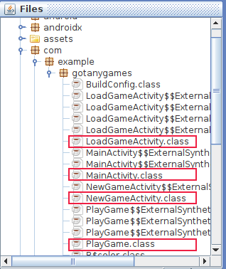
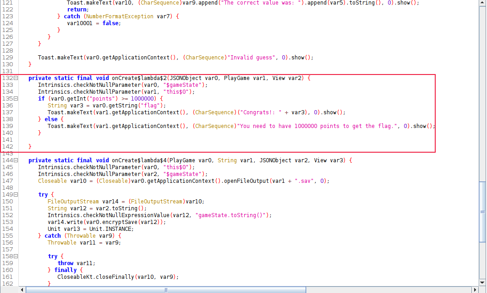
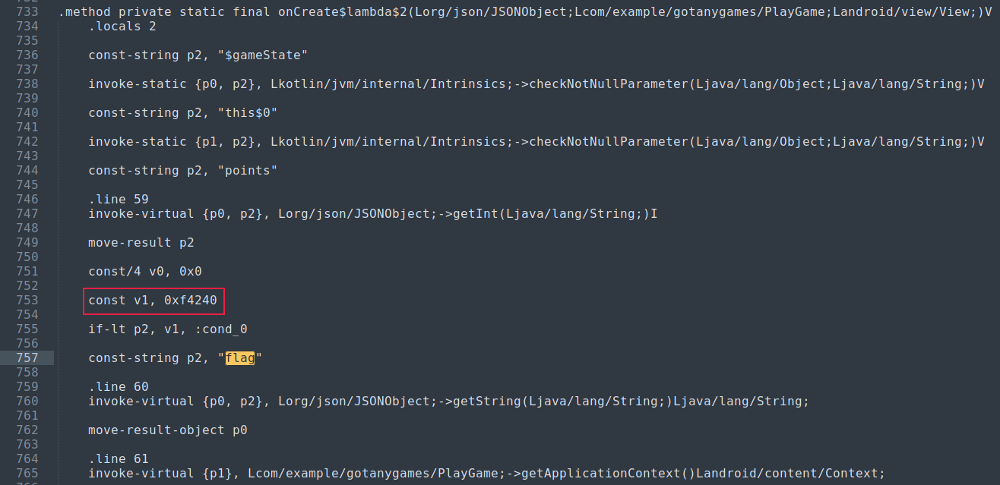
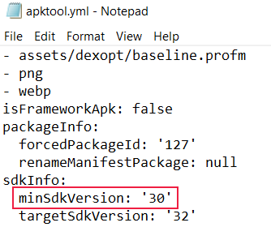
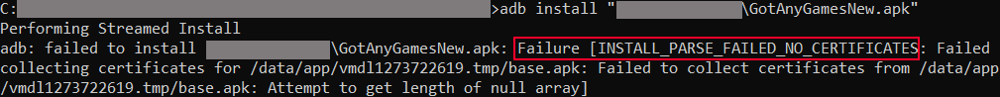
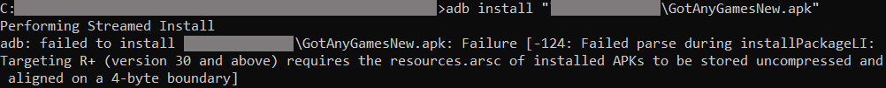
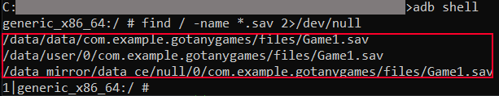
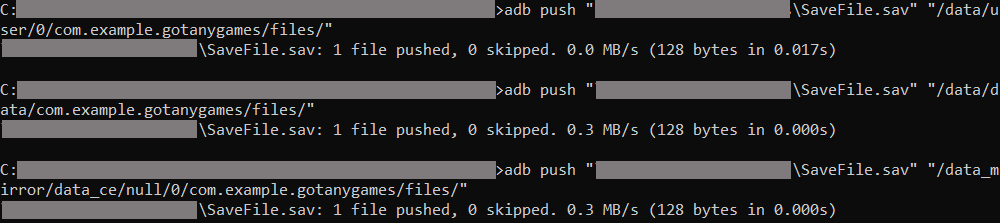
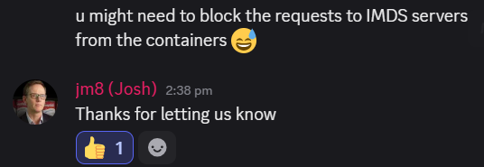

# 🔴 Got Any Games?

| Category | Solves |
| -------- | ------ |
| Hard     | 33     |

## Description

> _Author: @M\_alpha#3534_\
> \
> I created this new guessing game for Android. To deter cheaters, I made sure to include advanced _military grade_ encryption.\
> Please don't cheat, Thanks!\
> \
> Download the files below.\
> \
> Special thank you to [INTIGRITI](https://www.intigriti.com/) for sponsoring NahamCon EU CTF 2022! This challenge is dedicated to them as a token of gratitude.





## TL;DR

* ~~Patch apk to print flag without any successful guesses~~
* Load the save file into the correct directory and print the flag.

## Solution

I did not know that the save file already had 1000000 points so I went through the trouble of patching the apk. I've written down the steps for patching the apk if anyone wants to learn from it :)


If you are looking for the straight-forward solution, you can skip to the [Loading .sav file](got-any-games.md#loading-.sav-file) section.


### Analysis

The **SaveFile.sav** seems to be a save point provided and we might need to be use it in the application later.

We can first run `apktool d GotAnyGames.apk` to decode the files of the apk into it's respective files.

We can also view the source code of the apk using any apk decompilers. I used [Bytecode-Viewer](https://github.com/Konloch/bytecode-viewer/releases/tag/v2.11.2) as my decompiler.

In **Bytecode-Viewer**, I the main files of the application are under **GotAnyGames.apk > com > example > gotanygames**.


The **com** subtree is where we would usually find the subtree containing the main files of the application for android apks, and it is clear that the **gotanygames** subtree is the one we are looking for (not some other lib files).


<figure><figcaption>
Android APK classes
</figcaption></figure>

Here, there are 4 main classes to focus on as highlighted in the picture above.

Looking through the 4 classes, it seems like all the _juicy_ stuff happens in the **PlayGame.class**.

#### PlayGame.class

This class basically contains the functions of the game.

On the left window of **Bytecode-Viewer**, we can see the decompiled code in Java.

Upon looking at the code, it looks like it is a guessing game, where you earn a point if you guess the correct number.

The main part we want to focus on is from lines **132** to **142**.

<figure><figcaption>
PlayGame flag function
</figcaption></figure>

It shows that the **flag** gets printed to us if the points we have is **>= 1000000**.

<figure><figcaption>
encryptSave function
</figcaption></figure>

In **PlayGame.class**, there is also a function that encrypts the save.

So we can guess that the flag is stored in the **SaveFile.sav** and the data of the save file is encrypted so we can't retrieve the flag so easily.

One way we can solve this is by finding the **key** and **iv** used by the **encryptSave** function and we can use them to decrypt the **SaveFile.sav**, but I did not try this method as it would take some time to find the values.

I instead, went for the method of patching the apk and loading the save file into the application instead.

### Patching the APK

As seen in the function that prints out the flag, the check for the points occurs at **`if (var0.getInt("points") >= 1000000)`**. We can try to patch the apk to make it **`if (var0.getInt("points") >= 0)`** so we can print the flag without even earning any points.

I managed to do this by editing the **Smali** files.

The **Smali** files are decoded when we ran the `apktool d GotAnyGames.apk` command.

Navigating to the folder at **GotAnyGames/smali/com/example/gotanygames**, we can see that the **smali** files have been decoded for every class we saw under the **gotanygames** subtree in **Bytecode-Viewer**.

We know we want to modify **PlayGame.smali**. Open a text editor to edit the contents.

I searched for the instances of the string `flag`, and we can see the check for the points right before our first `flag` instance.

<figure><figcaption>
PlayGame.smali points check
</figcaption></figure>

It seems like the line `const v1, 0xf4240` contains our check number for **1000000** points if we view the value of **0xf4240** in decimal, we can verify it is indeed our **1000000**.

<figure><figcaption></figcaption></figure>

The line `if-lt p2, v1, :cond_0` indicates that `if the value in p2 is lt (less than) v1, then jump to cond_0`, where our `cond_0` prints our _"1000000 points"_ message. So it is basically our `if (var0.getInt("points") >= 1000000)`.

<figure><figcaption>
cond_0
</figcaption></figure>

So we can just change the value of **0xf4240** to **0**x**0** and try to package the files into a proper apk and load it into our android device.

### Packaging & Installing Patched APK

Navigate to the folder containing our **GotAnyGames** folder and run `apktool b GotAnyGames -o GotAnyGamesNew.apk`.


When installing the apk, ensure that the android device/emulator you are using is of **API 30** or above. This is because the recommended API version is **30** as indicated in the **apktool.yml** under the **GotAnyGames** folder. (You can also try to patch this to try to support lower versions, but the application might not run properly)



When I tried to install the apk into my android emulator, there was an error due to "no certificate" of the apk.

<figure><figcaption>
Certification Error
</figcaption></figure>

So we have to create our own **keystore** to sign the apk.

#### Signing the APK

1. Generate a key:
   * `keytool -genkey -v <filename>.keystore -alias -keyalg RSA -keysize 2048`
2. Sign the apk with the key:
   * `apksigner sign –ks <filename>.keystore GotAnyGamesNew.apk`

After signing the apk I tried to install it but received this new error

<figure><figcaption>
Alignment error
</figcaption></figure>

A quick search brings us to [this](https://github.com/iBotPeaches/Apktool/issues/2421) issue on Github. So we just run `zipalign -f -p 4 GotAnyGamesNew.apk GotAnyGamesAligned.apk`, sign the apk again, and now it successfully installs.

<figure><figcaption>
Successful Installation of APK
</figcaption></figure>

### Testing Patched APK

Run the application, click on "New Game", then click on "Start", we see that we can retrieve the flag with the "FLAG" button.

Click on the "FLAG" button and see the fake flag gets printed out successfully.

<figure><figcaption>
fake flag
</figcaption></figure>

Now we just need to find a way to load the .sav file into the application.

### Loading .sav file

I do not know where the application searches for the **.sav** files to load the saves, but we can just try to find it through an **adb shell**.

I made sure to save a game first through the application so that it generates a **.sav** file in the android device. Then run `adb shell` to get a shell in the device, and run `find / -name *.sav 2>/dev/null` to find the **.sav** files.

We can see 3 different paths have been returned.

<figure><figcaption>
Location of .sav files
</figcaption></figure>

To push a file into the android device, we can run the command:

* `adb push "<local_file>" "<path_in_android_device>"`

I tried to push the **SaveFile.sav** to only a single directory but the application seems to crash everytime I load the save. So I had to push the save file to all three directories in order to make the application work properly.

<figure><figcaption>
Pushing save file
</figcaption></figure>

We can then open the application, click on "LOAD\_GAME" and click "NEXT" until we see "SaveFile", then click on "LOAD". The flag will be printed out when you press the "FLAG" button.

<figure><figcaption>
FLAG
</figcaption></figure>

I then noticed that the points for this save file is already at **1000000**, so there wasn't any need for patching the binary... At least it was a good practice :cry:

