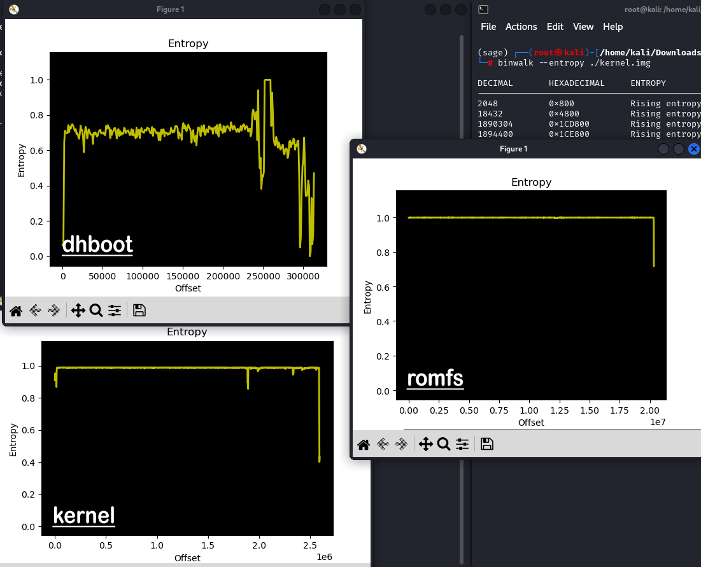

# Decrypting Firmware

## Description

> Bootloader Base Address : 0x21000000
>
>
>
> Kernel Base Address : 0xc0008000



***

## Solution

Only looked at this when the CTF ended :croissant:

### TL;DR

* Search for article on reversing u-boot IoT firmware
* Copy paste emulator code, modify it accordingly, then run to decrypt the kernel image
* Use `vmlinux-to-elf` to convert kernel to an elf file to reverse it
* Discover **block\_aes\_decrypt** and other key initializing functions, run similar emulator to emulate the functions to:
  * Get the aes key
  * Decrypt romfs using the aes key

## Analysis

### Getting Started: Mapping Out the Files

We are given 3 files:

1. `dhboot.bin.img` - U-boot bootloader
2. `kernel.img` -  Encrypted kernel image
3. `romfs-x.squashfs.img` - Encrypt SquashFS root filesystem image

Starting off without any knowledge on the boot up sequence of any firmware, we can guess that `dhboot.bin.img` would start executing first during boot up.

With the help of a friend, I was told to search up "reversing uboot iot firmware" and refer to this site to decrypt the firmware:

* [https://www.shielder.com/blog/2022/03/reversing-embedded-device-bootloader-u-boot-p.1/](https://www.shielder.com/blog/2022/03/reversing-embedded-device-bootloader-u-boot-p.1/)

The article states to use `binwalk --entropy <file>` as to check whether the file has been encrypted or not. This is a check on how "random" the bytes are (less entropy mean several 0s in some areas or certain repeated patterns, for e.g.), encrypted files would have a high entropy due to their "randomness".

<figure><figcaption><p>File entropies</p></figcaption></figure>

As seen above, both the `kernel` and `romfs` seems to have consistently **high entropies** throughout the file, highly indicating that they're encrypted. This is similar to what is shown in the article, where it indicates that `dhboot` is likely to not be encrypted.

The rest of the details can be read up on the article itself, where they nicely explain on how they reversed the u-boot, to how they managed to decrypt the kernel.

However, I will properly provide some details on how to load the u-boot into ghidra for static analysis as this can be useful for future challenges (custom u-boot perhaps?).

### Peeling Back U-Boot: Decompiling the Bootloader

Opening the file in Ghidra, we first select the `Language` to be `ARMv7 Little Endian` (following the article).

<figure><figcaption><p>Selecting Language</p></figcaption></figure>

Click OK to select the language, then click on the `Options...` button at the bottom right of the window, setting the `Block Name` to anything, the `Base Address` as `0x21000000` as per the challenge description, then the `File Offset` would be where the code starts.

To determine where the code starts, we can do a rough guess on where the entropy starts in the file, by running `hexdump -C ./dhboot.bin.img | head -n 50` and checking where the bunch of `00`s stop. (thank Jin Kai for this trick)

<figure><figcaption></figcaption></figure>

In the image above, we can guess that the code starts at the `0x840` offset of the file, so we set this in the `File Offset` and try to decompile it.

You will receive a message on setting the `Length` to some other value, so just set it according to the message.

<figure><figcaption><p>Options</p></figcaption></figure>

Afterwhich, the binary should be decompiled properly!

<figure><figcaption><p>Ghidra</p></figcaption></figure>

### Kernel Decryption: Extracting Offsets

Thankfully, there isn't a need for decompiling and reading code of the u-boot binary.

At the end of the article, a script is given to emulate the decryption function `block_aes_decrypt` of the bootloader:

<details>

<summary>original_emulator.py</summary>

```python
from __future__ import print_function
from ctypes import sizeof
from unicorn import *
from unicorn.arm_const import *
from unicorn.unicorn_const import *
from capstone import *
import struct, binascii

#callback of the code hook
def hook_code(uc, addr, size, user_data): 
	mem = uc.mem_read(addr, size)
	disas_single(bytes(mem),addr)

#disassembly each istruction and print the mnemonic name
def disas_single(data,addr):
		for i in capmd.disasm(data,addr):
			print("0x%x:\t%s\t%s" % (i.address, i.mnemonic, i.op_str))
			break
			
#create a new instance of capstone
capmd = Cs(UC_ARCH_ARM, UC_MODE_ARM) 

#code to be emulated
in_file = open("u-boot.bin", "rb") # opening for [r]eading as [b]inary
ARM_CODE32 = in_file.read()
in_file.close()

# file to be decrypted
in_file = open("kernel.img.raw", "rb") # opening for [r]eading as [b]inary
FILE_TOBE_DEC = in_file.read()
in_file.close()

# U-Boot base address
# we have seen this in the previous article (DDR start at 8000_0000)
ADDRESS = 0x80800000

print("Emulate ARM code")
print("Shielder")
try:
    # Initialize emulator in ARM-32bit mode
    # with "ARM" ARM instruction set
    mu = Uc(UC_ARCH_ARM, UC_MODE_ARM)

    # map U-boot in memory for this emulation
    # "// (1024 * 1024)" for memory allign pourses
    i = len(ARM_CODE32) // (1024 * 1024)
    mem_size = (1024 * 1024) + (i * (1024 * 1024))
    mu.mem_map(ADDRESS, mem_size, perms=UC_PROT_ALL)
    # write machine code to be emulated to memory
    mu.mem_write(ADDRESS, ARM_CODE32)
    
    # map STACK
    stack_address = ADDRESS + mem_size
    # 2MB 
    stack_size = (1024 * 1024) * 2
    mu.mem_map(stack_address, stack_size, perms=UC_PROT_ALL)
    
    # map the Kernel in RAM memory for this emulation
    # remember that RAM starts at 8000_0000
    # there we call RAM a sub-region of memory inside the RAM itself 
    ram_address = ADDRESS + mem_size + stack_size
    ram_size = (1024 * 1024) * 8
    mu.mem_map(ram_address, ram_size, perms=UC_PROT_ALL)
    # write file to be decrypted to memory
    mu.mem_write(ram_address, FILE_TOBE_DEC)

    # initialize machine registries
    mu.reg_write(UC_ARM_REG_SP, stack_address)
    # first argument, memory pointer to the location of the file
    mu.reg_write(UC_ARM_REG_R0, ram_address)
    # second argument, memory pointer to the location on which write the file
    mu.reg_write(UC_ARM_REG_R1, ram_address) 
    # third argument, block size to be read from memory pointed by r0
    mu.reg_write(UC_ARM_REG_R2, 512) 

    # hook any instruction and disassembly them with capstone
    mu.hook_add(UC_HOOK_CODE, hook_code)

    # emulate code in infinite time
    # Address + start/end of the block_aes_decrypt function
    # this trick save much headaches
    mu.emu_start(ADDRESS+0x8c40, ADDRESS+0x8c44) 

    # now print out some registers
    print("Emulation done. Below is the CPU context")

    r_r0 = mu.reg_read(UC_ARM_REG_R0)
    r_r1 = mu.reg_read(UC_ARM_REG_R1)
    r_r2 = mu.reg_read(UC_ARM_REG_R2)
    r_pc = mu.reg_read(UC_ARM_REG_PC)
    print(">>> r0 = 0x%x" %r_r0)
    print(">>> r1 = 0x%x" %r_r1)
    print(">>> r2 = 0x%x" %r_r2)
    print(">>> pc = 0x%x" %r_pc)

    print("\nReading data from first 512byte of the RAM at: "+hex(ram_address))
    print("==== BEGIN ====")
    ram_data = mu.mem_read(ram_address, 512)
    print(str(binascii.hexlify(ram_data)))
    print("==== END ====")

    # from the reversed binary, we know which are the magic bytes
    # at the beginning of the kernel
    if b"27051956" == binascii.hexlify(bytearray(ram_data[:4])):
        print("\nMagic Bytes match :)\n\n")
        with open("test.bin", "wb") as f:
            f.write(ram_data)

except UcError as e:
    print("ERROR: %s" % e)
```

</details>

To decrypt the kernel that we have, we have to modify the code to work on our kernel image.

We have to modify

* `ARM_CODE32` to contain just the u-boot code, which as we found before is at the `0x840` offset.
* `FILE_TOBE_DEC` also have to be changed to only include the encrypted part of the kernel image, so we can skip past the 64 bytes header.
* `ADDRESS` to start at `0x21000000`
* Add a `SIZE` to calculate the **size of the kernel image file - 0x40 bytes for header**. Use this `SIZE` to be placed into the `R2` register, and also to be read from `ram_address`.

Lastly, we have to modify the `start` and `end` addresses of the emulator according to the **block\_aes\_decrypt** function call address. We can find this address by searching for the string "decrypt" in Ghidra, and cross referencing the article's screenshot of the decompiled code.

<figure><figcaption><p>Finding "decrypt" string</p></figcaption></figure>

Jumping to the address of this function in IDA (0x2101305c), we can see a cleaner decompiled code (as compared to Ghidra). Using the strings as context clues, we can guess what each function represents, and so we find the **block\_aes\_decrypt** function based on the error message.

<figure><figcaption><p>Decompiled code in IDA</p></figcaption></figure>

We can then use the address that call this function, following the article!

<figure><figcaption><p>Addresses for block_aes_decrypt call</p></figcaption></figure>

### Kernel Decryption Script



```python
from __future__ import print_function
from ctypes import sizeof
from unicorn import *
from unicorn.arm_const import *
from unicorn.unicorn_const import *
from capstone import *
import struct, binascii

#callback of the code hook
def hook_code(uc, addr, size, user_data): 
	mem = uc.mem_read(addr, size)
	disas_single(bytes(mem),addr)

#disassembly each istruction and print the mnemonic name
def disas_single(data,addr):
		for i in capmd.disasm(data,addr):
			print("0x%x:\t%s\t%s" % (i.address, i.mnemonic, i.op_str))
			break
			
#create a new instance of capstone
capmd = Cs(UC_ARCH_ARM, UC_MODE_ARM) 

#code to be emulated
in_file = open("dhboot.bin.img", "rb") # opening for [r]eading as [b]inary
ARM_CODE32 = in_file.read()[0x840:]
in_file.close()

# file to be decrypted
in_file = open("kernel.img", "rb") # opening for [r]eading as [b]inary
FILE_TOBE_DEC = in_file.read()[0x40:]
in_file.close()

# U-Boot base address
# we have seen this in the previous article (DDR start at 8000_0000)
ADDRESS = 0x21000000

KERNEL_START = 0x40
KERNEL_SIZE = 0x2792f8 # total size of kernel image file
SIZE = KERNEL_SIZE - KERNEL_START

print("Emulate ARM code")
print("Shielder")
try:
    # Initialize emulator in ARM-32bit mode
    # with "ARM" ARM instruction set
    mu = Uc(UC_ARCH_ARM, UC_MODE_ARM)

    # map U-boot in memory for this emulation
    # "// (1024 * 1024)" for memory allign pourses
    i = len(ARM_CODE32) // (1024 * 1024)
    mem_size = (1024 * 1024) + (i * (1024 * 1024))
    mu.mem_map(ADDRESS, mem_size, perms=UC_PROT_ALL)
    # write machine code to be emulated to memory
    mu.mem_write(ADDRESS, ARM_CODE32)
    
    # map STACK
    stack_address = ADDRESS + mem_size
    # 2MB 
    stack_size = (1024 * 1024) * 2
    mu.mem_map(stack_address, stack_size, perms=UC_PROT_ALL)
    
    # map the Kernel in RAM memory for this emulation
    # remember that RAM starts at 8000_0000
    # there we call RAM a sub-region of memory inside the RAM itself 
    ram_address = ADDRESS + mem_size + stack_size
    ram_size = (1024 * 1024) * 8
    mu.mem_map(ram_address, ram_size, perms=UC_PROT_ALL)
    # write file to be decrypted to memory
    mu.mem_write(ram_address, FILE_TOBE_DEC)

    # initialize machine registries
    mu.reg_write(UC_ARM_REG_SP, stack_address)
    # first argument, memory pointer to the location of the file
    mu.reg_write(UC_ARM_REG_R0, ram_address)
    # second argument, memory pointer to the location on which write the file
    mu.reg_write(UC_ARM_REG_R1, ram_address) 
    # third argument, block size to be read from memory pointed by r0
    mu.reg_write(UC_ARM_REG_R2, SIZE) 

    # hook any instruction and disassembly them with capstone
    # mu.hook_add(UC_HOOK_CODE, hook_code)

    # emulate code in infinite time
    # Address + start/end of the block_aes_decrypt function
    # this trick save much headaches
    mu.emu_start(0x210130CC, 0x210130D0) 

    # now print out some registers
    print("Emulation done. Below is the CPU context")

    r_r0 = mu.reg_read(UC_ARM_REG_R0)
    r_r1 = mu.reg_read(UC_ARM_REG_R1)
    r_r2 = mu.reg_read(UC_ARM_REG_R2)
    r_pc = mu.reg_read(UC_ARM_REG_PC)
    print(">>> r0 = 0x%x" %r_r0)
    print(">>> r1 = 0x%x" %r_r1)
    print(">>> r2 = 0x%x" %r_r2)
    print(">>> pc = 0x%x" %r_pc)

    # print("\nReading data from first 512byte of the RAM at: "+hex(ram_address))
    print("==== BEGIN ====")
    ram_data = mu.mem_read(ram_address, SIZE)
    # print(str(binascii.hexlify(ram_data)))
    print("==== END ====")

    # from the reversed binary, we know which are the magic bytes
    # at the beginning of the kernel
    if b"27051956" == binascii.hexlify(bytearray(ram_data[:4])):
        print("\nMagic Bytes match :)\n\n")
        with open("kernel.bin", "wb") as f:
            f.write(ram_data)

except UcError as e:
    print("ERROR: %s" % e)
```



<figure><figcaption><p>Decrypted kernel header</p></figcaption></figure>

### Dissecting Kernel ELF: Understanding the Decryption

We can convert the decrypted kernel image into an elf file using [vmlinux-to-elf](https://github.com/marin-m/vmlinux-to-elf) so that we can reverse the decryption process. As there is no write-ups or articles on how to reverse the decryption of the file system, we will have to reverse it ourselves :disappointed\_relieved:. We run `vmlinux-to-elf kernel.bin kernel.elf --e-machine 40 --bit-size 32` (searching up ARM e machine gives us the number 40).

Loading the binary up in IDA Pro, we are given this message that indicates there are ARM and THUMB instructions that can be switched back and forth. The instruction can be changed from ARM to THUMB in IDA by using `Alt-G` and changing the `T` register value from `0` to `1`.

<figure><figcaption></figcaption></figure>

Looking through the functions, we can spot some function names containing "dahua" and back in the bootloader, we can find several strings (e.g. _DH-DVR-LBX_) that indicates that we are looking at a "Dahua IP Camera" Firmware.

Searching for "dahua ip camera reversing" on google, we can find a talk on Dahua IP Camera reversing made at OFFZONE 2022 [https://2022.offzone.moscow/report/dahua-ip-camera-where-to-look-what-to-poke/](https://2022.offzone.moscow/report/dahua-ip-camera-where-to-look-what-to-poke/). This includes a slide on the broad overview on how the kernel decrypts the romfs.

<figure><figcaption><p>Kernel romfs decryption</p></figcaption></figure>

This talk is pretty old, so we can assume that the method of decryption is different for the firmware we have, but we can guess that some aspects of the decryption is similar, like how it uses `AES CBC`.

We can see that the binary is thankfully not stripped so we can start off by searching for functions with "decrypt" in the name.

<figure><figcaption></figcaption></figure>

We only see 2 functions that uses AES, so we can look into those and find out where those functions are called from. Looking at **SecUnit\_AES\_decrypt**, we find the call <mark style="background-color:blue;">SecUnit\_EncryptFirmware ⇒ SecUnit\_FirmwareAesCBCDecode ⇒ SecUnit\_AES\_decrypt, SecUnit\_EncryptFirmware</mark> also calls **SecUnit\_AES\_set\_decrypt\_key**, which we can assume just sets the AES key for decryption.

However, we can't seem to find any references to **SecUnit\_EncryptFirmware** by default. Remember that the binary uses both ARM and THUMB instructions? The reason the reference cannot be found is because the call was made by a THUMB instruction and IDA doesn't know that the function is in THUMB, so no reference. This can be resolved by spinning up another IDA instance and viewing it entirely in THUMB instructions.

<figure><figcaption><p>Set ARM off</p></figcaption></figure>

After IDA finishes analyzing the binary, we can go the **SecUnit\_EncryptFirmware** and check the references, and it seems like **block\_aes\_decrypt** calls it!

<figure><figcaption><p>SecUnit_EncryptFirmware References</p></figcaption></figure>

By doing this, we can find out that the function calls are <mark style="background-color:blue;">mtdblock\_readsect ⇒ block\_aes\_decrypt ⇒ SecUnit\_EncryptFirmware ⇒ SecUnit\_FirmwareAesCBCDecode</mark>. From reversing these functions, we discover a few things that can aid us in emulating the decryption:

1. AES CBC 512 is used
2. AES key is retrieved and used in the **SecUnit\_EncryptFirmware** function
3. Function prototype <mark style="color:yellow;">SecUnit\_EncryptFirmware(char \*srcbuf, uint32\_t size, char \*dstbuf, uint32\_t size2, uint8\_t cryptoflags, int sector\_skip, int\* pCounter)</mark>
4. For **SecUnit\_EncryptFirmware**, there are hardcoded parameters to decrypt a sector, which is `cryptoflags = 0x11` and `sector_skip = 2`. These hardcoded parameters are passed in when **block\_aes\_decrypt** is called.

With these information, we can pretty much emulate the **SecUnit\_EncryptFirmware** function and decrypt the romfs right? Well, not quite...

In order to find if the file decrypted properly, we have to find what to look out for in a properly decrypted squashfs image. In a normal unencrypted squashfs image, the data past the romfs header would still have a valid header starting with `hsqs8`, which represents a squashfs filesystem. We can get an example `romfs-x.squashfs.img` from [https://snr.systems/site/data-files/Dahua/Firmware/NVR4216-4232-16P-4KS2/DH\_NVR4XXX-4KS2\_Eng\_V3.216.0000000.0.R.180605/?utm\_source=chatgpt.com](https://snr.systems/site/data-files/Dahua/Firmware/NVR4216-4232-16P-4KS2/DH_NVR4XXX-4KS2_Eng_V3.216.0000000.0.R.180605/?utm_source=chatgpt.com) as a reference.

<figure><figcaption><p>Example of unencrypted romfs</p></figcaption></figure>

However, if we run the emulator, we still get an unidentifiable file.

<figure><figcaption><p>Wrongly decrypted romfs</p></figcaption></figure>


One thing to note is that in **SecUnit\_EncryptFirmware**, there are mmioset function calls at **0xC0280C04**, **0xC0280C14**, and **0xC0280C24**. The function mainly runs on ARM instructions, but mmioset runs on THUMB instructions.

If unicorn cannot switch from ARM to THUMB instructions, then we can circumvent this by patching these function calls out with NOPs <mark style="background-color:red;">00 F0 20 E2</mark>. (it should run fine without patching)


So what can be the issue? At this point I was puzzled. I read over the functions and understood that the decryption is performed on every 3rd sector, because the sector\_skip was set to 2. Running binwalk showed that some sectors were still identifiable as "xz compressed data", diffing the result to the original also showed that it tries to decrypt every 3rd sector.

This can only mean that one or some of my parameters to the AES decryption is incorrect. AES decryption only has 2 important values other than the source buffer and destination buffer. It's either the IV or the KEY that is wrong. Since I know the IV starts from 0 from a buffer on the stack in the **mtdblock\_readsect**, then sure only the KEY is wrong.

The AES key can be seen taken from a global variable `g_secUnitKey` and based on the cryptoflags passed into the function, there can be encryption and decryption and the use of 3 different AES key offset from `g_secUnitKey`. However, our cryptoflags have to be fixed to 0x11 based on the arguments passed into **block\_aes\_decrypt**.

### Deriving the AES Key: Tracing Key Initialization

Trying to see references to the AES key `g_secUnitkey`, we see one especially noteworthy.

<figure><figcaption><p>SecUnit_SetKeyFactor</p></figcaption></figure>

The function name seems to set the SecUnit key and we can see that this is called by <mark style="background-color:blue;">prepare\_namespace ⇒ block\_aes\_set\_keyfactor</mark>. Now, this **block\_aes\_set\_keyfactor** seems to be what we are finding because when we reverse it, we can determine how the key is initialized.

The **block\_aes\_set\_keyfactor** first initializes an intermediary 16 byte buffer for the key on the stack.

<figure><figcaption><p>block_aes_set_keyfactor</p></figcaption></figure>

It then calls **firmware\_get\_key\_constprop\_0**, which grabs data from several global variables like `AES_KEY_N` and a reference to a string "ssc325".

It then uses these to hash the original key with SHA256, then perform some XOR and store the resulting value in `keybuf`.

<figure><figcaption><p>firmware_get_key_constprop_0</p></figcaption></figure>

After this is done, **block\_aes\_set\_keyfactor** calls **SecUnit\_SetKeyFactor** with the `keybuf`, the size of the key, and a `keyid` which is a offset to the `g_secUnitKey`, which is hardcoded as the value `1`. This aligns with the key offset that is used during decryption (0x11 &0xF as cryptoflags)!

The function calls **SecUnit\_FirmwareFactors** which is a confusing function to look through. But note that if the function completes without any errors, then memcpy is performed from the `keybuf` into the `g_secUnitKey` global variable at the offset of `keyid`.

<figure><figcaption><p>SecUnit_SetKeyFactor</p></figcaption></figure>

This means that we can emulate both functions to get the correct AES key in order for the decryption to properly decrypt the romfs!

### Emulating Kernel Decryption: RomFS Decryption

I had to emulate the functions individually because of how **firmware\_get\_key\_constprop\_0** runs on THUMB instructions, while **SecUnit\_SetKeyFactor** runs on ARM instructions.

We first emulate **firmware\_get\_key\_constprop\_0** and retrieve the key in keybuf, then pass that key value to our other emulator that emulates **SecUnit\_SetKeyFactor**. Emulating the function, we then read the value where the key was memcpy'ed to, then we pass this key into the correct address where **SecUnit\_EncryptFirmware** would retrieve it from (an offset from `g_secUnitKey`)!

Putting these all together, we can successfully decrypt the romfs, and then run unsquashfs to extract the files and find the flag :relaxed:

<figure><figcaption><p>Decrypting and Extracting files</p></figcaption></figure>

<figure><figcaption><p>Flag captured :)</p></figcaption></figure>

***

### Romfs Decryption Scripts



```python
from __future__ import print_function
from ctypes import sizeof
from unicorn import *
from unicorn.arm_const import *
from unicorn.unicorn_const import *
from capstone import *
import struct, binascii
from capstone.arm import *

capmd = Cs(CS_ARCH_ARM, CS_MODE_THUMB)

in_file = open("kernel.elf", "rb") # opening for [r]eading as [b]inary
ARM_CODE32 = in_file.read()[0x124:]
in_file.close()

ADDRESS = 0xc0008000

print("Emulate ARM code")
print("Shielder")
try:
    mu = Uc(UC_ARCH_ARM, UC_MODE_THUMB)

    i = len(ARM_CODE32) // (1024 * 1024)
    mem_size = (1024 * 1024) + (i * (1024 * 1024))
    mu.mem_map(ADDRESS, mem_size, perms=UC_PROT_ALL)
    mu.mem_write(ADDRESS, ARM_CODE32)
    
    stack_address = ADDRESS + mem_size
    stack_size = (1024 * 1024) * 2
    mu.mem_map(stack_address, stack_size, perms=UC_PROT_ALL)
    
    ram_address = ADDRESS + mem_size + stack_size
    ram_size = (1024 * 1024) * 8 * 8
    mu.mem_map(ram_address, ram_size, perms=UC_PROT_ALL)

    mu.reg_write(UC_ARM_REG_SP, stack_address)
    mu.reg_write(UC_ARM_REG_R0, ram_address)

    mu.emu_start(0xC017C6AC | 1, 0xC017C720) 

    print("Emulation done. Below is the CPU context")

    r_r0 = mu.reg_read(UC_ARM_REG_R0)
    r_r1 = mu.reg_read(UC_ARM_REG_R1)
    r_r2 = mu.reg_read(UC_ARM_REG_R2)
    r_pc = mu.reg_read(UC_ARM_REG_PC)
    print(">>> r0 = 0x%x" %r_r0)
    print(">>> r1 = 0x%x" %r_r1)
    print(">>> r2 = 0x%x" %r_r2)
    print(">>> pc = 0x%x" %r_pc)

    print("==== BEGIN ====")
    ram_data = mu.mem_read(ram_address, 16)
    print("==== END ====")

    with open("key", "wb") as f:
        f.write(ram_data)
        print("DONE!")

except UcError as e:
    print("ERROR: %s" % e)
```



```python
from __future__ import print_function
from ctypes import sizeof
from unicorn import *
from unicorn.arm_const import *
from unicorn.unicorn_const import *
from capstone import *
import struct, binascii
from capstone.arm import *

KEY_ADDR = 0
def hook_code(uc, addr, size, user_data): 
    global KEY_ADDR
    mem = uc.mem_read(addr, size)
    print(bytes(mem).hex())
    if addr == 0xC0280BBC:
        print("HELO")
        KEY_ADDR = uc.reg_read(UC_ARM_REG_R0)
        
    if addr == 0xC0280BC0:
        key = uc.mem_read(KEY_ADDR, 32)
        with open('fullkey','wb') as f:
            f.write(key)
            print("WRITTEN KEY!")

    disas_single(bytes(mem),addr)

def disas_single(data,addr):
		for i in capmd.disasm(data,addr):
			print("0x%x:\t%s\t%s" % (i.address, i.mnemonic, i.op_str))
			break
			
capmd = Cs(CS_ARCH_ARM, CS_MODE_ARM)

in_file = open("kernel.elf", "rb") # opening for [r]eading as [b]inary
ARM_CODE32 = in_file.read()[0x124:]
in_file.close()

ADDRESS = 0xc0008000
KEY = open('key','rb').read()

print("Emulate ARM code")
print("Shielder")
try:
    mu = Uc(UC_ARCH_ARM, UC_MODE_ARM)

    i = len(ARM_CODE32) // (1024 * 1024)
    mem_size = (1024 * 1024) + (i * (1024 * 1024))
    mu.mem_map(ADDRESS, mem_size, perms=UC_PROT_ALL)
    mu.mem_write(ADDRESS, ARM_CODE32)
    
    stack_address = ADDRESS + mem_size
    stack_size = (1024 * 1024) * 2
    mu.mem_map(stack_address, stack_size, perms=UC_PROT_ALL)
    
    ram_address = ADDRESS + mem_size + stack_size
    ram_size = (1024 * 1024) * 8 * 8
    mu.mem_map(ram_address, ram_size, perms=UC_PROT_ALL)
    mu.mem_write(ram_address, KEY)

    mu.reg_write(UC_ARM_REG_SP, stack_address)
    mu.reg_write(UC_ARM_REG_R0, ram_address)
    mu.reg_write(UC_ARM_REG_R1, 16)
    mu.reg_write(UC_ARM_REG_R2, 1)

    mu.hook_add(UC_HOOK_CODE, hook_code)

    mu.emu_start(0xC0280B60, 0xC0280B74) 

    print("Emulation done. Below is the CPU context")

    r_r0 = mu.reg_read(UC_ARM_REG_R0)
    r_r1 = mu.reg_read(UC_ARM_REG_R1)
    r_r2 = mu.reg_read(UC_ARM_REG_R2)
    r_pc = mu.reg_read(UC_ARM_REG_PC)
    print(">>> r0 = 0x%x" %r_r0)
    print(">>> r1 = 0x%x" %r_r1)
    print(">>> r2 = 0x%x" %r_r2)
    print(">>> pc = 0x%x" %r_pc)

except UcError as e:
    print("ERROR: %s" % e)
```



```python
from __future__ import print_function
from ctypes import sizeof
from unicorn import *
from unicorn.arm_const import *
from unicorn.unicorn_const import *
from capstone import *
import struct, binascii
from capstone.arm import *

capmd = Cs(CS_ARCH_ARM, CS_MODE_ARM)

in_file = open("kernel.elf", "rb") # opening for [r]eading as [b]inary
ARM_CODE32 = in_file.read()[0x124:]
in_file.close()

in_file = open("romfs-x.squashfs.img", "rb") # opening for [r]eading as [b]inary
 
ENCRYPTED_CONTENT = in_file.read()
FILE_TOBE_DEC = ENCRYPTED_CONTENT[0x40:]
in_file.close()

KERN_START = 0x00000040
KERN_END = 0x01364040
SIZE = KERN_END - KERN_START

ADDRESS = 0xc0008000

AES_KEY = open('fullkey','rb').read()

print("Emulate ARM code")
print("Shielder")
try:
    mu = Uc(UC_ARCH_ARM, UC_MODE_ARM)

    i = len(ARM_CODE32) // (1024 * 1024)
    mem_size = (1024 * 1024) + (i * (1024 * 1024))
    mu.mem_map(ADDRESS, mem_size, perms=UC_PROT_ALL)
    mu.mem_write(ADDRESS, ARM_CODE32)
    
    stack_address = ADDRESS + mem_size
    stack_size = (1024 * 1024) * 2
    mu.mem_map(stack_address, stack_size, perms=UC_PROT_ALL)
    
    a5_value = 0x11  # example value (adjust to your needs)
    mu.mem_write(stack_address + 0, bytes([a5_value]))

    a6_value = 2
    mu.mem_write(stack_address + 4, a6_value.to_bytes(4, 'little'))

    counter_addr = stack_address + 0x20
    counter_init = 0
    mu.mem_write(counter_addr, counter_init.to_bytes(4, 'little'))

    mu.mem_write(stack_address + 8, counter_addr.to_bytes(4, 'little'))

    ram_address = ADDRESS + mem_size + stack_size
    ram_size = (1024 * 1024) * 8 * 8
    mu.mem_map(ram_address, ram_size, perms=UC_PROT_ALL)
    mu.mem_write(ram_address, FILE_TOBE_DEC)

    mu.reg_write(UC_ARM_REG_SP, stack_address)
    mu.reg_write(UC_ARM_REG_R0, ram_address)
    mu.reg_write(UC_ARM_REG_R2, ram_address) 
    mu.reg_write(UC_ARM_REG_R1, SIZE) 
    mu.reg_write(UC_ARM_REG_R3, SIZE) 

    mu.mem_write(0xc0465738, AES_KEY) # write to aeskeybuf

    mu.emu_start(0xC0280BC8, 0xC0280C58) 

    print("Emulation done. Below is the CPU context")

    r_r0 = mu.reg_read(UC_ARM_REG_R0)
    r_r1 = mu.reg_read(UC_ARM_REG_R1)
    r_r2 = mu.reg_read(UC_ARM_REG_R2)
    r_pc = mu.reg_read(UC_ARM_REG_PC)
    print(">>> r0 = 0x%x" %r_r0)
    print(">>> r1 = 0x%x" %r_r1)
    print(">>> r2 = 0x%x" %r_r2)
    print(">>> pc = 0x%x" %r_pc)

    ram_data = mu.mem_read(ram_address, SIZE)

    with open("romfs.squashfs", "wb") as f:
        f.write(ram_data)
        print("DONE!")

except UcError as e:
    print("ERROR: %s" % e)

```


