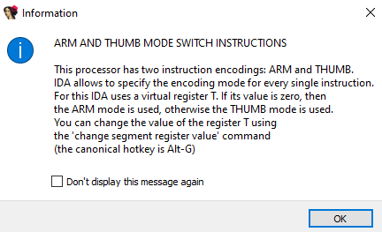

# 10000

## Descript

> Ok hotshot, this is it, the only thing standing between you and slightly less internet anonymity.
>
> ***
>
> 7-zip password: flare



## Analysis

### Finding the main function

We are given a Windows executable that is over 1GB. Running the executable, we see an error message "invalid license file". We can open the executable in IDA and search for this string.

<figure><figcaption><p>Error message</p></figcaption></figure>

Looking at the string references, we can see that `sub_140001E87` uses it.  We can see that another function `sub_140001180` calls this function, but it just seems to be running some initialization stuff so we don't have to bother reversing it. We can rename `sub_140001E87` to `mainFunction`.

### Main function analysis

Since the executable is stripped, most of the function names are unknown. We can guess some of the through analysis, like how `sub_1400C7680` is like `printf` because of the arguments passed into it ("checking license file..." as 2nd argument).


You can load FLIRT signatures to resolve most of the functions. I managed to resolve some but not all, so this writeup will demonstrate the resolution of functions **without** FLIRT signatures.


We also see "license.bin" being passed as the 2nd argument into function `sub_14009E480`, from which we can assume its `fopen`. From this method,  we can resolve functions like `fread` and `fseek`. `fread` reads the file contents into a variable we will rename to `filecontent`.

Looking at the function `sub_14001F990`, we see that it eventually calls the `sub_14001E750`, which uses a string "picosha2.h" as argument. Searching for this online, we can see that it is used in a library that generates a SHA256 hash ([https://github.com/okdshin/PicoSHA2](https://github.com/okdshin/PicoSHA2)). Looking at the examples in the GitHub page, we can infer that `sub_14001F990` is essentially `picosha2::hash256` as the arguments also makes sense. If we debug the executable, we can also see that the function does indeed write the SHA256 hash of the contents of "license.bin" into the 3rd argument of the `hash256` function.

If we rename the functions and variables, this is what we have now:

<figure><figcaption><p>IDA File operations</p></figcaption></figure>

### Finding the goal

A bunch of code is then executed, which we will check out later. We first see how this generate hash will be used. In the `mainFunction`, we see that `sub_14001D6A0` is called with the hash as the 3rd argument. The 1st argument passed is a global variable that points to a bunch of random bytes, which is a size of 80 bytes. This can be guessed to be our ciphertext that needs to be decrypted.

In the function we also see that it eventually calls `sub_14001D8F0`, which calls another function with the "Invalid key size" as an argument. These hints of it requiring a fixed key size and the random bytes is 80 bytes long which can be placed in blocks of 16 bytes highly points to this function being a AES decryption.

```cpp
decryptFlag((__int64)&ciphertext, 0x50u, (__int64)hashbegin, 0x20u, (__int64)&iv, &Src[4], v10, (unsigned int *)Src);
```

Looking at the arguments to this decryption function, the 2nd argument seems to signify the size of ciphertext, 4th argument is the size of the hash (AES key), and the 5th argument to a global variable containing 16 bytes, which highly suggest that it is the IV key. This gives us an idea that it is most likely performing AES CBC decryption.

> GPT with IDA MCP can be used to confirm that the function is indeed performing AES CBC decryption.

From this, we can derive that we must recover the expected "license.bin" in order to decrypt the ciphertext for the flag.

### Reversing license checks

There are several checks in play. The first is for the size of "license.bin" to be **340000** bytes.

```cpp
    fopen_0((const char *)fd, "license.bin");
    sub_14007EDF0((__int64)v15, fd);
    filesize = file_size((__int64)v15);
    if ( filesize == 340000 )
```

The variable we renamed to `filecontent` is an array of 2 bytes. This is then assigned to another variable, then these 2 bytes are checked to make sure its not more than 9999. These are performed in the `for` loop, which seems to be the most important part of the license checking.


```cpp
    for ( position = 0; position <= 9999; ++position )
    {
      recordId = *file_content_ptr;
      if ( recordId > 9999u )
        goto invalidJmp;
      sub_1400AFB10((__int64)v17, (__int64)v12, recordId);
      if ( sub_140028F80((__int64)v17) )
        goto invalidJmp;
      sub_1400AFB10((__int64)v18, (__int64)v12, recordId);
      sub_14009DED0((__int64)v18, 1);
      ++file_content_ptr;
      v23 = sub_140001482(recordId);
      v4 = (__int64)(v23 + 1);
      v21 = &v20;
      sub_1400B46B0((__int64)v19, (__int64)"_Z5checkPh", (__int64)&v20);
      v5 = (__int64 (__fastcall **)(unsigned __int16 *))sub_1400AB330(v4, (__int64)v19);
      LODWORD(v4) = (*v5)(file_content_ptr) ^ 1;
      sub_1400B4C10((__int64)v19);
      if ( (_BYTE)v4 )
        goto invalidJmp;
      file_content_ptr += 16;
      sub_140001D9F(position);
    }
```


We can see a clear pattern here. A `for` loop running for 10000 iterations where each `recordId` (2 bytes) is checked to be less than 9999 signifies an indexing of some sort. `file_content_ptr` is then incremented (by 2 bytes) and at the end of the loop, it is incremented by 16 (32 bytes) which is off by 34 bytes effectively.

Since this iterates over 10000 times, it means there should be a total of $$10000*(32+2) = 340000$$ bytes, which matches the previous check of 340000 bytes for "license.bin".

This gives us the following struct for the license:

```cpp
struct entry {
    char id[2];
    char body[32];
}

entry license[10000];
```

### Main Logic

The first few function calls in the `for` loop isn't note worthy. The interesting part is in the function `sub_140001482`, where it takes in the id (`recordId` variable) as an argument and calls a bunch of WinAPI functions.




```cpp
_OWORD *__fastcall sub_140001482(unsigned __int16 recordId)
{
  unsigned int v1; // esi
  __int64 v2; // rbx
  __int64 v3; // rax
  _OWORD *v4; // rbx
  _OWORD *v5; // rbx
  _OWORD *v6; // rbx
  char *v7; // rbx
  _OWORD *v8; // rsi
  _BYTE v10[24]; // [rsp+30h] [rbp-50h] BYREF
  _OWORD *v11; // [rsp+48h] [rbp-38h] BYREF
  __int64 v12; // [rsp+50h] [rbp-30h] BYREF
  __int64 v13; // [rsp+58h] [rbp-28h] BYREF
  _BYTE v14[47]; // [rsp+60h] [rbp-20h] BYREF
  char v15; // [rsp+8Fh] [rbp+Fh] BYREF
  _BYTE v16[39]; // [rsp+90h] [rbp+10h] BYREF
  char v17; // [rsp+B7h] [rbp+37h] BYREF
  char *v18; // [rsp+B8h] [rbp+38h]
  char *v19; // [rsp+C0h] [rbp+40h]
  FARPROC ProcAddress; // [rsp+C8h] [rbp+48h]
  char *v21; // [rsp+D0h] [rbp+50h]
  HMODULE hModule; // [rsp+D8h] [rbp+58h]
  INT_PTR (__stdcall *v23)(); // [rsp+E0h] [rbp+60h]
  char *v24; // [rsp+E8h] [rbp+68h]
  _OWORD *v25; // [rsp+F0h] [rbp+70h]
  unsigned __int16 v26; // [rsp+FEh] [rbp+7Eh]
  char *String; // [rsp+100h] [rbp+80h]
  char *v28; // [rsp+108h] [rbp+88h]
  unsigned __int16 v29; // [rsp+116h] [rbp+96h]
  char *v30; // [rsp+118h] [rbp+98h]
  char *v31; // [rsp+120h] [rbp+A0h]
  int v32; // [rsp+12Ch] [rbp+ACh]
  char *v33; // [rsp+130h] [rbp+B0h]
  char *v34; // [rsp+138h] [rbp+B8h]
  int v35; // [rsp+144h] [rbp+C4h]
  char *v36; // [rsp+148h] [rbp+C8h]
  char *v37; // [rsp+150h] [rbp+D0h]
  char *v38; // [rsp+158h] [rbp+D8h]
  char *v39; // [rsp+160h] [rbp+E0h]
  char *v40; // [rsp+168h] [rbp+E8h]
  char *v41; // [rsp+170h] [rbp+F0h]
  __int64 v42; // [rsp+178h] [rbp+F8h]
  __int64 v43; // [rsp+180h] [rbp+100h]
  int v44; // [rsp+188h] [rbp+108h]
  DWORD v45; // [rsp+18Ch] [rbp+10Ch]
  LPVOID v46; // [rsp+190h] [rbp+110h]
  HGLOBAL hResData; // [rsp+198h] [rbp+118h]
  HRSRC hResInfo; // [rsp+1A0h] [rbp+120h]
  unsigned int *m; // [rsp+1A8h] [rbp+128h]
  unsigned int *v50; // [rsp+1B0h] [rbp+130h]
  unsigned int k; // [rsp+1BCh] [rbp+13Ch]
  FARPROC *v52; // [rsp+1C0h] [rbp+140h]
  char *j; // [rsp+1C8h] [rbp+148h]
  int i; // [rsp+1D4h] [rbp+154h]
  unsigned int *v55; // [rsp+1D8h] [rbp+158h]

  v1 = recordId;
  v2 = sub_1400AF750(&unk_140112C80);
  v3 = sub_1400AF780(&unk_140112C80);
  v12 = sub_1400023B1(v3, v2, v1);
  v13 = sub_1400AF750(&unk_140112C80);
  if ( (unsigned __int8)sub_140021500(&v12, &v13) != 1 )
    return *(_OWORD **)sub_1400230F0(&v12);
  v5 = (_OWORD *)sub_1400C9F00(0x40uLL);
  *v5 = 0LL;
  v5[1] = 0LL;
  v5[2] = 0LL;
  v5[3] = 0LL;
  sub_14001D670(v5);
  v11 = v5;
  *(_WORD *)v5 = recordId;
  hResInfo = FindResourceA(0LL, (LPCSTR)recordId, (LPCSTR)0xA);
  hResData = LoadResource(0LL, hResInfo);
  v46 = LockResource(hResData);
  v45 = SizeofResource(0LL, hResInfo);
  v44 = sub_140002690(v46, v45, 0LL);
  sub_1400C0C30(v10, v44);
  v43 = sub_1400297D0(v10, 0LL);
  sub_1400035E8((_DWORD)v46, v43, v45, v44, 0LL);
  v42 = *(int *)(v43 + 60) + v43;
  v41 = (char *)VirtualAlloc(0LL, *(unsigned int *)(v42 + 80), 0x3000u, 0x40u);
  *((_QWORD *)v11 + 1) = v41;
  v55 = (unsigned int *)(v42 + 24 + *(unsigned __int16 *)(v42 + 20));
  for ( i = 0; i < *(unsigned __int16 *)(v42 + 6); ++i )
  {
    memcpy(&v41[v55[3]], (const void *)(v43 + v55[5]), v55[4]);
    v55 += 10;
  }
  for ( j = &v41[*(unsigned int *)(v42 + 144)]; *((_DWORD *)j + 3); j += 20 )
  {
    String = &v41[*((unsigned int *)j + 3)];
    v52 = (FARPROC *)&v41[*((unsigned int *)j + 4)];
    if ( (unsigned int)(*String - 48) > 9
      || (unsigned int)(String[1] - 48) > 9
      || (unsigned int)(String[2] - 48) > 9
      || (unsigned int)(String[3] - 48) > 9 )
    {
      hModule = LoadLibraryA(String);
      while ( *v52 )
      {
        v21 = &v41[(_QWORD)*v52];
        ProcAddress = GetProcAddress(hModule, v21 + 2);
        *v52++ = ProcAddress;
      }
    }
    else
    {
      v26 = atoi(String);
      v25 = sub_140001482(v26);
      while ( *v52 )
      {
        v24 = &v41[(_QWORD)*v52];
        v6 = v25 + 1;
        v19 = &v15;
        sub_1400B46B0(v14, v24 + 2, &v15);
        v23 = *(INT_PTR (__stdcall **)())sub_1400AB330(v6, v14);
        sub_1400B4C10(v14);
        *v52++ = v23;
      }
    }
  }
  v40 = &v41[*(unsigned int *)(v42 + 136)];
  v39 = &v41[*((unsigned int *)v40 + 8)];
  v38 = &v41[*((unsigned int *)v40 + 9)];
  v37 = &v41[*((unsigned int *)v40 + 7)];
  for ( k = 0; k < *((_DWORD *)v40 + 6); ++k )
  {
    v30 = &v41[*(unsigned int *)&v39[4 * k]];
    v29 = *(_WORD *)&v38[2 * k];
    v28 = &v41[*(unsigned int *)&v37[4 * v29]];
    v7 = v28;
    v8 = v11 + 1;
    v18 = &v17;
    sub_1400B46B0(v16, v30, &v17);
    *(_QWORD *)sub_1400AB330(v8, v16) = v7;
    sub_1400B4C10(v16);
  }
  v36 = &v41[*(unsigned int *)(v42 + 176)];
  v35 = *(_DWORD *)(v42 + 180);
  v50 = (unsigned int *)v36;
  v34 = &v41[-*(_QWORD *)(v42 + 48)];
  while ( v50 < (unsigned int *)&v36[v35] )
  {
    for ( m = v50 + 2; m < (unsigned int *)((char *)v50 + v50[1]); m = (unsigned int *)((char *)m + 2) )
    {
      v31 = &v41[(*(_WORD *)m & 0xFFF) + (unsigned __int64)*v50];
      switch ( *((_BYTE *)m + 1) & 0xF0 )
      {
        case 160:
          *(_QWORD *)v31 += v34;
          break;
        case 48:
          *(_QWORD *)v31 += (unsigned int)v34;
          break;
        case 16:
          *(_QWORD *)v31 += WORD1(v34);
          break;
        case 32:
          *(_QWORD *)v31 += (unsigned __int16)v34;
          break;
      }
    }
    v50 = m;
  }
  v33 = &v41[*(unsigned int *)(v42 + 40)];
  v32 = ((__int64 (__fastcall *)(void *, __int64, _QWORD))v33)(&unk_140109040, 1LL, 0LL);
  sub_1400AF7E0(&unk_140112C80, &v11);
  v4 = v11;
  sub_140086660(v10);
  return v4;
}
```




We see that the `recordId` is passed into [FindResourceA](https://learn.microsoft.com/en-us/windows/win32/api/winbase/nf-winbase-findresourcea) as the 2nd argument, which is used to specify the ID of the resource to load. If we view the resources of the executable in **CFF Explorer**, we can see why the file is over 1GB of size; it contains 10000 resources with each resource being over **0x10000** bytes big!

<figure><figcaption><p>Resources of executable</p></figcaption></figure>

This means the specified `recordId` would specify the resource accordingly, 0 would match the first resource, and 9999 would match the last.

The resource is then loaded and a buffer is assigned its pointer. This is then passed into another important function `sub_1400035E8`, which essentially decodes the resource bytes. We can determine this by debugging, where we see the 1st argument is the input encoded bytes and the 2nd argument is the output containing the decoded bytes.



<figure><figcaption></figcaption></figure>



<figure><figcaption></figcaption></figure>



We can also tell that the resource is essentially encoded DLLs based on the first few bytes seen in the decoded output.

### Extracting DLLs

With this, I asked GPT to code me a python script that uses the **frida** library to hook the running executable at a given address and dump out a certain number of bytes in the specified register.

The code had a lot of errors initially (mostly with running the fridaJS), but I managed to fix it by reading the documentation on the correct frida version that I'm using. This particularly fixes the retrieval of base address of the executable, the code to set the interceptor at an address, and also the reading of bytes from the address stored in the RAX register.




```python
import frida
import os
import struct
import time
import queue
import sys
from pathlib import Path

# ---------------- CONFIG ----------------
TARGET_EXE = r"10000.exe"  # full path to executable to spawn each iteration
MODULE_NAME = "10000.exe"  # full path to executable to spawn each iteration
PATCH_FILE_PATH = r"license.bin"  # file whose first 2 bytes will be overwritten with i (uint16, little-endian)
BP_ADDR = 0x1672  # breakpoint VA (adjust for target)
DUMP_SIZE = 500000  # bytes to read from address in RAX
OUT_DIR = r".\frida_out"  # where to write the "{i}.dll" files
ITERATIONS = 10000  # number of iterations (0..ITERATIONS-1)
TIMEOUT_SECS = 15  # how long to wait for a dump each iteration
SLEEP_BETWEEN = 0.05  # small sleep between iterations
REG_NAME = "rax"  # register that contains buffer pointer
# ----------------------------------------

os.makedirs(OUT_DIR, exist_ok=True)
patch_path = Path(PATCH_FILE_PATH)
if not patch_path.exists():
    print(f"[!] patch file does not exist: {PATCH_FILE_PATH}")
    sys.exit(1)
if not os.path.exists(TARGET_EXE):
    print(f"[!] target exe not found: {TARGET_EXE}")
    sys.exit(1)

FRIDA_JS = r"""
var moduleName = {modname};
var base = Process.findModuleByName(moduleName);
var rva = {bp}
var bp = base.base.add(rva);
Interceptor.attach(bp, {{
  onEnter: function (args) {{
    try {{
      var addr = this.context.{reg};
      var size = {size};
      if (addr.isNull()) {{
        send({{ type: 'error', msg: 'rax is NULL' }});
        return;
      }}
      var memaddr = ptr(addr)
      var buf = memaddr.readByteArray(size);
      send({{ type: 'dump', addr: addr.toString(), size: size }}, buf);
    }} catch (e) {{
      send({{ type: 'error', msg: e.message }});
    }}
  }}
}});
""".format(
    modname=repr(MODULE_NAME), bp=hex(BP_ADDR), reg=REG_NAME, size=DUMP_SIZE
)


def write_first_two_bytes_le(value):
    """Write the first two bytes of PATCH_FILE_PATH with uint16 little-endian of value."""
    v16 = value & 0xFFFF
    packed = struct.pack("<H", v16)
    # open in r+b (read+write, binary)
    with open(PATCH_FILE_PATH, "r+b") as f:
        f.seek(0)
        f.write(packed)
        f.flush()
        os.fsync(f.fileno())


def spawn_attach_and_dump(iter_index):
    """Spawn the target exe suspended, attach, load script, resume, wait for dump, save and cleanup."""
    q = queue.Queue()

    def on_message(message, data):
        q.put((message, data))

    pid = None
    session = None
    script = None
    try:
        pid = frida.spawn([TARGET_EXE])
    except Exception as e:
        print(f"[iter {iter_index}] spawn failed: {e}")
        return False

    try:
        session = frida.attach(pid)
    except Exception as e:
        print(f"[iter {iter_index}] attach failed: {e}")
        try:
            frida.kill(pid)
        except Exception:
            pass
        return False

    try:
        script = session.create_script(FRIDA_JS)
        script.on("message", on_message)
        script.load()
    except Exception as e:
        print(f"[iter {iter_index}] create/load script failed: {e}")
        try:
            session.detach()
        except Exception:
            pass
        try:
            frida.kill(pid)
        except Exception:
            pass
        return False

    # resume process so it runs and will hit the bp
    try:
        frida.resume(pid)
    except Exception as e:
        print(f"[iter {iter_index}] resume failed: {e}")
        try:
            session.detach()
        except Exception:
            pass
        try:
            frida.kill(pid)
        except Exception:
            pass
        return False

    # wait for message from JS
    try:
        message, data = q.get(timeout=TIMEOUT_SECS)
    except queue.Empty:
        print(
            f"[iter {iter_index}] timed out waiting for dump (no message in {TIMEOUT_SECS}s)."
        )
        try:
            session.detach()
        except Exception:
            pass
        try:
            frida.kill(pid)
        except Exception:
            pass
        return False

    # message handling
    # message structure from frida: {'type': 'send', 'payload': {...}} or {'type': 'error', 'description': ...}
    try:
        mtype = message.get("type")
        if mtype == "send":
            payload = message.get("payload", {})
            ptype = payload.get("type")
            if ptype == "dump":
                addr_str = payload.get("addr")
                size = payload.get("size", DUMP_SIZE)
                # write binary data to file named "{i}.dll"
                outname = os.path.join(OUT_DIR, f"{iter_index}.dll")
                with open(outname, "wb") as f:
                    f.write(data)
                print(
                    f"[iter {iter_index}] wrote {size} bytes from {addr_str} -> {outname}"
                )
            else:
                # info or error sent from JS
                print(f"[iter {iter_index}] message payload: {payload}")
        else:
            # type might be 'error' (frida internal)
            print(f"[iter {iter_index}] frida message (non-send): {message}")
    except Exception as e:
        print(f"[iter {iter_index}] error processing message: {e}")

    # cleanup
    #    try:
    #        print("DETACH")
    #        session.detach()
    #        print("DETACHED!")
    #    except Exception:
    #        pass
    try:
        frida.kill(pid)
    except Exception:
        pass

    return True


def main():
    print("Starting automated loop. This will run ITERATIONS times.")
    for i in range(0, ITERATIONS):
        print(f"Running {i}")
        try:
            write_first_two_bytes_le(i)
        except Exception as e:
            print(f"[iter {i}] failed to patch file: {e}")
            time.sleep(SLEEP_BETWEEN)
            continue
        ok = spawn_attach_and_dump(i)
        if not ok:
            print(f"[iter {i}] iteration failed.")
        time.sleep(SLEEP_BETWEEN)
    print("All iterations complete.")

if __name__ == "__main__":
    main()

```




Running this took about 2 hours to extract all the DLLs. It would be faster if the decryption function was reimplemented or if I had threaded the extraction process, but I had time so I just let it run in the background.

Looking back at the function that loads the resource, we can see that after the decoding, there are some offset calculations before copying the decoded bytes into the **VirtualAlloc**-ed region.

```cpp
  decodeDLL(dll_decode, decoded, v45, v44, 0LL);
  NtHeader = *(int *)(decoded + 0x3C) + decoded;
  vMem = (char *)VirtualAlloc(0LL, *(unsigned int *)(NtHeader + 0x50), 0x3000u, 0x40u);
  *((_QWORD *)v11 + 1) = vMem;
  sectionHeaders = (unsigned int *)(NtHeader + 0x18 + *(unsigned __int16 *)(NtHeader + 0x14));
  for ( i = 0; i < *(unsigned __int16 *)(NtHeader + 6); ++i )
  {
    memcpy(&vMem[sectionHeaders[3]], (const void *)(decoded + sectionHeaders[5]), sectionHeaders[4]);
    sectionHeaders += 10;
  }
```

For people who are familiar with reversing Windows Executables, the offsets should look familiar. I recommend using [010 Editor](https://www.sweetscape.com/010editor/) to view the DLL for easier visualization as it highlights the different fields and their sizes in a hex view.

| Offset                                                       | Significance                  |
| ------------------------------------------------------------ | ----------------------------- |
| decoded + 0x3C                                               | AddressOfNewExeHeader         |
| \*(int \*)(decoded + 0x3C) + decoded                         | NtHeader                      |
| NtHeader + 0x50                                              | SizeOfImage                   |
| NtHeader + 0x14                                              | SizeOfOptionalHeader          |
| NtHeader + 0x18                                              | OptionalHeader                |
| NtHeader + 0x18 + \*(unsigned \_\_int16 \*)(NtHeader + 0x14) | SectionHeaders                |
| NtHeader + 6                                                 | NumberOfSections              |
| sectionHeaders\[3]                                           | VirtualAddress                |
| sectionHeaders\[4]                                           | SizeOfRawData                 |
| sectionHeaders\[5]                                           | PointerToRawData              |
| decoded + sectionHeaders\[5]                                 | .text section (Start of code) |

This chunk of code essentially copies the .text section of the DLL into the (VirtualAlloc-ed region + VirtualAddress offset).

Following this code is another `for` loop:


```cpp
  for ( j = &vMem[*(unsigned int *)(NtHeader + 0x90)]; *((_DWORD *)j + 3); j += 20 )
  {
    ModName = &vMem[*((unsigned int *)j + 3)];
    FirstThunk = (FARPROC *)&vMem[*((unsigned int *)j + 4)];
    if ( (unsigned int)(*ModName - 48) > 9
      || (unsigned int)(ModName[1] - 48) > 9
      || (unsigned int)(ModName[2] - 48) > 9
      || (unsigned int)(ModName[3] - 48) > 9 )
    {
      hModule = LoadLibraryA(ModName);
      while ( *FirstThunk )
      {
        v21 = &vMem[(_QWORD)*FirstThunk];
        ProcAddress = GetProcAddress(hModule, v21 + 2);
        *FirstThunk++ = ProcAddress;
      }
    }
    else
    {
      v26 = atoi(ModName);
      v25 = loadlib(v26);
      while ( *FirstThunk )
      {
        v24 = &vMem[(_QWORD)*FirstThunk];
        v6 = (__int64)(v25 + 1);
        v19 = &v15;
        sub_7FF776D146B0((__int64)v14, (__int64)(v24 + 2), (__int64)&v15);
        v23 = *(INT_PTR (__stdcall **)())sub_7FF776D0B330(v6, (__int64)v14);
        sub_7FF776D14C10((__int64)v14);
        *FirstThunk++ = v23;
      }
    }
  }
```


Although this look complex, what it does is pretty simple:



Go through all the imports of the DLL



Check the first 4 bytes of the module name



If first 4 bytes of module name isn't all digits, then its a normal system provided library, so load and populate IAT.



Else the library is custom and should be loaded as a DLL, so recursively call the current function  to load other DLLs, then populate IAT.



Basically, this would go through all imports of the DLL and then recursively load it.&#x20;

The rest of the code in the function isn't that important, it mainly loads things into their correct locations so that the DLL is able to run normally with the exported functions. The only important function that was called at the end is `sub_1400AE7E0`, which we will talk about later on.

Going back to the `mainFunction`, after the loading of the libraries, the exported function `_Z5checkPh` of the DLL is then loaded and ran (at 0x140001180) with the `file_content_ptr` as an argument. This can easily be deduced by debugging the executable. We can also guess that each DLL would have their own checks on each 32 bytes of body, which we would need to reverse the logic of. Repeat this 10000 times to get all the correct bytes of body for each DLL.

### Getting the right order

Before diving into the DLLs, we have to determine the order of which to load the DLLs in, that is, what is the order of `recordId`s to input.

In the `mainFunction`, there is a `memcmp` after the `for` loop ends. It compares 40000 bytes of a global variable that is initially all nulls, against a populated global variable, which is the goal we have to aim towards. We can start by looking at the references to this global variable of nulls.

```cpp
if ( memcmp(&unk_140108040, &unk_1400CB000, 40000uLL) )
```

Out of all the references, the only one that seems to change the values is found in the function `sub_140000D9F`, which is called by the `mainFunction`.




```cpp
__int64 __fastcall sub_140000D9F(int a1)
{
  __int64 v2; // [rsp+20h] [rbp-20h] BYREF
  __int64 v3; // [rsp+28h] [rbp-18h] BYREF
  LPVOID *v4; // [rsp+30h] [rbp-10h]
  void *v5; // [rsp+38h] [rbp-8h]

  v5 = &unk_140111C80;
  v3 = sub_1400AE780(&unk_140111C80);
  v2 = sub_1400AE750(&unk_140111C80);
  while ( (unsigned __int8)sub_140020500(&v3, &v2) != 1 )
  {
    v4 = *(LPVOID **)sub_1400220F0(&v3);
    dword_140108040[*(unsigned __int16 *)v4] += a1;
    VirtualFree(v4[1], 0LL, 0x8000u);
    sub_14001F560(&v3);
  }
  return sub_1400AE7B0(&unk_140111C80);
}
```




We can see that `sub_1400220F0` returns the index to which a certain value should be added to. If you enter the `sub_140000D9F` function in IDA and press F5 to refresh the generated decompiled code, you will see that our global variable of nulls changed from **unk...** to **dword...**.

This is because IDA identifies that 4 bytes are being added to it for each index. So when the `memcmp` compares 40000 bytes, it's actually comparing 10000 entries of 4 bytes. This matches the number of DLL ids we can input. We can convert both global variables to an array with the correct sizes.

We can also easily see that the value that it adds is the current iteration count of the `for` loop in the `mainFunction`. However to determine how the index (v4) is generated, we have to look through some confusing references...

Most of the functions in the `sub_140001D9F` function are pretty straightforward, but they suggest that the variables being worked on is of some kind of struct, especially so for `unk_140112C80`.

Renaming the variables and functions, we have this:

```cpp
__int64 __fastcall populateTarget(int iteration)
{
  __int64 endPtr; // [rsp+20h] [rbp-20h] BYREF
  __int64 startPtr; // [rsp+28h] [rbp-18h] BYREF
  unsigned __int16 *index; // [rsp+30h] [rbp-10h]
  _QWORD *v5; // [rsp+38h] [rbp-8h]

  v5 = someQueue;
  startPtr = Deref_8B((__int64)someQueue);
  endPtr = Deref_Next_8B((__int64)someQueue);
  while ( !compareDeref((__int64)&startPtr, (__int64)&endPtr) )
  {
    index = *(unsigned __int16 **)retDeref((__int64)&startPtr);
    targetInp[*index] += iteration;
    VirtualFree(*((LPVOID *)index + 1), 0LL, 0x8000u);
    goNext(&startPtr);
  }
  return sub_1400AF7B0(someQueue);
}
```

It's hard to understand completely what's going on here because the struct makes it messy, but it's actually pretty simple.

Looking at the `index` variable and its type definition "**\*(unsigned \_\_int16 \*\*)**", we can easily deduce how the struct would look like:

```cpp
struct queue {
    unsigned __int16** startPtr;
    unsigned __int16** endPtr;
}
```

`startPtr` and `endPtr` would be pointers to pointers to **int16** values. `compareDeref` would compare the 2 addresses to see if the queue ended, if the addresses are not the same, then it continues the loop. At the end of the loop, the `goNext` function would add 8 to the pointer, which makes it point to the next pointer in the queue. 8 is then added until the `startPtr` is the same address as the `endPtr`.

The `index` is the value dereferenced from the pointer that `startPtr` is pointing to.

<figure><figcaption><p>Loop example</p></figcaption></figure>

Now we know it retrieves the index from the queue, we need to find out how this queue is populated.

Looking at references to the queue, we see the function that loads the libraries accesses it many times. Now it's quite confusing to reverse this part on how the queue is populated. The easiest way is to debug and check the queue after the load library function is ran.

When we debug and check against the DLLs that ran, we see a certain pattern. When we load a random DLL, we see that the queue will be populated with a lot of entries. However, if we try to load **9998.dll** by putting the id as **9998** in little endian, we see that the load library function runs very quickly because the DLL does not have any imports. We can also see that the queue contains only **1** entry, which is a pointer to the current DLL index **9998**! From this, we can guess that the load library function populates the queue based on each DDL ID, including the ID of the other DLLs it imports since load library would run recursively.

Now we know that depending on the DLL ID provided, it will populate the queue with indices that are the IDs of every imported DLL recursively, and then each ID is used as an offset to the `targetInp` from which to add the order to.

In pseudo-python code, the main code of the executable is doing:


```python
def loadLib(id):
    queue.add(id)
    for import dll.imports:
        if import.is_custom() then loadLib(id)
        else LoadLibrary(import)
        populateIAT(import)

def populateTarget(increment):
    for q in queue:
        targetInp[q] += increment
    queue = []

targetInp = [0]*10000
for i in range(10000):
    id = file_content[:2]
    if id > 9999 then invalidLicense
    file_content += 2
    lib = loadLib(id)
    result = lib.call("_Z5checkPh")
    if result == 0 then invalidLicense
    file_content += 32
    populateTarget(i)
if targetInp != goal then invalidLicense
print("license valid!")
decryptFlag(ciphertext, ciphertext_size, aes_key_file_hash, hash_size, iv, plaintext)
print(plaintext)
```


Given that we know that at each loop, it adds all indices by the loop counter, how do we get the right order so that the target matches the goal?

We first need to extract all imports for every single DLL. This gives us an idea of what indices of `targetInp` are incremented for each DLL ID we give. I used GPT to generate a python script for extracting the imports recursively for each every DLL ID. This script outputs a `sets.json` containing a json file entries **{ID: list\_of\_imports}**.




```python
import argparse
import json
import os
import re
from concurrent.futures import ProcessPoolExecutor, as_completed
from typing import Dict, Set, List, Optional, Tuple

import pefile


def is_numeric_loader_name(dll_name: str) -> bool:
    """Match the loader's check: first 4 chars must be '0'..'9'.

    In loadlib, it tested the first four characters with (unsigned)(c-48) <= 9.
    Then it used atoi(String), which parses an initial decimal sequence.
    """
    if not dll_name:
        return False
    if len(dll_name) < 4:
        return False
    s = dll_name[:4]
    return all('0' <= ch <= '9' for ch in s)


def parse_numeric_id_from_name(dll_name: str) -> Optional[int]:
    """Return decimal integer parsed from start of string (like atoi) if first 4 chars are digits.

    Examples:
      '270f.dll' -> None (4th char is 'f', not digit) per loader's check
      '9998.dll' -> 9998
      '12345_something.dll' -> 12345
    """
    if not is_numeric_loader_name(dll_name):
        return None
    m = re.match(r"^([0-9]+)", dll_name)
    if not m:
        return None
    try:
        return int(m.group(1))
    except ValueError:
        return None


def get_numeric_imports(dll_path: str) -> List[int]:
    """Return immediate numeric import ids for a DLL file (no recursion)."""
    try:
        pe = pefile.PE(dll_path, fast_load=True)
    except Exception:
        return []

    try:
        pe.parse_data_directories(
            directories=[pefile.DIRECTORY_ENTRY["IMAGE_DIRECTORY_ENTRY_IMPORT"]]
        )
    except Exception:
        return []

    out: List[int] = []
    if not hasattr(pe, "DIRECTORY_ENTRY_IMPORT"):
        return out
    for entry in pe.DIRECTORY_ENTRY_IMPORT:
        try:
            dll_name = entry.dll.decode(errors="ignore") if entry.dll else ""
        except Exception:
            dll_name = ""
        num = parse_numeric_id_from_name(dll_name)
        if num is not None:
            out.append(num)
    # Dedup while preserving order
    seen = set()
    res = []
    for x in out:
        if x not in seen:
            seen.add(x)
            res.append(x)
    return res


def _scan_one(args: Tuple[int, str]) -> Tuple[int, List[int]]:
    """Worker: return (id, immediate_numeric_import_ids)."""
    j, dll_dir = args
    path = os.path.join(dll_dir, f"{j}.dll")
    if not os.path.exists(path):
        return j, []
    return j, get_numeric_imports(path)


def build_adjacency(
    dll_dir: str, start: int, end: int, workers: int | None = None
) -> Dict[int, List[int]]:
    """Parallel pre-scan of all DLLs to build immediate numeric-import adjacency.

    Returns dict id -> list of ids. Missing DLLs map to [].
    """
    ids = list(range(start, end))
    adj: Dict[int, List[int]] = {j: [] for j in ids}
    with ProcessPoolExecutor(max_workers=workers) as exe:
        futs = {exe.submit(_scan_one, (j, dll_dir)): j for j in ids}
        for fut in as_completed(futs):
            j, lst = fut.result()
            adj[j] = lst
    return adj


def compute_closure_for_all(adj: Dict[int, List[int]]) -> Dict[int, Set[int]]:
    """Compute transitive closure sets for all nodes using DFS + memoization.

    Returns sets excluding the node itself (we add self later to match queue behavior).
    Handles cycles gracefully by tracking recursion stack.
    """
    memo: Dict[int, Set[int]] = {}
    visiting: Set[int] = set()

    def dfs(u: int) -> Set[int]:
        if u in memo:
            return memo[u]
        if u in visiting:
            # Cycle detected: return empty additional set to break the loop.
            return set()
        visiting.add(u)
        out: Set[int] = set()
        for v in adj.get(u, []):
            if v == u:
                continue
            out.add(v)
            out.update(dfs(v))
        visiting.remove(u)
        memo[u] = out
        return out

    for node in adj.keys():
        dfs(node)
    return memo


def main():
    ap = argparse.ArgumentParser(description="Generate sets.json: dll_id -> sorted list of ids enqueued (transitive numeric imports)")
    ap.add_argument("--dll-dir", default=r"D:\\files\\frida_out", help="Directory containing {id}.dll dumps")
    ap.add_argument("--start", type=int, default=0, help="Start id (inclusive)")
    ap.add_argument("--end", type=int, default=10000, help="End id (exclusive)")
    ap.add_argument("--out", default="sets.json", help="Output JSON path")
    ap.add_argument("--workers", type=int, default=None, help="Number of parallel workers for scanning (default: CPU count)")
    ap.add_argument("--adj-cache", default=None, help="Optional path to read/write adjacency JSON to skip re-scan")
    args = ap.parse_args()

    # Build or load adjacency
    adj: Dict[int, List[int]]
    if args.adj_cache and os.path.isfile(args.adj_cache):
        with open(args.adj_cache, "r", encoding="utf-8") as f:
            raw = json.load(f)
        # keys may be strings
        adj = {int(k): list(map(int, v)) for k, v in raw.items()}
    else:
        adj = build_adjacency(args.dll_dir, args.start, args.end, args.workers)
        if args.adj_cache:
            with open(args.adj_cache, "w", encoding="utf-8") as f:
                json.dump({str(k): v for k, v in adj.items()}, f)

    # Compute closures
    closures = compute_closure_for_all(adj)

    # Build final sets including self
    result: Dict[int, List[int]] = {}
    for j in range(args.start, args.end):
        print("Processing id", j)
        s = set(closures.get(j, set()))
        s.add(j)
        result[j] = sorted(s)

    # Write as dict with string keys to keep JSON smaller/compatible
    with open(args.out, "w", encoding="utf-8") as f:
        json.dump({str(k): v for k, v in result.items()}, f)

    print(
        f"Wrote {args.out} for ids in [{args.start}, {args.end}) using dll-dir {args.dll_dir}"
    )


if __name__ == "__main__":
    main()

```




After the import lists are extracted, we can ask GPT to create another script for solving the order given the import lists and the list of goals.




```python
import argparse
import json
import os
import struct
from collections import defaultdict
from typing import Dict, List, Set, Tuple, Optional


def load_goal(path: str) -> List[int]:
    ext = os.path.splitext(path)[1].lower()
    if ext in (".bin", ".dat"):
        with open(path, "rb") as f:
            data = f.read()
        if len(data) != 10000 * 4:
            raise ValueError(f"Goal bin length={len(data)} but expected 40000 bytes")
        return list(struct.unpack("<10000I", data))
    else:
        with open(path, "r", encoding="utf-8") as f:
            obj = json.load(f)
        if isinstance(obj, dict) and "goal" in obj:
            arr = obj["goal"]
        else:
            arr = obj
        if len(arr) != 10000:
            raise ValueError(f"Goal length={len(arr)} but expected 10000")
        return [int(x) & 0xFFFFFFFF for x in arr]


def load_S(path: str) -> Dict[int, Set[int]]:
    with open(path, "r", encoding="utf-8") as f:
        raw = json.load(f)
    s_by_dll: Dict[int, Set[int]] = {}
    # Accept dict[str->list], dict[int->list], or list-of-lists indexed by dll id.
    if isinstance(raw, dict):
        for k, v in raw.items():
            j = int(k)
            s_by_dll[j] = set(int(x) for x in v)
    elif isinstance(raw, list):
        for j, v in enumerate(raw):
            s_by_dll[j] = set(int(x) for x in v)
    else:
        raise ValueError("Unsupported S format")
    # Basic sanity
    for j, S in s_by_dll.items():
        for k in S:
            if not (0 <= k < 10000):
                raise ValueError(f"S[{j}] contains out-of-range id {k}")
    return s_by_dll


def build_contributors(
    s_by_dll: Dict[int, Set[int]], active: Set[int]
) -> Dict[int, Set[int]]:
    contributors: Dict[int, Set[int]] = {k: set() for k in range(10000)}
    for j in active:
        for k in s_by_dll[j]:
            contributors[k].add(j)
    return contributors


def simulate(order: List[int], s_by_dll: Dict[int, Set[int]]) -> List[int]:
    """Simulate counters under the corrected semantics:
    - gWorkQueue holds a registry of loaded modules; loadlib pushes each module once
    - ProcessWorkItemsAndAccumulate(i) processes only the newly-pushed tail since last call
      so each module k receives its position exactly once, at the iteration when it is first introduced.
    """
    counters = [0] * 10000
    seen: Set[int] = set()
    for i, j in enumerate(order):
        for k in s_by_dll[j]:
            if k not in seen:
                counters[k] = i & 0xFFFFFFFF
                seen.add(k)
    return counters


def solve_order(
    goal: List[int], s_by_dll: Dict[int, Set[int]]
) -> Tuple[Optional[List[int]], Dict[int, int]]:
    # Residual vector r initially equals goal; for each module k, r[k] should be reduced to 0 exactly once
    # when the dll that first introduces k is assigned its position.
    residual = [int(x) & 0xFFFFFFFF for x in goal]
    unknown: Set[int] = set(s_by_dll.keys())
    pos_by_dll: Dict[int, int] = {}
    contributors = build_contributors(s_by_dll, unknown)
    covered: List[bool] = [False] * 10000  # whether module k has been introduced/assigned yet

    # Pre-check: all ids must be covered by some DLL; otherwise impossible.
    for k in range(10000):
        if len(contributors.get(k, set())) == 0 and (residual[k] != 0):
            raise ValueError(f"id {k} has residual {residual[k]} but no contributors")

    progress = True
    round_no = 0
    while unknown and progress:
        progress = False
        round_no += 1

        # Step 1: assign DLLs that appear as the unique contributor for any uncovered id k
        unique_assignments: List[Tuple[int, int, int]] = []  # (dll j, pos, id k)
        for k, js in contributors.items():
            if covered[k]:
                continue
            active_js = [j for j in js if j in unknown]
            if len(active_js) == 1:
                j = active_js[0]
                pos = residual[k]
                # pos must be in 0..9999 to be a valid iteration index
                if not (0 <= pos < 10000):
                    raise ValueError(
                        f"Derived position {pos} out of range for dll {j} from id {k}"
                    )
                unique_assignments.append((j, pos, k))

        # Consolidate unique assignments per dll to ensure consistency
        by_dll: Dict[int, List[Tuple[int, int]]] = defaultdict(list)
        for j, pos, k in unique_assignments:
            by_dll[j].append((pos, k))

        for j, lst in by_dll.items():
            # If multiple ids imply positions for the same dll, they must agree
            positions = {pos for (pos, _) in lst}
            if len(positions) != 1:
                details = ", ".join(f"pos={p} via id={k}" for (p, k) in lst)
                raise ValueError(f"Inconsistent positions for dll {j}: {details}")
            pos = positions.pop()
            # Assign position to dll j
            pos_by_dll[j] = pos
            unknown.discard(j)
            progress = True

            # This dll introduces some subset of modules (those not yet covered);
            # for each such k, its expected position must match pos and then it's covered exactly once.
            for k in s_by_dll[j]:
                if covered[k]:
                    continue
                if residual[k] != pos:
                    raise ValueError(
                        f"Conflict: assigning dll {j} at pos {pos} but id {k} expects {residual[k]}"
                    )
                residual[k] = 0
                covered[k] = True
                # Once covered, k no longer participates in contributor checks
                contributors[k].clear()

        # Optional: prune any ids that are fully satisfied (residual==0 and no unknown contributors)
        # Not strictly needed, but keeps struct smaller.
        # Also, detect contradictions early.
        for k in range(10000):
            if covered[k] or residual[k] == 0:
                continue
            active_js = [j for j in contributors[k] if j in unknown]
            if not active_js:
                # No remaining contributors but residual nonzero -> impossible
                raise ValueError(
                    f"Stuck: id {k} residual {residual[k]} has no remaining contributors"
                )

    if unknown:
        # Could not finish with pure elimination
        return None, pos_by_dll

    # Build order array from pos_by_dll
    order = [None] * 10000  # index i -> dll j
    for j, pos in pos_by_dll.items():
        if order[pos] is not None:
            raise ValueError(
                f"Duplicate position {pos} assigned to dlls {order[pos]} and {j}"
            )
        order[pos] = j
    if any(x is None for x in order):
        # Some positions unfilled (should not happen if we assigned all dlls)
        return None, pos_by_dll

    return order, pos_by_dll


def main():
    ap = argparse.ArgumentParser(
        description="Solve record order from Goal and enqueue sets S_j"
    )
    ap.add_argument(
        "--goal", required=True, help="Path to Goal (40000-byte .bin or JSON list)"
    )
    ap.add_argument(
        "--sets", required=True, help="Path to S_j JSON (dict dll_id -> list of ids)"
    )
    ap.add_argument(
        "--out-order",
        default="order.txt",
        help="Output path for order (one dll_id per line)",
    )
    ap.add_argument(
        "--verify",
        action="store_true",
        help="Simulate and verify that computed order reproduces Goal",
    )
    args = ap.parse_args()

    goal = load_goal(args.goal)
    s_by_dll = load_S(args.sets)

    # Basic sanity
    dll_ids = sorted(s_by_dll.keys())
    if len(dll_ids) != 10000 or dll_ids[0] != 0 or dll_ids[-1] != 9999:
        print(
            f"Warning: sets file defines {len(dll_ids)} dll ids; expected 10000 (0..9999)"
        )

    order, partial = solve_order(goal, s_by_dll)
    if order is None:
        print("Could not fully solve with elimination. Assigned so far:")
        print(f"  assigned={len(partial)}; remaining={10000 - len(partial)}")
        unresolved = sorted(set(range(10000)) - set(partial.keys()))
        print(f"  unresolved dlls (first 50): {unresolved[:50]}")
        return

    # Write order
    with open(args.out_order, "w", encoding="utf-8") as f:
        for j in order:
            f.write(f"{j}\n")

    print(f"Wrote order to {args.out_order}")

    if args.verify:
        sim = simulate(order, s_by_dll)
        ok = all((a & 0xFFFFFFFF) == (b & 0xFFFFFFFF) for a, b in zip(sim, goal))
        if ok:
            print("Verification passed: simulated counters match Goal.")
        else:
            mism = [(i, sim[i], goal[i]) for i in range(10000) if sim[i] != goal[i]]
            print(f"Verification FAILED. First mismatches (up to 10): {mism[:10]}")


if __name__ == "__main__":
    main()

```




The way that it solves for the correct order is through finding each import references and eliminating them one by one. Say that we have:

{0: \[0,1], 1: \[1,2], 2: \[2,3], 3: \[3]}

This means that ID 0 is only imported by 0, ID 1 is imported by both 0 and 1, ID 2 is imported by both 1 and 2, and ID 3 is imported by 2 and 3.

Since ID 0 is only imported by 0, it can only be at goal\[0]. This eliminates 0 from the imports of others, meaning the now ID 1 is only import by 1, which means it can only be at goal\[1], and so on until eventually we have goal = \[0,1,2,3]

Now when we run `solve_order.py`, we get a `order.txt` which contains the order of IDs to input separated by newlines.

## 10000 DLLs War

#### Some Initial Setup

Now that we solved the order of IDs, we can solve for the 32 bytes of body for the respective IDs.

Every DLL is unique but very similar. If we open two different DLLs in IDA and focus on the `check` function ("\_Z5checkPh" calls the "check" function), we can see the differences and similarities.

Before we start, I have to point out that my IDA originally had issues identifying the calling convention of the DLLs. It assumed that the calling convention was RDI, RSI, RDX... (Linux System V AMD64) instead of the intended RCX, RDX, R8 (Windows x64 \_\_fastcall).

<figure><figcaption><p>Wrong calling convention!</p></figcaption></figure>

I had to go to my IDA's Options > Compiler > Compiler and change it from "GNU C++" to "Visual C++" in order for IDA to interpret the correct calling convention.

<figure><figcaption><p>Change compiler</p></figcaption></figure>

With that out of the way, we can start analyzing the functions.

### Stage 1: Flood of similar function calls

I will start by analyzing `7476.dll`, the first ID of the order. The `check` function starts off with numerous function calls to locally-defined and imported functions. Every one of these functions takes in the 32 bytes body input for modification. It should also be noted that every DLL also exports some of these functions.


Since we want to retrieve the correct input, we have to create an inverse/reverse of every "encrypting" logic in this `check` function. At the end it should have a check against a few hard coded bytes to check if the encrypted input matches it. This hard coded bytes would be the goal and also the input to our inverse/reverse functions, in order to get the original input.


If we enter a random function, we can see that there are a lot of hardcoded values, and they are used to modify the input payload.


```cpp
__int64 __fastcall f33692664580364779594(unsigned __int8 *a1, __int64 a2, __int64 a3, _DWORD *a4)
{
  __int64 result; // rax
  _QWORD v5[33]; // [rsp+0h] [rbp-80h]
  int i; // [rsp+10Ch] [rbp+8Ch]

  *a4 ^= *(_DWORD *)(qword_342238020 + 29904);
  v5[0] = 0xCA9D19363527087ALL;
  v5[1] = 0xEA3107DD0AE4185LL;
  v5[2] = 0x251F4B0C09B7BA7CLL;
  v5[3] = 0x44C62359F4EDC5F6LL;
  v5[4] = 0x4C6F76314DDD6E93LL;
  v5[5] = 0xF98712EECD242AC8LL;
  v5[6] = 0x64EB427294CCC0AFLL;
  v5[7] = 0x28F29196B87E68A2LL;
  v5[8] = 0xD35D3D8FDBAD0721LL;
  v5[9] = 0x880B3EFDA1FB1501LL;
  v5[10] = 0x30EADC9AE91BFEB0LL;
  v5[11] = 0xD2013E8DE26BDD1LL;
  v5[12] = 0xD517A5C997B99C48LL;
  v5[13] = 0x4E655B9E83D8A6BBLL;
  v5[14] = 0x7BF3E7038A731A8DLL;
  v5[15] = 0x14D962F89FB4DA2DLL;
  v5[16] = 0x6B79E4396966C7E3LL;
  v5[17] = 0xB36DD2403C0FE554LL;
  v5[18] = 0x81E258520518747FLL;
  v5[19] = 0x1DC306AB631C0ABELL;
  v5[20] = 0x46375060AA49869BLL;
  v5[21] = 0x383A45BC98FC5FE0LL;
  v5[22] = 0x828C80CED799E622LL;
  v5[23] = 0x2CAC3B8E2F531155LL;
  v5[24] = 0x3F774390BFC261A4LL;
  v5[25] = 0x16007867B295C184LL;
  v5[26] = 0xB5C4A8E1EF47DF02LL;
  v5[27] = 0xF14ACF292E6A8BA9LL;
  v5[28] = 0x56B1F0892B4F5A57LL;
  v5[29] = 0x341E04F5F7A792ECLL;
  result = 0x33D6A05CCB753251LL;
  v5[30] = 0x33D6A05CCB753251LL;
  v5[31] = 0xB671D4FF70FA6C5ELL;
  for ( i = 0; i <= 31; ++i )
  {
    result = *((unsigned __int8 *)v5 + *((unsigned __int8 *)a4 + i));
    *((_BYTE *)a4 + i) = result;
  }
  return result;
}
```


This can easily be reversed given the key 32\*8 bytes key. We also see an XOR performed on line 7. If we look at other **f...** functions, we see this XOR is done at every start of the function. Now, this caused me problems in the implementation of the inverse of this function, but this value that it tries to XOR is actually pointing to the `totalInp` global variable from the main executable, at its own index's offset. So for **7476.dll**, it will get the value from `totalInp[7674]` and XOR with the input, for every one of these functions in **7476.dll**. I only figured this out after debugging and tracing the addresses.

Now, this is just one function to inverse. Looking at most of the functions, we can see that most of it perform the similar algorithm, just with a different key. There are only 3 unique functions that we have to create inverses of, then we also need to code out a way to extract the keys from every one of these functions.

Here are examples of each unique function:




```cpp
__int64 __fastcall f33692664580364779594(unsigned __int8 *a1, __int64 a2, __int64 a3, _DWORD *a4)
{
  __int64 result; // rax
  _QWORD v5[33]; // [rsp+0h] [rbp-80h]
  int i; // [rsp+10Ch] [rbp+8Ch]

  *(_DWORD *)a1 ^= *(_DWORD *)(qword_342238020 + 29904);
  v5[0] = 0xCA9D19363527087AuLL;
  v5[1] = 0xEA3107DD0AE4185LL;
  v5[2] = 0x251F4B0C09B7BA7CLL;
  v5[3] = 0x44C62359F4EDC5F6LL;
  v5[4] = 0x4C6F76314DDD6E93LL;
  v5[5] = 0xF98712EECD242AC8uLL;
  v5[6] = 0x64EB427294CCC0AFLL;
  v5[7] = 0x28F29196B87E68A2LL;
  v5[8] = 0xD35D3D8FDBAD0721uLL;
  v5[9] = 0x880B3EFDA1FB1501uLL;
  v5[10] = 0x30EADC9AE91BFEB0LL;
  v5[11] = 0xD2013E8DE26BDD1LL;
  v5[12] = 0xD517A5C997B99C48uLL;
  v5[13] = 0x4E655B9E83D8A6BBLL;
  v5[14] = 0x7BF3E7038A731A8DLL;
  v5[15] = 0x14D962F89FB4DA2DLL;
  v5[16] = 0x6B79E4396966C7E3LL;
  v5[17] = 0xB36DD2403C0FE554uLL;
  v5[18] = 0x81E258520518747FuLL;
  v5[19] = 0x1DC306AB631C0ABELL;
  v5[20] = 0x46375060AA49869BLL;
  v5[21] = 0x383A45BC98FC5FE0LL;
  v5[22] = 0x828C80CED799E622uLL;
  v5[23] = 0x2CAC3B8E2F531155LL;
  v5[24] = 0x3F774390BFC261A4LL;
  v5[25] = 0x16007867B295C184LL;
  v5[26] = 0xB5C4A8E1EF47DF02uLL;
  v5[27] = 0xF14ACF292E6A8BA9uLL;
  v5[28] = 0x56B1F0892B4F5A57LL;
  v5[29] = 0x341E04F5F7A792ECLL;
  result = 0x33D6A05CCB753251LL;
  v5[30] = 0x33D6A05CCB753251LL;
  v5[31] = 0xB671D4FF70FA6C5EuLL;
  for ( i = 0; i <= 31; ++i )
  {
    result = *((unsigned __int8 *)v5 + a1[i]);
    a1[i] = result;
  }
  return result;
}
```





```cpp
unsigned __int8 *__fastcall f72698410388788737266(unsigned __int8 *a1)
{
  unsigned __int8 *result; // rax
  _BYTE v2[64]; // [rsp+0h] [rbp-C0h]
  _QWORD v3[4]; // [rsp+40h] [rbp-80h] BYREF
  unsigned __int64 v4; // [rsp+60h] [rbp-60h]
  _QWORD v5[4]; // [rsp+68h] [rbp-58h]
  char v7; // [rsp+8Fh] [rbp-31h]
  int nn; // [rsp+90h] [rbp-30h]
  int mm; // [rsp+94h] [rbp-2Ch]
  int kk; // [rsp+98h] [rbp-28h]
  int jj; // [rsp+9Ch] [rbp-24h]
  int v12; // [rsp+A0h] [rbp-20h]
  int ii; // [rsp+A4h] [rbp-1Ch]
  int n; // [rsp+A8h] [rbp-18h]
  int m; // [rsp+ACh] [rbp-14h]
  int v16; // [rsp+B0h] [rbp-10h]
  int k; // [rsp+B4h] [rbp-Ch]
  int j; // [rsp+B8h] [rbp-8h]
  int i; // [rsp+BCh] [rbp-4h]

  *(_DWORD *)a1 ^= *(_DWORD *)(qword_342238020 + 29904);
  v7 = *a1 & 1;
  *a1 |= 1u;
  v4 = 0xA7AB8F0D347E8CBFuLL;
  v5[0] = 0xA3BBFBF17DA886F1uLL;
  *(_QWORD *)((char *)v5 + 7) = 0x3D384E9FE88950A3LL;
  *(_QWORD *)((char *)&v5[1] + 7) = 0xA7D7BACDDB75733FuLL;
  v3[0] = 1LL;
  memset(&v3[1], 0, 24);
  for ( i = 0; i <= 31; ++i )
    v2[i + 32] = a1[i];
  for ( j = 0; j <= 30; ++j )
  {
    for ( k = 0; k <= 7; ++k )
    {
      if ( ((int)*((unsigned __int8 *)&v5[-1] + j) >> k) & 1 )
      {
        v16 = 0;
        for ( m = 0; m <= 31; ++m )
        {
          for ( n = 0; n <= m; ++n )
            v16 += *((unsigned __int8 *)v3 + n) * (unsigned __int8)v2[m - n + 32];
          v2[m] = v16;
          v16 >>= 8;
        }
        for ( ii = 0; ii <= 31; ++ii )
          *((_BYTE *)v3 + ii) = v2[ii];
      }
      v12 = 0;
      for ( jj = 0; jj <= 31; ++jj )
      {
        for ( kk = 0; kk <= jj; ++kk )
          v12 += (unsigned __int8)v2[kk + 32] * (unsigned __int8)v2[jj - kk + 32];
        v2[jj] = v12;
        v12 >>= 8;
      }
      for ( mm = 0; mm <= 31; ++mm )
        v2[mm + 32] = v2[mm];
    }
  }
  for ( nn = 0; nn <= 31; ++nn )
    a1[nn] = *((_BYTE *)v3 + nn);
  result = a1;
  *a1 ^= v7 ^ 1;
  return result;
}
```





```cpp
__int64 __fastcall f55632593681260980514(unsigned __int8 *a1)
{
  __int64 result; // rax
  _QWORD v2[4]; // [rsp+0h] [rbp-50h] BYREF
  _QWORD v3[5]; // [rsp+20h] [rbp-30h]
  int j; // [rsp+48h] [rbp-8h]
  int i; // [rsp+4Ch] [rbp-4h]

  *(_DWORD *)a1 ^= *(_DWORD *)(qword_342238020 + 29904);
  v3[0] = 0x41C14190813090FLL;
  v3[1] = 0x20B1F161D1A050CLL;
  result = 0xA070D1B1E101803LL;
  v3[2] = 0xA070D1B1E101803LL;
  v3[3] = 0x1206170111150E00LL;
  memset(v2, 0, sizeof(v2));
  for ( i = 0; i <= 31; ++i )
  {
    result = i;
    *((_BYTE *)v2 + i) = a1[*((unsigned __int8 *)v3 + i)];
  }
  for ( j = 0; j <= 31; ++j )
  {
    result = *((unsigned __int8 *)v2 + j);
    a1[j] = result;
  }
  return result;
}
```




Now we can just create a function to extract the keys from these functions, and also the XOR key from the **totalInp** global variable (4 bytes), and create inverses of each function and we are done with this stage.

### Stage 2: key XORs

After the wave of function calls, the code does some XOR with some hardcoded bytes.


```cpp
  v103 = 0xD83146B153175933uLL;
  v102 = 0x559D6E12E849596BLL;
  v99[0] = 0xF98EFEF9B4D91F6EuLL;
  v99[1] = 0x9B6A4C80B5B1F2E8uLL;
  v99[2] = 0x2DF308609A576A8DuLL;
  v99[3] = 0x2602DC84E56FC8D7uLL;
  v99[4] = 0x2D73F4FBB5FD9583uLL;
  v99[5] = 0xBDF9A047BEFDCC6BuLL;
  v99[6] = 0x59A762C00AEE2BC2uLL;
  v99[7] = 0x1B3D7791163B4CA4uLL;
  v99[8] = 0x1C1C29536EE6D72CuLL;
  v99[9] = 0x7D0887FE75684BCFuLL;
  v99[10] = 0x34DEDFB47C2283A0uLL;
  v99[11] = 0x4262F2F39E547F89uLL;
  v99[12] = 0x2EAC87236B3E6041uLL;
  v99[13] = 0x4299E4F3195E3695uLL;
  v99[14] = 0xE77D5389E61F24ACuLL;
  v99[15] = 0x4D458A85909EA355uLL;
  for ( i = 0; i <= 15; ++i )
  {
    v8 = &v97[2 * i + 120];
    v9 = v8[1];
    *v8 ^= *(_QWORD *)&a1[8 * (i % 4)];
    v8[1] = v9;
    if ( *(_OWORD *)&v97[2 * i + 120] >= v103 )
      return 0LL;
  }
```


Although it defines the buffer with weird offsets of `v97`, `v8` effectively just points to the keys starting from `v99`, which is a 16 \* 8 byte key. We can debug and see in order to determine what is being XORed.

<figure><figcaption><p>rax = modifiedInp, rcx = v99[0] key</p></figcaption></figure>

This is also simple to create an inverse function for since it's just a simple XOR, we just need to extract the keys.

### Stage 3: Useless checks

Following that, there is this huge chunk of code that calls this `sub_3422314B0` function numerous times.&#x20;


```cpp
  v101 = 0uLL;
  v11 = v99[0];
  v12 = v99[5];
  v95 = v99[15] * v99[10];
  v94 = v103;
  *(double *)&v4 = sub_3422314B0(&v95, &v94, &v95, &v94);
  v95 = v4 * v12;
  v94 = v103;
  *(double *)&v4 = sub_3422314B0(&v95, &v94, &v95, &v94);
  v90 = v4;
  v13 = v99[6];
  v95 = v99[13] * v99[11];
  v94 = v103;
  *(double *)&v4 = sub_3422314B0(&v95, &v94, &v95, &v94);
  v95 = v4 * v13;
  v94 = v103;
  *(double *)&v4 = sub_3422314B0(&v95, &v94, &v95, &v94);
  v86 = v4;
  v14 = v99[7];
  v95 = v99[14] * v99[9];
  v94 = v103;
  *(double *)&v4 = sub_3422314B0(&v95, &v94, &v95, &v94);
  v95 = v4 * v14;
  v94 = v103;
  *(double *)&v4 = sub_3422314B0(&v95, &v94, &v95, &v94);
  v82 = v4;
  v15 = v99[13];
  v95 = v99[7] * v99[10];
  v94 = v103;
  *(double *)&v4 = sub_3422314B0(&v95, &v94, v103, *((_QWORD *)&v103 + 1));
  v95 = v4 * v15;
  v94 = v103;
  *(double *)&v4 = sub_3422314B0(&v95, &v94, &v95, &v94);
  v78 = v4;
  v16 = v99[14];
  v95 = v99[5] * v99[11];
  v94 = v103;
  *(double *)&v4 = sub_3422314B0(&v95, &v94, &v94, &v95);
  v95 = v4 * v16;
  v94 = v103;
  *(double *)&v4 = sub_3422314B0(&v95, &v94, v103, *((_QWORD *)&v103 + 1));
  v17 = v4;
  v18 = v99[15];
  v95 = v99[6] * v99[9];
  v94 = v103;
  *(double *)&v4 = sub_3422314B0(&v95, &v94, &v94, &v95);
  v95 = v4 * v18;
  v94 = v103;
  *(double *)&v4 = sub_3422314B0(&v95, &v94, &v94, &v95);
  v95 = v17 + v4;
  v94 = v103;
  *(double *)&v4 = sub_3422314B0(&v95, &v94, v103, *((_QWORD *)&v103 + 1));
  v95 = v78 + v4;
  v94 = v103;
  *(double *)&v4 = sub_3422314B0(&v95, &v94, &v95, &v94);
  v95 = v82 + v103 - v4;
  v94 = v103;
  *(double *)&v4 = sub_3422314B0(&v95, &v94, &v95, &v94);
  v95 = v86 + v4;
  v94 = v103;
  *(double *)&v4 = sub_3422314B0(&v95, &v94, &v95, &v94);
  v95 = v90 + v4;
  v94 = v103;
  *(double *)&v4 = sub_3422314B0(&v95, &v94, &v95, &v94);
  v95 = v4 * v11;
  v94 = v103;
  *(double *)&v4 = sub_3422314B0(&v95, &v94, &v95, &v94);
  v95 = v4 + v101;
  v94 = v103;
  *(double *)&v4 = sub_3422314B0(&v95, &v94, &v95, &v94);
  v101 = v4;
  v19 = v99[1];
  v20 = v99[4];
  v95 = v99[15] * v99[10];
  v94 = v103;
  *(double *)&v4 = sub_3422314B0(&v95, &v94, &v95, &v94);
  v95 = v4 * v20;
  v94 = v103;
  *(double *)&v4 = sub_3422314B0(&v95, &v94, &v95, &v94);
  v91 = v4;
  v21 = v99[6];
  v95 = v99[12] * v99[11];
  v94 = v103;
  *(double *)&v4 = sub_3422314B0(&v95, &v94, &v95, &v94);
  v95 = v4 * v21;
  v94 = v103;
  *(double *)&v4 = sub_3422314B0(&v95, &v94, &v95, &v94);
  v87 = v4;
  v22 = v99[7];
  v95 = v99[14] * v99[8];
  v94 = v103;
  *(double *)&v4 = sub_3422314B0(&v95, &v94, &v95, &v94);
  v95 = v4 * v22;
  v94 = v103;
  *(double *)&v4 = sub_3422314B0(&v95, &v94, &v95, &v94);
  v83 = v4;
  v23 = v99[12];
  v95 = v99[7] * v99[10];
  v94 = v103;
  *(double *)&v4 = sub_3422314B0(&v95, &v94, v103, *((_QWORD *)&v103 + 1));
  v95 = v4 * v23;
  v94 = v103;
  *(double *)&v4 = sub_3422314B0(&v95, &v94, &v95, &v94);
  v79 = v4;
  v24 = v99[14];
  v95 = v99[4] * v99[11];
  v94 = v103;
  *(double *)&v4 = sub_3422314B0(&v95, &v94, &v94, &v95);
  v95 = v4 * v24;
  v94 = v103;
  *(double *)&v4 = sub_3422314B0(&v95, &v94, v103, *((_QWORD *)&v103 + 1));
  v25 = v4;
  v26 = v99[15];
  v95 = v99[6] * v99[8];
  v94 = v103;
  *(double *)&v4 = sub_3422314B0(&v95, &v94, &v94, &v95);
  v95 = v4 * v26;
  v94 = v103;
  *(double *)&v4 = sub_3422314B0(&v95, &v94, &v94, &v95);
  v95 = v25 + v4;
  v94 = v103;
  *(double *)&v4 = sub_3422314B0(&v95, &v94, v103, *((_QWORD *)&v103 + 1));
  v95 = v79 + v4;
  v94 = v103;
  *(double *)&v4 = sub_3422314B0(&v95, &v94, &v95, &v94);
  v95 = v83 + v103 - v4;
  v94 = v103;
  *(double *)&v4 = sub_3422314B0(&v95, &v94, &v95, &v94);
  v95 = v87 + v4;
  v94 = v103;
  *(double *)&v4 = sub_3422314B0(&v95, &v94, &v95, &v94);
  v95 = v91 + v4;
  v94 = v103;
  *(double *)&v4 = sub_3422314B0(&v95, &v94, &v95, &v94);
  v95 = v4 * v19;
  v94 = v103;
  *(double *)&v4 = sub_3422314B0(&v95, &v94, &v95, &v94);
  v95 = v101 + v103 - v4;
  v94 = v103;
  *(double *)&v4 = sub_3422314B0(&v95, &v94, &v95, &v94);
  v101 = v4;
  v27 = v99[2];
  v28 = v99[4];
  v95 = v99[15] * v99[9];
  v94 = v103;
  *(double *)&v4 = sub_3422314B0(&v95, &v94, &v95, &v94);
  v95 = v4 * v28;
  v94 = v103;
  *(double *)&v4 = sub_3422314B0(&v95, &v94, &v95, &v94);
  v92 = v4;
  v29 = v99[5];
  v95 = v99[12] * v99[11];
  v94 = v103;
  *(double *)&v4 = sub_3422314B0(&v95, &v94, &v95, &v94);
  v95 = v4 * v29;
  v94 = v103;
  *(double *)&v4 = sub_3422314B0(&v95, &v94, &v95, &v94);
  v88 = v4;
  v30 = v99[7];
  v95 = v99[13] * v99[8];
  v94 = v103;
  *(double *)&v4 = sub_3422314B0(&v95, &v94, &v95, &v94);
  v95 = v4 * v30;
  v94 = v103;
  *(double *)&v4 = sub_3422314B0(&v95, &v94, &v95, &v94);
  v84 = v4;
  v31 = v99[12];
  v95 = v99[7] * v99[9];
  v94 = v103;
  *(double *)&v4 = sub_3422314B0(&v95, &v94, v103, *((_QWORD *)&v103 + 1));
  v95 = v4 * v31;
  v94 = v103;
  *(double *)&v4 = sub_3422314B0(&v95, &v94, &v95, &v94);
  v80 = v4;
  v32 = v99[13];
  v95 = v99[4] * v99[11];
  v94 = v103;
  *(double *)&v4 = sub_3422314B0(&v95, &v94, &v94, &v95);
  v95 = v4 * v32;
  v94 = v103;
  *(double *)&v4 = sub_3422314B0(&v95, &v94, v103, *((_QWORD *)&v103 + 1));
  v33 = v4;
  v34 = v99[15];
  v95 = v99[5] * v99[8];
  v94 = v103;
  *(double *)&v4 = sub_3422314B0(&v95, &v94, &v94, &v95);
  v95 = v4 * v34;
  v94 = v103;
  *(double *)&v4 = sub_3422314B0(&v95, &v94, &v94, &v95);
  v95 = v33 + v4;
  v94 = v103;
  *(double *)&v4 = sub_3422314B0(&v95, &v94, v103, *((_QWORD *)&v103 + 1));
  v95 = v80 + v4;
  v94 = v103;
  *(double *)&v4 = sub_3422314B0(&v95, &v94, &v95, &v94);
  v95 = v84 + v103 - v4;
  v94 = v103;
  *(double *)&v4 = sub_3422314B0(&v95, &v94, &v95, &v94);
  v95 = v88 + v4;
  v94 = v103;
  *(double *)&v4 = sub_3422314B0(&v95, &v94, &v95, &v94);
  v95 = v92 + v4;
  v94 = v103;
  *(double *)&v4 = sub_3422314B0(&v95, &v94, &v95, &v94);
  v95 = v4 * v27;
  v94 = v103;
  *(double *)&v4 = sub_3422314B0(&v95, &v94, &v95, &v94);
  v95 = v4 + v101;
  v94 = v103;
  *(double *)&v4 = sub_3422314B0(&v95, &v94, &v95, &v94);
  v101 = v4;
  v35 = v99[3];
  v36 = v99[4];
  v95 = v99[14] * v99[9];
  v94 = v103;
  *(double *)&v4 = sub_3422314B0(&v95, &v94, &v95, &v94);
  v95 = v4 * v36;
  v94 = v103;
  *(double *)&v4 = sub_3422314B0(&v95, &v94, &v95, &v94);
  v93 = v4;
  v37 = v99[5];
  v95 = v99[12] * v99[10];
  v94 = v103;
  *(double *)&v4 = sub_3422314B0(&v95, &v94, &v95, &v94);
  v95 = v4 * v37;
  v94 = v103;
  *(double *)&v4 = sub_3422314B0(&v95, &v94, &v95, &v94);
  v89 = v4;
  v38 = v99[6];
  v95 = v99[13] * v99[8];
  v94 = v103;
  *(double *)&v4 = sub_3422314B0(&v95, &v94, &v95, &v94);
  v95 = v4 * v38;
  v94 = v103;
  *(double *)&v4 = sub_3422314B0(&v95, &v94, &v95, &v94);
  v85 = v4;
  v39 = v99[12];
  v95 = v99[6] * v99[9];
  v94 = v103;
  *(double *)&v4 = sub_3422314B0(&v95, &v94, v103, *((_QWORD *)&v103 + 1));
  v95 = v4 * v39;
  v94 = v103;
  *(double *)&v4 = sub_3422314B0(&v95, &v94, &v95, &v94);
  v81 = v4;
  v40 = v99[13];
  v95 = v99[4] * v99[10];
  v94 = v103;
  *(double *)&v4 = sub_3422314B0(&v95, &v94, &v94, &v95);
  v95 = v4 * v40;
  v94 = v103;
  *(double *)&v4 = sub_3422314B0(&v95, &v94, v103, *((_QWORD *)&v103 + 1));
  v41 = v4;
  v42 = v99[14];
  v95 = v99[5] * v99[8];
  v94 = v103;
  *(double *)&v4 = sub_3422314B0(&v95, &v94, &v94, &v95);
  v95 = v4 * v42;
  v94 = v103;
  *(double *)&v4 = sub_3422314B0(&v95, &v94, &v94, &v95);
  v95 = v41 + v4;
  v94 = v103;
  *(double *)&v4 = sub_3422314B0(&v95, &v94, v103, *((_QWORD *)&v103 + 1));
  v95 = v81 + v4;
  v94 = v103;
  *(double *)&v4 = sub_3422314B0(&v95, &v94, &v95, &v94);
  v95 = v85 + v103 - v4;
  v94 = v103;
  *(double *)&v4 = sub_3422314B0(&v95, &v94, &v95, &v94);
  v95 = v89 + v4;
  v94 = v103;
  *(double *)&v4 = sub_3422314B0(&v95, &v94, &v95, &v94);
  v95 = v93 + v4;
  v94 = v103;
  *(double *)&v4 = sub_3422314B0(&v95, &v94, &v95, &v94);
  v95 = v4 * v35;
  v94 = v103;
  *(double *)&v4 = sub_3422314B0(&v95, &v94, &v95, &v94);
  v95 = v101 + v103 - v4;
  v94 = v103;
  *(double *)&v4 = sub_3422314B0(&v95, &v94, &v95, &v94);
  v101 = v4;
  if ( v4 == 0 )
    return 0LL;
```


This whole chunk can be ignored in our solver. This is because if you look at the end of this code chunk, all it does is just checks for if `v4 == 0` then fail the check (return 0). If you look at this code chunk, nothing also modifies any buffer that would be used in the following code. This seems to be just a check to make sure that the encrypted input matches some criteria, so there is no point creating a reverse for this.

### Stage 4: Some obscure algorithm

Following the previous code, there is some kind of moving 1s and setting of nulls to an array at the start of this check.


```cpp
  Size[0] = 1LL;
  memset(&Size[1], 0, 72);
  Size[10] = 1LL;
  memset(&Size[11], 0, 72);
  Size[20] = 1LL;
  memset(&Size[21], 0, 72);
  Size[30] = 1LL;
  Size[31] = 0LL;
  memset(&v97[24], 0, 512);
  for ( j = 0; j <= 15; ++j )
  {
    v43 = &v97[2 * j + 120];
    v44 = v43[1];
    v45 = &v97[2 * j + 56];
    *v45 = *v43;
    v45[1] = v44;
  }
```


If we visualize this in an array where each number is 8 bytes, it would look like this:

```
[[1, 0, 0, 0, 0, 0, 0, 0, 0, 0],
[1, 0, 0, 0, 0, 0, 0, 0, 0, 0],
[1, 0, 0, 0, 0, 0, 0, 0, 0, 0],
[1, 0, 0, 0, 0, 0, 0, 0, 0, 0]]
```

However, if we debug this program within the next `for` loop, we can see that this small loop just copies the encrypted bytes into another address. We can also see that only the bytes at even offsets are being used. The reason for this is because each value is treated as a 16 byte value instead of the usual maximum 8 bytes. This can be determined later on when we discuss the reversing of the `sub_3422314B0` function.


Reverse the disassembly to figure out what it's doing! Do not rely on the decompiled code because the offsets in the decompiled code is weird and confusing.


<figure><figcaption><p>Moved encrypted bytes</p></figcaption></figure>

We also see that its a length of 16 entries. So if we make the 0s and 1s array into 16 bytes each, we get an Identity Matrix!

```
[[1,0,0,0],
[0,1,0,0],
[0,0,1,0],
[0,0,0,1]]
```

The buffer that points to this matrix is then used in the following `for` loops.


```cpp
  for ( k = 0; k <= 63; ++k )
  {
    if ( (v102 >> k) & 1 )
    {
      for ( m = 0; m <= 3; ++m )
      {
        for ( n = 0; n <= 3; ++n )
        {
          v46 = &v97[8 * m + 24 + 2 * n];
          *v46 = 0LL;
          v46[1] = 0LL;
          for ( ii = 0; ii <= 3; ++ii )
          {
            v47 = &v97[8 * m + 24 + 2 * n];
            v48 = *v47;
            v49 = v47[1];
            v50 = &v97[8 * m + 88 + 2 * ii];
            v51 = v50[1];
            v52 = *v50;
            v53 = &v97[8 * ii + 56 + 2 * n];
            v54 = v53[1];
            v55 = *v53;
            v56 = v55 * v51 + v52 * v54;
            v57 = v55 * (unsigned __int128)v52;
            *((_QWORD *)&v57 + 1) += v56;
            v95 = v57;
            v94 = v103;
            *(double *)&v4 = sub_3422314B0(&v95, &v94, &v95, &v94);
            *(_QWORD *)&v58 = v48;
            *((_QWORD *)&v58 + 1) = v49;
            *(_OWORD *)&v97[8 * m + 24 + 2 * n] = v4 + v58;
            LODWORD(v48) = 4 * m + n;
            v95 = *(_OWORD *)&v97[2 * (int)v48 + 24];
            v94 = v103;
            *(double *)&v4 = sub_3422314B0(&v95, &v94, &v95, &v94);
            *(_OWORD *)&v97[2 * (int)v48 + 24] = v4;
          }
        }
      }
      for ( jj = 0; jj <= 15; ++jj )
      {
        v59 = &v97[2 * jj + 24];
        v60 = v59[1];
        v61 = &v97[2 * jj + 88];
        *v61 = *v59;
        v61[1] = v60;
      }
    }
    for ( kk = 0; kk <= 3; ++kk )
    {
      for ( mm = 0; mm <= 3; ++mm )
      {
        v62 = &v97[8 * kk + 24 + 2 * mm];
        *v62 = 0LL;
        v62[1] = 0LL;
        for ( nn = 0; nn <= 3; ++nn )
        {
          v63 = &v97[8 * kk + 24 + 2 * mm];
          v64 = *v63;
          v65 = v63[1];
          v66 = &v97[8 * kk + 56 + 2 * nn];
          v67 = v66[1];
          v68 = *v66;
          v69 = &v97[8 * nn + 56 + 2 * mm];
          v70 = v69[1];
          v71 = *v69;
          v72 = v71 * v67 + v68 * v70;
          v73 = v71 * (unsigned __int128)v68;
          *((_QWORD *)&v73 + 1) += v72;
          v95 = v73;
          v94 = v103;
          *(double *)&v4 = sub_3422314B0(&v95, &v94, &v95, &v94);
          *(_QWORD *)&v74 = v64;
          *((_QWORD *)&v74 + 1) = v65;
          *(_OWORD *)&v97[8 * kk + 24 + 2 * mm] = v4 + v74;
          LODWORD(v64) = 4 * kk + mm;
          v95 = *(_OWORD *)&v97[2 * (int)v64 + 24];
          v94 = v103;
          *(double *)&v4 = sub_3422314B0(&v95, &v94, &v95, &v94);
          *(_OWORD *)&v97[2 * (int)v64 + 24] = v4;
        }
      }
    }
    for ( i1 = 0; i1 <= 15; ++i1 )
    {
      v75 = &v97[2 * i1 + 24];
      v76 = v75[1];
      v77 = &v97[2 * i1 + 56];
      *v77 = *v75;
      v77[1] = v76;
    }
  }
```


To get a rough idea of what it is doing, we first have to look back at the 2 buffers that were defined in Stage 3 but not used then.

```cpp
  v103 = 0xD83146B153175933uLL;
  v102 = 0x559D6E12E849596BLL;
```

`v102` is only used at `if ( (v102 >> k) & 1 )`, which is difficult to determine the purpose of currently.

`v103` has been used a lot in Stage 4, and its always with the use of the `sub_3422314B0` function. This means we have to figure out what this function does and the easiest way to do this is through debugging, seeing the input values, and then analyze it against the output value. Through this method, we can determine that this function effectively performs a 16 bytes (128-bit) modulus operation, with the given modulus as a fixed value from the buffer `v102` that was hardcoded in Stage 3.

The rest of the logic was hard for me to reverse, so I had to use GPT-5 to help me reverse the this stage. Turns out, the whole stage basically performs a **Modular Matrix Exponentiation**. This can be reversed with some math and GPT-5 easily generated an **Inverse Modular Matrix Exponentiation** function for me.

From this, we can see that the 18 \* 8 hard coded bytes are the Modulus, followed by the Exponent, then 16 \* 8 bytes of the xor key for Stage 2.




```python
from Crypto.Util.number import isPrime, inverse
from sympy import factorint

# ---------------- matrix helpers ----------------
def matmul_mod(A, B, mod):
    """Multiply two 4x4 matrices (flattened 16-element lists) mod `mod`."""
    res = [0] * 16
    for i in range(4):
        for j in range(4):
            s = 0
            for k in range(4):
                s += A[i*4 + k] * B[k*4 + j]
            res[i*4 + j] = s % mod
    return res

def matpow_mod(M, exp, mod):
    """Matrix exponentiation (M^exp mod mod)."""
    I = [1 if i % 5 == 0 else 0 for i in range(16)]
    result = I[:]
    base = M[:]
    while exp > 0:
        if exp & 1:
            result = matmul_mod(result, base, mod)
        base = matmul_mod(base, base, mod)
        exp >>= 1
    return result

def mat_eq(A, B):
    return all((a - b) % 2**64 == 0 for a, b in zip(A, B))  # safe equality

def is_identity(M):
    I = [1 if i % 5 == 0 else 0 for i in range(16)]
    return M == I

# ---------------- main recovery ----------------
def reverse_matrix_exponentiation(v107, mod, final16, max_bruteforce=200000, verbose=False):
    """
    Recover original matrix M given final = M^v107 (mod).
    Args:
        v107: exponent
        mod: modulus
        final16: flat 16-element list = M^v107
    Returns:
        flat 16-element list representing M
    """
    F = [x % mod for x in final16]

    # Case: modulus prime -> use GL(4,p) group order
    if isPrime(mod):
        p = mod
        order_GL = 1
        for i in range(4):
            order_GL *= (p**4 - p**i)

        try:
            d = inverse(v107, order_GL)
            M = matpow_mod(F, d, mod)
            if mat_eq(matpow_mod(M, v107, mod), F):
                return M
        except ValueError:
            if verbose:
                print("v107 not invertible mod group order, will try reducing order.")

        # try reduce order by dividing out prime factors
        factors = factorint(order_GL)
        ord_candidate = order_GL
        for prime, mult in factors.items():
            for _ in range(mult):
                trial = ord_candidate // prime
                if mat_eq(matpow_mod(F, trial, mod), [1 if i % 5 == 0 else 0 for i in range(16)]):
                    ord_candidate = trial
                else:
                    break
        try:
            d = inverse(v107, ord_candidate)
            M = matpow_mod(F, d, mod)
            if mat_eq(matpow_mod(M, v107, mod), F):
                return M
        except ValueError:
            pass

    # fallback brute-force for d
    I = [1 if i % 5 == 0 else 0 for i in range(16)]
    current = I[:]
    for d in range(1, max_bruteforce + 1):
        current = matmul_mod(current, F, mod)  # F^d
        if mat_eq(matpow_mod(current, v107, mod), F):
            return current

    raise ValueError("Could not recover M (try higher brute-force bound).")


def matrix_exponentiation_forward(M, v107, mod):
    """
    Forward matrix exponentiation:
    Compute F = M^v107 mod mod

    Args:
        M: flat 16-element list (4x4 matrix)
        v107: exponent
        mod: modulus

    Returns:
        flat 16-element list representing M^v107 mod mod
    """
    return matpow_mod([x % mod for x in M], v107, mod)

```




### Stage 5: Final check

The last check is just a `memcmp` against some hard coded 16\*8 bytes.


```cpp
  Goal[0] = 0x1F2CCE278F7F0F03uLL;
  Goal[1] = 0x888A753879E68DAEuLL;
  Goal[2] = 0x5D9239E3618BFF63uLL;
  Goal[3] = 0xC435210FB4402532uLL;
  Goal[4] = 0x2525FDEF8C7D331FuLL;
  Goal[5] = 0x91946D8C60DFB121uLL;
  Goal[6] = 0x2BBD94327DE98D3CuLL;
  Goal[7] = 0x92687B6921C294D9uLL;
  Goal[8] = 0x9B6D2CD527805891uLL;
  Goal[9] = 0xC8B953E0B3259F8AuLL;
  Goal[10] = 0x9940614C1A71E163uLL;
  Goal[11] = 0x3B7509EA3F34B738uLL;
  Goal[12] = 0x8D12A5121B46FC6FuLL;
  Goal[13] = 0x826512EE04D2A7A4uLL;
  Goal[14] = 0x27E7AF737205BC87uLL;
  Goal[15] = 0x33371FE0DE4D083EuLL;
  return memcmp(Goal, Size, 0x100uLL) == 0;
```


Weirdly, IDA's decompiler couldn't show the buffers being checked properly. I think this had to do with how the buffer is confused with some buffers being 16 bytes, and some being 8 bytes. I had to convert the buffer into an array of 32 QWORDs in order for the decompiler to show the right code.

In the end, I created several arrays of 32 QWORDs, all of which I will reference as an offset from the Goal buffer (because it was used in the modular matrix exponentiation algorithm):


Note that I treated Goal as a pointer to 16 bytes although there isn't a thing. This makes the matrix algorithm more understandable because of how IDA interprets it weirdly.

The information stated below is right before the matrix algorithm is ran, after the first small for loop that copies bytes.


* Goal\[0 to 15] contains the actual hardcoded goal bytes.
* Goal\[16 to 16+15] contains an empty array of 32 \* 16 bytes
* Goal\[32 to 32+15] contains an empty buffer to which Goal\[64] is copied to
* Goal\[48 to 48+15] is essentially the Size, Goal\[48] points to the start of Size (originally where the Identity Matrix is set)
* Goal\[64 to 64+15] is the original encrypted input, right before the matrix algorithm is performed

<figure><figcaption><p>Goal[32 to 79]</p></figcaption></figure>

With the renaming of variables and the creation of the arrays, the matrix algorithm is easier to read.


```cpp
  Size[0] = 1LL;
  memset(&Size[1], 0, 72);
  Size[10] = 1LL;
  memset(&Size[11], 0, 72);
  Size[20] = 1LL;
  memset(&Size[21], 0, 72);
  Size[30] = 1LL;
  Size[31] = 0LL;
  memset(&Goal[16], 0, 512);
  for ( j = 0; j <= 15; ++j )
  {
    v47 = &Goal[j + 64];
    v48 = v47[1];
    v49 = &Goal[j + 32];
    *v49 = *v47;
    v49[1] = v48;
  }
  for ( k = 0; k <= 63; ++k )
  {
    if ( (v109 >> k) & 1 )
    {
      for ( m = 0; m <= 3; ++m )
      {
        for ( n = 0; n <= 3; ++n )
        {
          v50 = &Goal[4 * m + 16 + n];
          *v50 = 0LL;
          v50[1] = 0LL;
          for ( ii = 0; ii <= 3; ++ii )
          {
            v51 = (__int64 *)&Goal[4 * m + 16 + n];
            v52 = *v51;
            v53 = v51[1];
            v54 = (unsigned __int64 *)&Goal[4 * m + 48 + ii];
            v55 = v54[1];
            v56 = *v54;
            v57 = (unsigned __int64 *)&Goal[4 * ii + 32 + n];
            v58 = v57[1];
            v59 = *v57;
            v60 = v59 * v55 + v56 * v58;
            v61 = v59 * (unsigned __int128)v56;
            *((_QWORD *)&v61 + 1) += v60;
            v103 = v61;
            v102 = v110;
            v62 = sub_3422314B0((unsigned __int64 *)&v103, (unsigned __int64 *)&v102);
            *(_QWORD *)&v63 = v52;
            *((_QWORD *)&v63 + 1) = v53;
            Goal[4 * m + 16 + n] = *(_OWORD *)&v62 + v63;
            LODWORD(v52) = 4 * m + n;
            v103 = Goal[(int)v52 + 16];
            v102 = v110;
            Goal[(int)v52 + 16] = sub_3422314B0((unsigned __int64 *)&v103, (unsigned __int64 *)&v102);
          }
        }
      }
      for ( jj = 0; jj <= 15; ++jj )
      {
        v64 = &Goal[jj + 16];
        v65 = v64[1];
        v66 = &Goal[jj + 48];
        *v66 = *v64;
        v66[1] = v65;
      }
    }
    for ( kk = 0; kk <= 3; ++kk )
    {
      for ( mm = 0; mm <= 3; ++mm )
      {
        v67 = &Goal[4 * kk + 16 + mm];
        *v67 = 0LL;
        v67[1] = 0LL;
        for ( nn = 0; nn <= 3; ++nn )
        {
          v68 = (__int64 *)&Goal[4 * kk + 16 + mm];
          v69 = *v68;
          v70 = v68[1];
          v71 = (unsigned __int64 *)&Goal[4 * kk + 32 + nn];
          v72 = v71[1];
          v73 = *v71;
          v74 = (unsigned __int64 *)&Goal[4 * nn + 32 + mm];
          v75 = v74[1];
          v76 = *v74;
          v77 = v76 * v72 + v73 * v75;
          v78 = v76 * (unsigned __int128)v73;
          *((_QWORD *)&v78 + 1) += v77;
          v103 = v78;
          v102 = v110;
          v79 = sub_3422314B0((unsigned __int64 *)&v103, (unsigned __int64 *)&v102);
          *(_QWORD *)&v80 = v69;
          *((_QWORD *)&v80 + 1) = v70;
          Goal[4 * kk + 16 + mm] = *(_OWORD *)&v79 + v80;
          LODWORD(v69) = 4 * kk + mm;
          v103 = Goal[(int)v69 + 16];
          v102 = v110;
          Goal[(int)v69 + 16] = sub_3422314B0((unsigned __int64 *)&v103, (unsigned __int64 *)&v102);
        }
      }
    }
    for ( i1 = 0; i1 <= 15; ++i1 )
    {
      v81 = &Goal[i1 + 16];
      v82 = v81[1];
      v83 = &Goal[i1 + 32];
      *v83 = *v81;
      v83[1] = v82;
    }
  }
  Goal[0] = 0x1F2CCE278F7F0F03uLL;
  Goal[1] = 0x888A753879E68DAEuLL;
  Goal[2] = 0x5D9239E3618BFF63uLL;
  Goal[3] = 0xC435210FB4402532uLL;
  Goal[4] = 0x2525FDEF8C7D331FuLL;
  Goal[5] = 0x91946D8C60DFB121uLL;
  Goal[6] = 0x2BBD94327DE98D3CuLL;
  Goal[7] = 0x92687B6921C294D9uLL;
  Goal[8] = 0x9B6D2CD527805891uLL;
  Goal[9] = 0xC8B953E0B3259F8AuLL;
  Goal[10] = 0x9940614C1A71E163uLL;
  Goal[11] = 0x3B7509EA3F34B738uLL;
  Goal[12] = 0x8D12A5121B46FC6FuLL;
  Goal[13] = 0x826512EE04D2A7A4uLL;
  Goal[14] = 0x27E7AF737205BC87uLL;
  Goal[15] = 0x33371FE0DE4D083EuLL;
  return memcmp(Goal, Size, 0x100uLL) == 0;
```


It might be possible to reverse this and identify the algorithm without the use of GPT as well.

## Retrieving Flag

With all the inverse functions in place (and generated with GPT), we can solve for all the 32 bytes for each ID. One last problem with have that we need to prepare for is the resolving of imported functions for every DLL. We need to get the imported functions with their algorithm and keys ready before running through the `check` function of each DLL.

I asked GPT to create a python script for me that extract the EAT for every DLL, where the output is a `tables.json` file that contains entries like

```json
"1.dll": { // dll
    "_Z21f00029497591897714959Ph": [ // exported func name
      "2", // algo
      [
        13454569916250942715, // keys for algo
        15609739870894629995,
        4351671785548079064,
        4219946918732294207
      ]
```




```python
# parallel_list_exports.py
import os
import json
from concurrent.futures import ProcessPoolExecutor, as_completed
from capstone import Cs, CS_ARCH_X86, CS_MODE_64
import pefile
import warnings

warnings.filterwarnings("ignore", category=UserWarning, module="pkg_resources")


def get_key(rva, code):
    base = 0x1000
    c = code[rva - base : rva - base + 1000]
    md = Cs(CS_ARCH_X86, CS_MODE_64)
    key_list = []
    for insn in md.disasm(c, rva):
        if insn.mnemonic == "ret":
            break
        if insn.mnemonic == "movabs":
            key_list.append(int(insn.op_str.split(", ")[-1], 16))
    return key_list

def inspect_exports_for_dll(dll_path):
    """
    Returns (dll_path, table) or (dll_path, {"__error__": "msg"}) on failure.
    This runs in a worker process, so create local Cs/PE objects here.
    """
    print(dll_path)
    try:
        pe = pefile.PE(dll_path)
    except FileNotFoundError:
        return dll_path, {"__error__": "FileNotFound"}
    except Exception as e:
        return dll_path, {"__error__": f"PE load failed: {e}"}

    try:
        if not hasattr(pe, "DIRECTORY_ENTRY_EXPORT"):
            return dll_path, {"__error__": "No export table found."}

        data = open(dll_path, "rb").read()
        # NOTE: you used code = data[0x400:] and base=0x1000 earlier.
        # Keep consistent with your previous offsets:
        code = data[0x400:]
        base = 0x1000

        md = Cs(CS_ARCH_X86, CS_MODE_64)  # create Capstone in worker
        table = {}

        for exp in pe.DIRECTORY_ENTRY_EXPORT.symbols:
            name = exp.name.decode() if exp.name else None
            rva = exp.address

            # bounds checks and normalization if necessary
            if rva >= pe.OPTIONAL_HEADER.ImageBase:
                # sometimes address is VA, convert to RVA
                rva = rva - pe.OPTIONAL_HEADER.ImageBase

            # protect from negative index / out-of-range
            start = rva - base
            if start < 0 or start >= len(code):
                # record as invalid or skip
                table[name] = "__invalid_rva__"
                continue

            c = code[start : start + 0x1000]
            funcsize = 0

            # disassemble from rva; ensure addresses we pass are RVAs (your original
            # passed rva to Capstone as address param; keep that behavior)
            for insn in md.disasm(c, rva):
                if insn.mnemonic == "ret":
                    funcsize = insn.address - rva
                    break

            # identify op_func as in your original code
            op_func = None
            if funcsize >= 0x240 and funcsize <= 0x260:
                op_func = "1"
            elif funcsize >= 0x280 and funcsize <= 0x2B0:
                op_func = "2"
            elif funcsize >= 0xD0 and funcsize <= 0xF0:
                op_func = "3"
            else:
                # if you want to fail on unexpected sizes, you can mark error,
                # but better to record it and continue:
                op_func = f"UNKNOWN({funcsize})"

            table[name] = [op_func, get_key(rva, code)]

        return dll_path, table

    except Exception as e:
        return dll_path, {"__error__": f"processing failed: {e}"}


def main(
    out_json="tables.json",
    start_idx=0,
    end_idx=10000,
    dll_dir=r"D:\files\frida_out",
    max_workers=50,
):
    """
    Parallel-run inspect_exports_for_dll over a range of DLLs.
    """
    if max_workers is None:
        # Use CPU count by default for ProcessPoolExecutor
        try:
            import multiprocessing

            max_workers = multiprocessing.cpu_count()
        except Exception:
            max_workers = 4

    EAT_TABLE = {}

    # create list of file paths to process
    paths = [os.path.join(dll_dir, f"{i}.dll") for i in range(start_idx, end_idx)]

    print(f"Starting processing {len(paths)} files with {max_workers} workers...")

    with ProcessPoolExecutor(max_workers=max_workers) as exe:
        # submit all tasks
        futures = {exe.submit(inspect_exports_for_dll, p): p for p in paths}
        for fut in as_completed(futures):
            p = futures[fut]
            try:
                dll_path, table = fut.result()
            except Exception as e:
                print(f"Worker failed for {p}: {e}")
                dll_path = p
                table = {"__error__": f"exception: {e}"}
            key = os.path.basename(dll_path)
            EAT_TABLE[key] = table

    # write output
    with open(out_json, "w", encoding="utf-8") as f:
        json.dump(EAT_TABLE, f, indent=2, ensure_ascii=False)

    print(f"Done. Wrote results to {out_json}")


if __name__ == "__main__":
    # adjust parameters as needed:
    main(
        out_json="tables.json",
        start_idx=0,
        end_idx=10000,
        dll_dir=r"D:\files\frida_out",
    )

```




Now we have everything to get the correct 32 bytes for each DLL. I used **capstone** to extract the keys and determine the algorithms for each function. The main `load_dll` function is manually coded but the other inverse algorithms are created by GPT.

The solve follows the idea:



Set the keys of targetInp to be populated as a Global Variable, initialized with \[0] \* 10000. Read in the import calls of each DLL from `sets.json` and the EAT from `tables.json`.



Iterate through the correct order of DDLs using `orders.txt`, feeding the specified DLL together with the DLL's xorkey.



Read the IAT of the current DLL, then iterate through all the instructions in the `check` function of the DLL.

If a `call` is detected, it means Stage 1 is active.

If the call is on the RAX register, means that it is calling an imported function. Resolve this address from the IAT to get the dll and function name, then use these to resolve the function operation and its key from the EAT. Append the operation function, the key, and the xorkey to a call\_list.



If not, then the call is to a locally-defined function. So jump to that function and iterate through the assembly until it returns. Extract keys when `movabs` opcode is used. When the function returns, check the function size. Different function operations (out of the 3) have different size ranges it can appear in. Append the operation function, the key, and the xorkey to the same `call_list`.



Back to the `check` function. If the opcode is a movabs, this means that Stage 1 is done and Stage 2 starts. This is the 18 \* 8 bytes hard coded values that needs to be copied over. The first 2 \* 8 bytes will always be the **Modulus** followed by the **Exponent**. The following 16 \* 8 bytes will be the xor key for Stage 2. All these will be appended to a `key_list` list.



If the `key_list` is populated with 18 entries, then keep reading the disassembly until it hits another `mobavs`. This will be the goal bytes that we need for input. After we receive 16 \* 8 of these hard coded **Goal** bytes, we can break out of the loop.



Using the **Modulus**, **Exponent**, and the **Goals**, pass it into `reverse_matrix_exponentiation`.



Use the results from `reverse_matrix_exponentiation` and xor with the 16 byte xor keys in Stage 2.



Iterate through every of the `call_list` in reverse, and call it with the inverse operation with the key, then xor with the xorkey. This should give us the original 32 bytes.

Write the "\<ID>: \<original\_input\_hex>" to a file `inputs` for saving.



Once that is done (takes around >2hrs for me), we can reconstruct the license.bin using the inputs from `inputs`, and then SHA256 the file and use that as the AES CBC Key to decrypt the ciphertext!

These are all the scripts that I have used, in execution order:




```python
import frida
import os
import struct
import time
import queue
import sys
from pathlib import Path

# ---------------- CONFIG ----------------
TARGET_EXE = r"10000.exe"  # full path to executable to spawn each iteration
MODULE_NAME = "10000.exe"  # full path to executable to spawn each iteration
PATCH_FILE_PATH = r"license.bin"  # file whose first 2 bytes will be overwritten with i (uint16, little-endian)
BP_ADDR = 0x1672  # breakpoint VA (adjust for target)
DUMP_SIZE = 500000  # bytes to read from address in RAX
OUT_DIR = r".\frida_out"  # where to write the "{i}.dll" files
ITERATIONS = 10000  # number of iterations (0..ITERATIONS-1)
TIMEOUT_SECS = 15  # how long to wait for a dump each iteration
SLEEP_BETWEEN = 0.05  # small sleep between iterations
REG_NAME = "rax"  # register that contains buffer pointer
# ----------------------------------------

os.makedirs(OUT_DIR, exist_ok=True)
patch_path = Path(PATCH_FILE_PATH)
if not patch_path.exists():
    print(f"[!] patch file does not exist: {PATCH_FILE_PATH}")
    sys.exit(1)
if not os.path.exists(TARGET_EXE):
    print(f"[!] target exe not found: {TARGET_EXE}")
    sys.exit(1)

FRIDA_JS = r"""
var moduleName = {modname};
var base = Process.findModuleByName(moduleName);
var rva = {bp}
var bp = base.base.add(rva);
Interceptor.attach(bp, {{
  onEnter: function (args) {{
    try {{
      var addr = this.context.{reg};
      var size = {size};
      if (addr.isNull()) {{
        send({{ type: 'error', msg: 'rax is NULL' }});
        return;
      }}
      var memaddr = ptr(addr)
      var buf = memaddr.readByteArray(size);
      send({{ type: 'dump', addr: addr.toString(), size: size }}, buf);
    }} catch (e) {{
      send({{ type: 'error', msg: e.message }});
    }}
  }}
}});
""".format(
    modname=repr(MODULE_NAME), bp=hex(BP_ADDR), reg=REG_NAME, size=DUMP_SIZE
)


def write_first_two_bytes_le(value):
    """Write the first two bytes of PATCH_FILE_PATH with uint16 little-endian of value."""
    v16 = value & 0xFFFF
    packed = struct.pack("<H", v16)
    # open in r+b (read+write, binary)
    with open(PATCH_FILE_PATH, "r+b") as f:
        f.seek(0)
        f.write(packed)
        f.flush()
        os.fsync(f.fileno())


def spawn_attach_and_dump(iter_index):
    """Spawn the target exe suspended, attach, load script, resume, wait for dump, save and cleanup."""
    q = queue.Queue()

    def on_message(message, data):
        q.put((message, data))

    pid = None
    session = None
    script = None
    try:
        pid = frida.spawn([TARGET_EXE])
    except Exception as e:
        print(f"[iter {iter_index}] spawn failed: {e}")
        return False

    try:
        session = frida.attach(pid)
    except Exception as e:
        print(f"[iter {iter_index}] attach failed: {e}")
        try:
            frida.kill(pid)
        except Exception:
            pass
        return False

    try:
        script = session.create_script(FRIDA_JS)
        script.on("message", on_message)
        script.load()
    except Exception as e:
        print(f"[iter {iter_index}] create/load script failed: {e}")
        try:
            session.detach()
        except Exception:
            pass
        try:
            frida.kill(pid)
        except Exception:
            pass
        return False

    # resume process so it runs and will hit the bp
    try:
        frida.resume(pid)
    except Exception as e:
        print(f"[iter {iter_index}] resume failed: {e}")
        try:
            session.detach()
        except Exception:
            pass
        try:
            frida.kill(pid)
        except Exception:
            pass
        return False

    # wait for message from JS
    try:
        message, data = q.get(timeout=TIMEOUT_SECS)
    except queue.Empty:
        print(
            f"[iter {iter_index}] timed out waiting for dump (no message in {TIMEOUT_SECS}s)."
        )
        try:
            session.detach()
        except Exception:
            pass
        try:
            frida.kill(pid)
        except Exception:
            pass
        return False

    # message handling
    # message structure from frida: {'type': 'send', 'payload': {...}} or {'type': 'error', 'description': ...}
    try:
        mtype = message.get("type")
        if mtype == "send":
            payload = message.get("payload", {})
            ptype = payload.get("type")
            if ptype == "dump":
                addr_str = payload.get("addr")
                size = payload.get("size", DUMP_SIZE)
                # write binary data to file named "{i}.dll"
                outname = os.path.join(OUT_DIR, f"{iter_index}.dll")
                with open(outname, "wb") as f:
                    f.write(data)
                print(
                    f"[iter {iter_index}] wrote {size} bytes from {addr_str} -> {outname}"
                )
            else:
                # info or error sent from JS
                print(f"[iter {iter_index}] message payload: {payload}")
        else:
            # type might be 'error' (frida internal)
            print(f"[iter {iter_index}] frida message (non-send): {message}")
    except Exception as e:
        print(f"[iter {iter_index}] error processing message: {e}")

    # cleanup
    #    try:
    #        print("DETACH")
    #        session.detach()
    #        print("DETACHED!")
    #    except Exception:
    #        pass
    try:
        frida.kill(pid)
    except Exception:
        pass

    return True


def main():
    print("Starting automated loop. This will run ITERATIONS times.")
    for i in range(0, ITERATIONS):
        print(f"Running {i}")
        try:
            write_first_two_bytes_le(i)
        except Exception as e:
            print(f"[iter {i}] failed to patch file: {e}")
            time.sleep(SLEEP_BETWEEN)
            continue
        ok = spawn_attach_and_dump(i)
        if not ok:
            print(f"[iter {i}] iteration failed.")
        time.sleep(SLEEP_BETWEEN)
    print("All iterations complete.")

if __name__ == "__main__":
    main()

```





```python
import argparse
import json
import os
import re
from concurrent.futures import ProcessPoolExecutor, as_completed
from typing import Dict, Set, List, Optional, Tuple

import pefile


def is_numeric_loader_name(dll_name: str) -> bool:
    """Match the loader's check: first 4 chars must be '0'..'9'.

    In loadlib, it tested the first four characters with (unsigned)(c-48) <= 9.
    Then it used atoi(String), which parses an initial decimal sequence.
    """
    if not dll_name:
        return False
    if len(dll_name) < 4:
        return False
    s = dll_name[:4]
    return all('0' <= ch <= '9' for ch in s)


def parse_numeric_id_from_name(dll_name: str) -> Optional[int]:
    """Return decimal integer parsed from start of string (like atoi) if first 4 chars are digits.

    Examples:
      '270f.dll' -> None (4th char is 'f', not digit) per loader's check
      '9998.dll' -> 9998
      '12345_something.dll' -> 12345
    """
    if not is_numeric_loader_name(dll_name):
        return None
    m = re.match(r"^([0-9]+)", dll_name)
    if not m:
        return None
    try:
        return int(m.group(1))
    except ValueError:
        return None


def get_numeric_imports(dll_path: str) -> List[int]:
    """Return immediate numeric import ids for a DLL file (no recursion)."""
    try:
        pe = pefile.PE(dll_path, fast_load=True)
    except Exception:
        return []

    try:
        pe.parse_data_directories(
            directories=[pefile.DIRECTORY_ENTRY["IMAGE_DIRECTORY_ENTRY_IMPORT"]]
        )
    except Exception:
        return []

    out: List[int] = []
    if not hasattr(pe, "DIRECTORY_ENTRY_IMPORT"):
        return out
    for entry in pe.DIRECTORY_ENTRY_IMPORT:
        try:
            dll_name = entry.dll.decode(errors="ignore") if entry.dll else ""
        except Exception:
            dll_name = ""
        num = parse_numeric_id_from_name(dll_name)
        if num is not None:
            out.append(num)
    # Dedup while preserving order
    seen = set()
    res = []
    for x in out:
        if x not in seen:
            seen.add(x)
            res.append(x)
    return res


def _scan_one(args: Tuple[int, str]) -> Tuple[int, List[int]]:
    """Worker: return (id, immediate_numeric_import_ids)."""
    j, dll_dir = args
    path = os.path.join(dll_dir, f"{j}.dll")
    if not os.path.exists(path):
        return j, []
    return j, get_numeric_imports(path)


def build_adjacency(
    dll_dir: str, start: int, end: int, workers: int | None = None
) -> Dict[int, List[int]]:
    """Parallel pre-scan of all DLLs to build immediate numeric-import adjacency.

    Returns dict id -> list of ids. Missing DLLs map to [].
    """
    ids = list(range(start, end))
    adj: Dict[int, List[int]] = {j: [] for j in ids}
    with ProcessPoolExecutor(max_workers=workers) as exe:
        futs = {exe.submit(_scan_one, (j, dll_dir)): j for j in ids}
        for fut in as_completed(futs):
            j, lst = fut.result()
            adj[j] = lst
    return adj


def compute_closure_for_all(adj: Dict[int, List[int]]) -> Dict[int, Set[int]]:
    """Compute transitive closure sets for all nodes using DFS + memoization.

    Returns sets excluding the node itself (we add self later to match queue behavior).
    Handles cycles gracefully by tracking recursion stack.
    """
    memo: Dict[int, Set[int]] = {}
    visiting: Set[int] = set()

    def dfs(u: int) -> Set[int]:
        if u in memo:
            return memo[u]
        if u in visiting:
            # Cycle detected: return empty additional set to break the loop.
            return set()
        visiting.add(u)
        out: Set[int] = set()
        for v in adj.get(u, []):
            if v == u:
                continue
            out.add(v)
            out.update(dfs(v))
        visiting.remove(u)
        memo[u] = out
        return out

    for node in adj.keys():
        dfs(node)
    return memo


def main():
    ap = argparse.ArgumentParser(description="Generate sets.json: dll_id -> sorted list of ids enqueued (transitive numeric imports)")
    ap.add_argument("--dll-dir", default=r"D:\\files\\frida_out", help="Directory containing {id}.dll dumps")
    ap.add_argument("--start", type=int, default=0, help="Start id (inclusive)")
    ap.add_argument("--end", type=int, default=10000, help="End id (exclusive)")
    ap.add_argument("--out", default="sets.json", help="Output JSON path")
    ap.add_argument("--workers", type=int, default=None, help="Number of parallel workers for scanning (default: CPU count)")
    ap.add_argument("--adj-cache", default=None, help="Optional path to read/write adjacency JSON to skip re-scan")
    args = ap.parse_args()

    # Build or load adjacency
    adj: Dict[int, List[int]]
    if args.adj_cache and os.path.isfile(args.adj_cache):
        with open(args.adj_cache, "r", encoding="utf-8") as f:
            raw = json.load(f)
        # keys may be strings
        adj = {int(k): list(map(int, v)) for k, v in raw.items()}
    else:
        adj = build_adjacency(args.dll_dir, args.start, args.end, args.workers)
        if args.adj_cache:
            with open(args.adj_cache, "w", encoding="utf-8") as f:
                json.dump({str(k): v for k, v in adj.items()}, f)

    # Compute closures
    closures = compute_closure_for_all(adj)

    # Build final sets including self
    result: Dict[int, List[int]] = {}
    for j in range(args.start, args.end):
        print("Processing id", j)
        s = set(closures.get(j, set()))
        s.add(j)
        result[j] = sorted(s)

    # Write as dict with string keys to keep JSON smaller/compatible
    with open(args.out, "w", encoding="utf-8") as f:
        json.dump({str(k): v for k, v in result.items()}, f)

    print(
        f"Wrote {args.out} for ids in [{args.start}, {args.end}) using dll-dir {args.dll_dir}"
    )


if __name__ == "__main__":
    main()

```





```python
import argparse
import json
import os
import struct
from collections import defaultdict
from typing import Dict, List, Set, Tuple, Optional


def load_goal(path: str) -> List[int]:
    ext = os.path.splitext(path)[1].lower()
    if ext in (".bin", ".dat"):
        with open(path, "rb") as f:
            data = f.read()
        if len(data) != 10000 * 4:
            raise ValueError(f"Goal bin length={len(data)} but expected 40000 bytes")
        return list(struct.unpack("<10000I", data))
    else:
        with open(path, "r", encoding="utf-8") as f:
            obj = json.load(f)
        if isinstance(obj, dict) and "goal" in obj:
            arr = obj["goal"]
        else:
            arr = obj
        if len(arr) != 10000:
            raise ValueError(f"Goal length={len(arr)} but expected 10000")
        return [int(x) & 0xFFFFFFFF for x in arr]


def load_S(path: str) -> Dict[int, Set[int]]:
    with open(path, "r", encoding="utf-8") as f:
        raw = json.load(f)
    s_by_dll: Dict[int, Set[int]] = {}
    # Accept dict[str->list], dict[int->list], or list-of-lists indexed by dll id.
    if isinstance(raw, dict):
        for k, v in raw.items():
            j = int(k)
            s_by_dll[j] = set(int(x) for x in v)
    elif isinstance(raw, list):
        for j, v in enumerate(raw):
            s_by_dll[j] = set(int(x) for x in v)
    else:
        raise ValueError("Unsupported S format")
    # Basic sanity
    for j, S in s_by_dll.items():
        for k in S:
            if not (0 <= k < 10000):
                raise ValueError(f"S[{j}] contains out-of-range id {k}")
    return s_by_dll


def build_contributors(
    s_by_dll: Dict[int, Set[int]], active: Set[int]
) -> Dict[int, Set[int]]:
    contributors: Dict[int, Set[int]] = {k: set() for k in range(10000)}
    for j in active:
        for k in s_by_dll[j]:
            contributors[k].add(j)
    return contributors


def simulate(order: List[int], s_by_dll: Dict[int, Set[int]]) -> List[int]:
    """Simulate counters under the corrected semantics:
    - gWorkQueue holds a registry of loaded modules; loadlib pushes each module once
    - ProcessWorkItemsAndAccumulate(i) processes only the newly-pushed tail since last call
      so each module k receives its position exactly once, at the iteration when it is first introduced.
    """
    counters = [0] * 10000
    seen: Set[int] = set()
    for i, j in enumerate(order):
        for k in s_by_dll[j]:
            if k not in seen:
                counters[k] = i & 0xFFFFFFFF
                seen.add(k)
    return counters


def solve_order(
    goal: List[int], s_by_dll: Dict[int, Set[int]]
) -> Tuple[Optional[List[int]], Dict[int, int]]:
    # Residual vector r initially equals goal; for each module k, r[k] should be reduced to 0 exactly once
    # when the dll that first introduces k is assigned its position.
    residual = [int(x) & 0xFFFFFFFF for x in goal]
    unknown: Set[int] = set(s_by_dll.keys())
    pos_by_dll: Dict[int, int] = {}
    contributors = build_contributors(s_by_dll, unknown)
    covered: List[bool] = [False] * 10000  # whether module k has been introduced/assigned yet

    # Pre-check: all ids must be covered by some DLL; otherwise impossible.
    for k in range(10000):
        if len(contributors.get(k, set())) == 0 and (residual[k] != 0):
            raise ValueError(f"id {k} has residual {residual[k]} but no contributors")

    progress = True
    round_no = 0
    while unknown and progress:
        progress = False
        round_no += 1

        # Step 1: assign DLLs that appear as the unique contributor for any uncovered id k
        unique_assignments: List[Tuple[int, int, int]] = []  # (dll j, pos, id k)
        for k, js in contributors.items():
            if covered[k]:
                continue
            active_js = [j for j in js if j in unknown]
            if len(active_js) == 1:
                j = active_js[0]
                pos = residual[k]
                # pos must be in 0..9999 to be a valid iteration index
                if not (0 <= pos < 10000):
                    raise ValueError(
                        f"Derived position {pos} out of range for dll {j} from id {k}"
                    )
                unique_assignments.append((j, pos, k))

        # Consolidate unique assignments per dll to ensure consistency
        by_dll: Dict[int, List[Tuple[int, int]]] = defaultdict(list)
        for j, pos, k in unique_assignments:
            by_dll[j].append((pos, k))

        for j, lst in by_dll.items():
            # If multiple ids imply positions for the same dll, they must agree
            positions = {pos for (pos, _) in lst}
            if len(positions) != 1:
                details = ", ".join(f"pos={p} via id={k}" for (p, k) in lst)
                raise ValueError(f"Inconsistent positions for dll {j}: {details}")
            pos = positions.pop()
            # Assign position to dll j
            pos_by_dll[j] = pos
            unknown.discard(j)
            progress = True

            # This dll introduces some subset of modules (those not yet covered);
            # for each such k, its expected position must match pos and then it's covered exactly once.
            for k in s_by_dll[j]:
                if covered[k]:
                    continue
                if residual[k] != pos:
                    raise ValueError(
                        f"Conflict: assigning dll {j} at pos {pos} but id {k} expects {residual[k]}"
                    )
                residual[k] = 0
                covered[k] = True
                # Once covered, k no longer participates in contributor checks
                contributors[k].clear()

        # Optional: prune any ids that are fully satisfied (residual==0 and no unknown contributors)
        # Not strictly needed, but keeps struct smaller.
        # Also, detect contradictions early.
        for k in range(10000):
            if covered[k] or residual[k] == 0:
                continue
            active_js = [j for j in contributors[k] if j in unknown]
            if not active_js:
                # No remaining contributors but residual nonzero -> impossible
                raise ValueError(
                    f"Stuck: id {k} residual {residual[k]} has no remaining contributors"
                )

    if unknown:
        # Could not finish with pure elimination
        return None, pos_by_dll

    # Build order array from pos_by_dll
    order = [None] * 10000  # index i -> dll j
    for j, pos in pos_by_dll.items():
        if order[pos] is not None:
            raise ValueError(
                f"Duplicate position {pos} assigned to dlls {order[pos]} and {j}"
            )
        order[pos] = j
    if any(x is None for x in order):
        # Some positions unfilled (should not happen if we assigned all dlls)
        return None, pos_by_dll

    return order, pos_by_dll


def main():
    ap = argparse.ArgumentParser(
        description="Solve record order from Goal and enqueue sets S_j"
    )
    ap.add_argument(
        "--goal", required=True, help="Path to Goal (40000-byte .bin or JSON list)"
    )
    ap.add_argument(
        "--sets", required=True, help="Path to S_j JSON (dict dll_id -> list of ids)"
    )
    ap.add_argument(
        "--out-order",
        default="order.txt",
        help="Output path for order (one dll_id per line)",
    )
    ap.add_argument(
        "--verify",
        action="store_true",
        help="Simulate and verify that computed order reproduces Goal",
    )
    args = ap.parse_args()

    goal = load_goal(args.goal)
    s_by_dll = load_S(args.sets)

    # Basic sanity
    dll_ids = sorted(s_by_dll.keys())
    if len(dll_ids) != 10000 or dll_ids[0] != 0 or dll_ids[-1] != 9999:
        print(
            f"Warning: sets file defines {len(dll_ids)} dll ids; expected 10000 (0..9999)"
        )

    order, partial = solve_order(goal, s_by_dll)
    if order is None:
        print("Could not fully solve with elimination. Assigned so far:")
        print(f"  assigned={len(partial)}; remaining={10000 - len(partial)}")
        unresolved = sorted(set(range(10000)) - set(partial.keys()))
        print(f"  unresolved dlls (first 50): {unresolved[:50]}")
        return

    # Write order
    with open(args.out_order, "w", encoding="utf-8") as f:
        for j in order:
            f.write(f"{j}\n")

    print(f"Wrote order to {args.out_order}")

    if args.verify:
        sim = simulate(order, s_by_dll)
        ok = all((a & 0xFFFFFFFF) == (b & 0xFFFFFFFF) for a, b in zip(sim, goal))
        if ok:
            print("Verification passed: simulated counters match Goal.")
        else:
            mism = [(i, sim[i], goal[i]) for i in range(10000) if sim[i] != goal[i]]
            print(f"Verification FAILED. First mismatches (up to 10): {mism[:10]}")


if __name__ == "__main__":
    main()

```





```python
import frida
import os
import struct
import time
import queue
import sys
from pathlib import Path

# ---------------- CONFIG ----------------
TARGET_EXE = r"10000.exe"  # full path to executable to spawn each iteration
MODULE_NAME = "10000.exe"  # full path to executable to spawn each iteration
PATCH_FILE_PATH = r"license.bin"  # file whose first 2 bytes will be overwritten with i (uint16, little-endian)
BP_ADDR = 0x1672  # breakpoint VA (adjust for target)
DUMP_SIZE = 500000  # bytes to read from address in RAX
OUT_DIR = r".\frida_out"  # where to write the "{i}.dll" files
ITERATIONS = 10000  # number of iterations (0..ITERATIONS-1)
TIMEOUT_SECS = 15  # how long to wait for a dump each iteration
SLEEP_BETWEEN = 0.05  # small sleep between iterations
REG_NAME = "rax"  # register that contains buffer pointer
# ----------------------------------------

os.makedirs(OUT_DIR, exist_ok=True)
patch_path = Path(PATCH_FILE_PATH)
if not patch_path.exists():
    print(f"[!] patch file does not exist: {PATCH_FILE_PATH}")
    sys.exit(1)
if not os.path.exists(TARGET_EXE):
    print(f"[!] target exe not found: {TARGET_EXE}")
    sys.exit(1)

FRIDA_JS = r"""
var moduleName = {modname};
var base = Process.findModuleByName(moduleName);
var rva = {bp}
var bp = base.base.add(rva);
Interceptor.attach(bp, {{
  onEnter: function (args) {{
    try {{
      var addr = this.context.{reg};
      var size = {size};
      if (addr.isNull()) {{
        send({{ type: 'error', msg: 'rax is NULL' }});
        return;
      }}
      var memaddr = ptr(addr)
      var buf = memaddr.readByteArray(size);
      send({{ type: 'dump', addr: addr.toString(), size: size }}, buf);
    }} catch (e) {{
      send({{ type: 'error', msg: e.message }});
    }}
  }}
}});
""".format(
    modname=repr(MODULE_NAME), bp=hex(BP_ADDR), reg=REG_NAME, size=DUMP_SIZE
)


def write_first_two_bytes_le(value):
    """Write the first two bytes of PATCH_FILE_PATH with uint16 little-endian of value."""
    v16 = value & 0xFFFF
    packed = struct.pack("<H", v16)
    # open in r+b (read+write, binary)
    with open(PATCH_FILE_PATH, "r+b") as f:
        f.seek(0)
        f.write(packed)
        f.flush()
        os.fsync(f.fileno())


def spawn_attach_and_dump(iter_index):
    """Spawn the target exe suspended, attach, load script, resume, wait for dump, save and cleanup."""
    q = queue.Queue()

    def on_message(message, data):
        q.put((message, data))

    pid = None
    session = None
    script = None
    try:
        pid = frida.spawn([TARGET_EXE])
    except Exception as e:
        print(f"[iter {iter_index}] spawn failed: {e}")
        return False

    try:
        session = frida.attach(pid)
    except Exception as e:
        print(f"[iter {iter_index}] attach failed: {e}")
        try:
            frida.kill(pid)
        except Exception:
            pass
        return False

    try:
        script = session.create_script(FRIDA_JS)
        script.on("message", on_message)
        script.load()
    except Exception as e:
        print(f"[iter {iter_index}] create/load script failed: {e}")
        try:
            session.detach()
        except Exception:
            pass
        try:
            frida.kill(pid)
        except Exception:
            pass
        return False

    # resume process so it runs and will hit the bp
    try:
        frida.resume(pid)
    except Exception as e:
        print(f"[iter {iter_index}] resume failed: {e}")
        try:
            session.detach()
        except Exception:
            pass
        try:
            frida.kill(pid)
        except Exception:
            pass
        return False

    # wait for message from JS
    try:
        message, data = q.get(timeout=TIMEOUT_SECS)
    except queue.Empty:
        print(
            f"[iter {iter_index}] timed out waiting for dump (no message in {TIMEOUT_SECS}s)."
        )
        try:
            session.detach()
        except Exception:
            pass
        try:
            frida.kill(pid)
        except Exception:
            pass
        return False

    # message handling
    # message structure from frida: {'type': 'send', 'payload': {...}} or {'type': 'error', 'description': ...}
    try:
        mtype = message.get("type")
        if mtype == "send":
            payload = message.get("payload", {})
            ptype = payload.get("type")
            if ptype == "dump":
                addr_str = payload.get("addr")
                size = payload.get("size", DUMP_SIZE)
                # write binary data to file named "{i}.dll"
                outname = os.path.join(OUT_DIR, f"{iter_index}.dll")
                with open(outname, "wb") as f:
                    f.write(data)
                print(
                    f"[iter {iter_index}] wrote {size} bytes from {addr_str} -> {outname}"
                )
            else:
                # info or error sent from JS
                print(f"[iter {iter_index}] message payload: {payload}")
        else:
            # type might be 'error' (frida internal)
            print(f"[iter {iter_index}] frida message (non-send): {message}")
    except Exception as e:
        print(f"[iter {iter_index}] error processing message: {e}")

    # cleanup
    #    try:
    #        print("DETACH")
    #        session.detach()
    #        print("DETACHED!")
    #    except Exception:
    #        pass
    try:
        frida.kill(pid)
    except Exception:
        pass

    return True


def main():
    print("Starting automated loop. This will run ITERATIONS times.")
    for i in range(0, ITERATIONS):
        print(f"Running {i}")
        try:
            write_first_two_bytes_le(i)
        except Exception as e:
            print(f"[iter {i}] failed to patch file: {e}")
            time.sleep(SLEEP_BETWEEN)
            continue
        ok = spawn_attach_and_dump(i)
        if not ok:
            print(f"[iter {i}] iteration failed.")
        time.sleep(SLEEP_BETWEEN)
    print("All iterations complete.")

if __name__ == "__main__":
    main()

```







```python
MOD_2_256 = 1 << 256
MOD_2_254 = 1 << 254 # Added from test.py

def _to_le_bytes_32(x: int) -> bytes:
    return int(x % MOD_2_256).to_bytes(32, "little", signed=False)

def _from_le_bytes_32(b: bytes) -> int:
    if len(b) != 32:
        raise ValueError("state must be exactly 32 bytes")
    return int.from_bytes(b, "little", signed=False)

def _xor_seed_low_dword(x: int, seed32: int) -> int:
    return (x & ~0xFFFF_FFFF) | ((x ^ (seed32 & 0xFFFF_FFFF)) & 0xFFFF_FFFF)

def _build_exponent(
    e_low_qword: int, v8_0_qword: int, overlap1_qword: int, overlap2_qword: int
) -> int:
    # Reconstruct 31-byte little-endian exponent exactly as in IDA memory writes, from test.py
    buf = bytearray(31)
    buf[0:8] = int(e_low_qword & ((1 << 64) - 1)).to_bytes(8, "little")
    buf[8:16] = int(v8_0_qword & ((1 << 64) - 1)).to_bytes(8, "little")
    buf[15:23] = int(overlap1_qword & ((1 << 64) - 1)).to_bytes(8, "little")
    buf[23:31] = int(overlap2_qword & ((1 << 64) - 1)).to_bytes(8, "little")
    return int.from_bytes(buf, "little")

def _modinv_pow2(exponent: int, k_minus_2: int = 254) -> int:
    mod = 1 << k_minus_2
    if exponent % 2 == 0:
        raise ValueError("exponent must be odd to be invertible modulo 2**(k-2)")
    x = 1
    bit = 1
    while bit < k_minus_2:
        x = (x * (2 - (exponent * x) % (1 << (bit + 1)))) % (1 << (bit + 1))
        bit += 1
    return x % mod

# Key values (little-endian 64-bit integers)
V7_VAL = 0xF06934D465BCF253
V8_0_VAL = 0xE42DED02D63D3042
V8_1_VAL = 0xDE57038F269A71E4
V8_2_VAL = 0xC87E0C711F1E7DB2

def f99964810309650572712_encrypt(buffer: bytes, key: list[int], xorkey: int = 0) -> bytes:
    if len(buffer) != 32:
        raise ValueError("Buffer must be 32 bytes long.")
    if len(key) != 4:
        raise ValueError("Key must be a list of 4 64-bit integer entries.")
    
    exponent_le = _build_exponent(key[0], key[1], key[2], key[3])

    x0 = _from_le_bytes_32(buffer)
    x1 = _xor_seed_low_dword(x0, xorkey)
    b = x1 & 1
    x2 = x1 | 1
    y1 = pow(x2, exponent_le, MOD_2_256)
    y = y1 ^ ((b ^ 1) & 1)
    return _to_le_bytes_32(y)

def f99964810309650572712_decrypt(encrypted_buffer: bytes, key: list[int], xorkey: int = 0) -> bytes: # does not decrypt properly
    if len(encrypted_buffer) != 32:
        raise ValueError("Encrypted buffer must be 32 bytes long.")
    if len(key) != 4:
        raise ValueError("Key must be a list of 4 64-bit integer entries.")

    exponent_le = _build_exponent(key[0], key[1], key[2], key[3])
    dinv = _modinv_pow2(exponent_le, 254) 

    y = _from_le_bytes_32(encrypted_buffer)
    b = y & 1 
    
    y1 = y ^ ((b ^ 1) & 1)
    x2 = pow(y1, dinv, MOD_2_256)
    
    x1 = (x2 & ~1) | b 

    x0 = _xor_seed_low_dword(x1, xorkey)
    return _to_le_bytes_32(x0)


def encrypt_f00700115057887691470(buffer: bytes, key_qwords: list[int], xorkey: int = 0) -> bytes:
    """
        Exact Python reimplementation of the function at 0x12180013657 (IDA):
      - Accepts 32-byte input buffer and a list of four 64-bit integers (keys)
      - Builds the 31-byte little-endian exponent with overlaps at offsets 0, 8, 15, 23
      - Performs exponentiation by repeated squaring using byte-wise convolution
      - Handles the LSB: save b = a1[0] & 1; set a1[0] |= 1 before; xor a1[0] with (b ^ 1) after

    Notes:
            - The binary XORs the low dword with a 32-bit seed BEFORE the transform. Pass that seed via
                xorkey (32-bit). We apply it to the low 4 bytes prior to LSB handling to match IDA.
    """
    if len(buffer) != 32:
        raise ValueError("buffer must be exactly 32 bytes")
    if not isinstance(key_qwords, (list, tuple)) or len(key_qwords) != 4:
        raise ValueError("key_qwords must be a list of four 64-bit integers")

    # Build 31-byte exponent E exactly as in IDA
    E = bytearray(31)
    E[0:8] = int(key_qwords[0] & ((1 << 64) - 1)).to_bytes(8, "little")
    E[8:16] = int(key_qwords[1] & ((1 << 64) - 1)).to_bytes(8, "little")
    # Note: For this helper, the last two 64-bit chunks map in the reverse order
    # compared to many others observed. Swap them to match IDA output.
    E[15:23] = int(key_qwords[3] & ((1 << 64) - 1)).to_bytes(8, "little")
    E[23:31] = int(key_qwords[2] & ((1 << 64) - 1)).to_bytes(8, "little")

    # Working state
    a1 = bytearray(buffer)
    v2 = bytearray(64)
    v3 = bytearray(32)

    # Apply XOR seed to low dword before LSB logic (match IDA forward order)
    if xorkey:
        low = int.from_bytes(a1[0:4], "little") ^ (xorkey & 0xFFFF_FFFF)
        a1[0:4] = low.to_bytes(4, "little")

    # LSB handling
    v7 = a1[0] & 1
    a1[0] |= 1

    # v3 = 1 (little-endian 256-bit one)
    v3[0] = 1

    # Copy input into v2[32..63]
    for i in range(32):
        v2[i + 32] = a1[i]

    # Exponentiation by repeated squaring and multiply (byte-wise convolution)
    for j in range(31):
        Ej = E[j]
        for k in range(8):
            if (Ej >> k) & 1:
                carry = 0
                for m in range(32):
                    s = carry
                    for n in range(m + 1):
                        s += v3[n] * v2[m - n + 32]
                    v2[m] = s & 0xFF
                    carry = s >> 8
                for ii in range(32):
                    v3[ii] = v2[ii]

            # square the base in-place: v2[32..63] * v2[32..63] -> v2[0..31], then shift back
            carry = 0
            for jj in range(32):
                s = carry
                for kk in range(jj + 1):
                    s += v2[kk + 32] * v2[jj - kk + 32]
                v2[jj] = s & 0xFF
                carry = s >> 8
            for mm in range(32):
                v2[mm + 32] = v2[mm]

    # Write result to output and toggle LSB back
    out = bytearray(32)
    for nn in range(32):
        out[nn] = v3[nn]
    out[0] ^= (v7 ^ 1)
    return bytes(out)

```





```python
from Crypto.Util.number import isPrime, inverse
from sympy import factorint

# ---------------- matrix helpers ----------------
def matmul_mod(A, B, mod):
    """Multiply two 4x4 matrices (flattened 16-element lists) mod `mod`."""
    res = [0] * 16
    for i in range(4):
        for j in range(4):
            s = 0
            for k in range(4):
                s += A[i*4 + k] * B[k*4 + j]
            res[i*4 + j] = s % mod
    return res

def matpow_mod(M, exp, mod):
    """Matrix exponentiation (M^exp mod mod)."""
    I = [1 if i % 5 == 0 else 0 for i in range(16)]
    result = I[:]
    base = M[:]
    while exp > 0:
        if exp & 1:
            result = matmul_mod(result, base, mod)
        base = matmul_mod(base, base, mod)
        exp >>= 1
    return result

def mat_eq(A, B):
    return all((a - b) % 2**64 == 0 for a, b in zip(A, B))  # safe equality

def is_identity(M):
    I = [1 if i % 5 == 0 else 0 for i in range(16)]
    return M == I

# ---------------- main recovery ----------------
def reverse_matrix_exponentiation(v107, mod, final16, max_bruteforce=200000, verbose=False):
    """
    Recover original matrix M given final = M^v107 (mod).
    Args:
        v107: exponent
        mod: modulus
        final16: flat 16-element list = M^v107
    Returns:
        flat 16-element list representing M
    """
    F = [x % mod for x in final16]

    # Case: modulus prime -> use GL(4,p) group order
    if isPrime(mod):
        p = mod
        order_GL = 1
        for i in range(4):
            order_GL *= (p**4 - p**i)

        try:
            d = inverse(v107, order_GL)
            M = matpow_mod(F, d, mod)
            if mat_eq(matpow_mod(M, v107, mod), F):
                return M
        except ValueError:
            if verbose:
                print("v107 not invertible mod group order, will try reducing order.")

        # try reduce order by dividing out prime factors
        factors = factorint(order_GL)
        ord_candidate = order_GL
        for prime, mult in factors.items():
            for _ in range(mult):
                trial = ord_candidate // prime
                if mat_eq(matpow_mod(F, trial, mod), [1 if i % 5 == 0 else 0 for i in range(16)]):
                    ord_candidate = trial
                else:
                    break
        try:
            d = inverse(v107, ord_candidate)
            M = matpow_mod(F, d, mod)
            if mat_eq(matpow_mod(M, v107, mod), F):
                return M
        except ValueError:
            pass

    # fallback brute-force for d
    I = [1 if i % 5 == 0 else 0 for i in range(16)]
    current = I[:]
    for d in range(1, max_bruteforce + 1):
        current = matmul_mod(current, F, mod)  # F^d
        if mat_eq(matpow_mod(current, v107, mod), F):
            return current

    raise ValueError("Could not recover M (try higher brute-force bound).")


def matrix_exponentiation_forward(M, v107, mod):
    """
    Forward matrix exponentiation:
    Compute F = M^v107 mod mod

    Args:
        M: flat 16-element list (4x4 matrix)
        v107: exponent
        mod: modulus

    Returns:
        flat 16-element list representing M^v107 mod mod
    """
    return matpow_mod([x % mod for x in M], v107, mod)

```





```python
from __future__ import annotations
from typing import Tuple, List, Dict, Literal, Any
from capstone import Cs, CS_ARCH_X86, CS_MODE_64
from stage3 import (
    f99964810309650572712_encrypt,
    f99964810309650572712_decrypt)
import pefile, json
from matrixinverse import reverse_matrix_exponentiation

def parse_hex_string_to_uint128_list(hex_string: str) -> list[int]:
    # Split the string into 2-character hex byte strings
    hex_bytes = hex_string.split()
    
    # Group into 16-byte (128-bit) chunks
    uint128_list = []
    for i in range(0, len(hex_bytes), 16):
        chunk = hex_bytes[i : i + 16]
        
        # The user provided input has 8 bytes of data then 8 bytes of 00s.
        # The data is little-endian.
        # Example: AA 6D 67 4D 01 9B 66 85 00 00 00 00 00 00 00 00
        # This means the 64-bit value is 0x85669B014D676DAA
        
        low_part_bytes = chunk[0:8]
        # Reverse for little-endian interpretation and join
        low_part_hex = "".join(low_part_bytes[::-1])
        low_part = int(low_part_hex, 16)
        
        # Assuming the high 64 bits are zero based on the input pattern
        high_part = 0
        
        uint128_list.append((high_part << 64) | low_part)
        
    return uint128_list

def get_export_by_name(pe_path, func_name):
    pe = pefile.PE(pe_path)
    image_base = pe.OPTIONAL_HEADER.ImageBase

    if not hasattr(pe, 'DIRECTORY_ENTRY_EXPORT'):
        raise ValueError("No export table")

    for exp in pe.DIRECTORY_ENTRY_EXPORT.symbols:
        # exp.name may be None for ordinal-only exports
        # print(exp.name)
        if exp.name and exp.name.decode(errors='ignore') == func_name:
            rva = exp.address  # this is the RVA to the function (or 0 if forwarded)
            va = image_base + rva
            return {
                'name': func_name,
                'rva': hex(rva),
                'va': hex(va),
                'ordinal': exp.ordinal,
                'forwarder': exp.forwarder  # bytes or None
            }
    return None

MOD_2_256 = 1 << 256
MOD_2_254 = 1 << 254  # Carmichael(2**256) = 2**254 for k>=3

def _to_le_bytes_32(x: int) -> bytes:
    return int(x % MOD_2_256).to_bytes(32, "little", signed=False)


def _from_le_bytes_32(b: bytes) -> int:
    if len(b) != 32:
        raise ValueError("state must be exactly 32 bytes")
    return int.from_bytes(b, "little", signed=False)


def _modinv_pow2(exponent: int, k_minus_2: int = 254) -> int:
    """Return exponent^{-1} modulo 2**(k_minus_2).

    For modulus 2**k, the multiplicative group of odd residues has exponent 2**(k-2).
    The inverse exponent exists iff exponent is odd.
    """
    mod = 1 << k_minus_2
    if exponent % 2 == 0:
        raise ValueError("exponent must be odd to be invertible modulo 2**(k-2)")
    # Extended Euclid for inverse modulo power of two
    # We can use pow(exponent, -1, mod) in Python >=3.8, but implement explicitly.
    a, m = exponent % mod, mod
    # Inverse modulo power of two for odd a can be computed by Newton iteration as well
    # x_{n+1} = x_n * (2 - a*x_n) mod 2^t, doubling bits each step.
    x = 1  # a * 1  a  1 (mod 2), since a is odd
    bit = 1
    while bit < k_minus_2:
        # increase precision to 2*bit
        x = (x * (2 - (a * x) % (1 << (bit + 1)))) % (1 << (bit + 1))
        bit += 1
    return x % mod


def _build_exponent(e_low_qword: int, v8_0: int, overlap1: int, overlap2: int) -> int:
    """Reconstruct 31-byte little-endian exponent exactly as in IDA memory writes.

    Layout relative to base = &v8[-1]:
      bytes 0..7   <- e_low_qword (v7)
      bytes 8..15  <- v8_0
      bytes 15..22 <- overlap1 written at (char*)v8 + 7
      bytes 23..30 <- overlap2 written at (char*)&v8[1] + 7
    """
    buf = bytearray(31)
    buf[0:8] = int.to_bytes(e_low_qword & ((1 << 64) - 1), 8, "little")
    buf[8:16] = int.to_bytes(v8_0 & ((1 << 64) - 1), 8, "little")
    buf[15:23] = int.to_bytes(overlap1 & ((1 << 64) - 1), 8, "little")
    buf[23:31] = int.to_bytes(overlap2 & ((1 << 64) - 1), 8, "little")
    return int.from_bytes(buf, "little")


def _build_exponent_2(
    e_low_qword: int, v8_0_qword: int, overlap1_qword: int, overlap2_qword: int
) -> int:
    """Reconstruct 31-byte little-endian exponent for f27959931433229754846.

    Layout relative to base:
      bytes 0..7   <- v7 (e_low_qword)
      bytes 8..15  <- v8[0] (v8_0_qword)
      bytes 15..22 <- *(_QWORD *)((char *)v8 + 7) (overlap1_qword)
      bytes 23..30 <- *(_QWORD *)((char *)&v8[1] + 7) (overlap2_qword)
    """
    buf = bytearray(31)
    buf[0:8] = int.to_bytes(e_low_qword & ((1 << 64) - 1), 8, "little")
    buf[8:16] = int.to_bytes(v8_0_qword & ((1 << 64) - 1), 8, "little")
    buf[15:23] = int.to_bytes(overlap1_qword & ((1 << 64) - 1), 8, "little")
    buf[23:31] = int.to_bytes(overlap2_qword & ((1 << 64) - 1), 8, "little")
    return int.from_bytes(buf, "little")


# Exponents from the two helpers (addresses 0x22415f666 and 0x22413eaa0)
E1 = _build_exponent(
    e_low_qword=0x22F130E6FAFE934B,
    v8_0=0x777FD23EB0B83B25,
    overlap1=0xF605C9124BC28C77,
    overlap2=0x59263089104BC46B,
)

E2 = _build_exponent(
    e_low_qword=0x2759439DC26540DF,
    v8_0=0x90D15DB9CF959B34,
    overlap1=0xD5CA662B8655DC90,
    overlap2=0x198E45265B4D53D1,
)

# From exp_transform_03
E3 = _build_exponent(
    e_low_qword=0x758598DB1D18AC13,
    v8_0=0x5365C48EEBD17CFA,
    overlap1=0x9165456B869E8853,
    overlap2=0x41664FFCD11BFF92,
)

E_F35010100783694276148 = _build_exponent(
    e_low_qword=0x22F130E6FAFE934B,
    v8_0=0x777FD23EB0B83B25,
    overlap1=0xF605C9124BC28C77,
    overlap2=0x59263089104BC46B,
)

E_F66537815892604739010 = _build_exponent(
    e_low_qword=0x2759439DC26540DF,
    v8_0=0x90D15DB9CF959B34,
    overlap1=0xD5CA662B8655DC90,
    overlap2=0x198E45265B4D53D1,
)


# Precompute inverse exponents modulo 2**254
E1_INV = _modinv_pow2(E1, 254)
E2_INV = _modinv_pow2(E2, 254)
E3_INV = _modinv_pow2(E3, 254)
E_F35010100783694276148_INV = _modinv_pow2(E_F35010100783694276148, 254)
E_F66537815892604739010_INV = _modinv_pow2(E_F66537815892604739010, 254)


def _xor_seed_low_dword(x: int, seed32: int) -> int:
    return (x & ~0xFFFF_FFFF) | ((x ^ (seed32 & 0xFFFF_FFFF)) & 0xFFFF_FFFF)


def _apply_byte_substitution(state32: bytes, table_qwords: Tuple[int, ...]) -> bytes:
    # Build 256-entry substitution table from concatenated 32-byte lookup region
    table = bytearray()
    for qw in table_qwords:
        table.extend(int(qw & ((1 << 64) - 1)).to_bytes(8, "little"))
    if len(table) < 256:
        # The helpers use 32*8 = 256 bytes; here we accept any >=256
        table = table[:256]
    inp = bytearray(state32)
    for i in range(32):
        inp[i] = table[inp[i]]
    return bytes(inp)


def _apply_byte_permutation(
    state32: bytes, perm_qwords: Tuple[int, int, int, int]
) -> bytes:
    # The decompiled helpers copy bytes using an index vector packed in 4 qwords.
    perm_bytes = bytearray()
    for qw in perm_qwords:
        perm_bytes.extend(int(qw & ((1 << 64) - 1)).to_bytes(8, "little"))
    perm = list(perm_bytes[:32])
    out = bytearray(32)
    for i in range(32):
        out[i] = state32[perm[i] & 0xFF]
    return bytes(out)


# ---------- Generic, parameterized building blocks (forward and inverse) ----------

TransformType = Literal["exp", "subst", "perm"]


def exp_forward(state32: bytes, exponent_le: int, seed32: int = 0) -> bytes:
    x0 = _from_le_bytes_32(state32)
    x1 = _xor_seed_low_dword(x0, seed32)
    b = x1 & 1
    x2 = x1 | 1
    y1 = pow(x2, exponent_le, MOD_2_256)
    y = y1 ^ ((b ^ 1) & 1)
    return _to_le_bytes_32(y)


def exp_forward_2(
    state32: bytes,
    e_low_qword: int,
    v8_0_qword: int,
    overlap1_qword: int,
    overlap2_qword: int,
    seed32: int = 0,
) -> bytes:
    exponent_le = _build_exponent_2(
        e_low_qword, v8_0_qword, overlap1_qword, overlap2_qword
    )
    x0 = _from_le_bytes_32(state32)
    x1 = _xor_seed_low_dword(x0, seed32)
    b = x1 & 1
    x2 = x1 | 1
    y1 = pow(x2, exponent_le, MOD_2_256)
    y = y1 ^ ((b ^ 1) & 1)
    return _to_le_bytes_32(y)


def exp_inverse_2(
    output32: bytes,
    e_low_qword: int,
    v8_0_qword: int,
    overlap1_qword: int,
    overlap2_qword: int,
    seed32: int = 0,
) -> bytes:
    exponent_le = _build_exponent_2(
        e_low_qword, v8_0_qword, overlap1_qword, overlap2_qword
    )
    dinv = _modinv_pow2(exponent_le, 254)
    y = _from_le_bytes_32(output32)
    b = y & 1
    y1 = y ^ ((b ^ 1) & 1)
    x2 = pow(y1, dinv, MOD_2_256)
    x1 = (x2 & ~1) | b
    x0 = _xor_seed_low_dword(x1, seed32)
    return _to_le_bytes_32(x0)


def exp_inverse(output32: bytes, exponent_le: int, seed32: int = 0) -> bytes:
    # Compute inverse exponent modulo 2**254
    dinv = _modinv_pow2(exponent_le, 254)
    y = _from_le_bytes_32(output32)
    b = y & 1
    y1 = y ^ ((b ^ 1) & 1)
    x2 = pow(y1, dinv, MOD_2_256)
    x1 = (x2 & ~1) | b
    x0 = _xor_seed_low_dword(x1, seed32)
    return _to_le_bytes_32(x0)


def subst_forward(state32: bytes, table_qwords: List[int], seed32: int = 0) -> bytes:
    x0 = _from_le_bytes_32(state32)
    x1 = _xor_seed_low_dword(x0, seed32)
    s = _to_le_bytes_32(x1)
    return _apply_byte_substitution(s, tuple(table_qwords))


def subst_inverse(output32: bytes, table_qwords: List[int], seed32: int = 0) -> bytes:
    # Build inverse S-box
    table = bytearray()
    for qw in table_qwords:
        table.extend(int(qw & ((1 << 64) - 1)).to_bytes(8, "little"))
    table = table[:256]
    inv = [0] * 256
    for i, v in enumerate(table):
        inv[v] = i
    out = bytearray(32)
    for i, b in enumerate(output32):
        out[i] = inv[b]
    x1 = _from_le_bytes_32(bytes(out))
    x0 = _xor_seed_low_dword(x1, seed32)
    return _to_le_bytes_32(x0)


def perm_forward(state32: bytes, perm_qwords: List[int], seed32: int = 0) -> bytes:
    x0 = _from_le_bytes_32(state32)
    x1 = _xor_seed_low_dword(x0, seed32)
    s = _to_le_bytes_32(x1)
    return _apply_byte_permutation(s, tuple(perm_qwords[:4]))


def perm_inverse(output32: bytes, perm_qwords: List[int], seed32: int = 0) -> bytes:
    perm_bytes = bytearray()
    for qw in perm_qwords[:4]:
        perm_bytes.extend(int(qw & ((1 << 64) - 1)).to_bytes(8, "little"))
    perm = list(perm_bytes[:32])
    inv = [0] * 32
    for i, p in enumerate(perm):
        inv[p & 0xFF] = i
    inp = bytearray(32)
    for i in range(32):
        inp[i] = output32[inv[i]]
    x1 = _from_le_bytes_32(bytes(inp))
    x0 = _xor_seed_low_dword(x1, seed32)
    return _to_le_bytes_32(x0)

def get_import_table(dll_path):
    pe = pefile.PE(dll_path)
    res = {}
    if hasattr(pe, 'DIRECTORY_ENTRY_IMPORT'):
        base = pe.OPTIONAL_HEADER.ImageBase
        for entry in pe.DIRECTORY_ENTRY_IMPORT:
            dll_name = entry.dll.decode()
            for imp in entry.imports:
                if imp.name.decode().startswith("_Z21"):
                    res[imp.address - base] = [str(int(dll_name.split('.')[0])) + '.dll', imp.name.decode() if imp.name else None]
        return res
    print("No import table found")
    return None

def startxor(buf, key):
    l = [buf[x:x+4] for x in range(0, len(buf), 4)]
    l = [int.from_bytes(x, 'little') for x in l]
    l[0] = (l[0] ^ key) & 0xFFFFFFFF
    return b''.join([x.to_bytes(4, 'little') for x in l])

# ops_table = {"1": subst_forward, "2": f99964810309650572712_encrypt, "3": perm_forward}
ops_table = {"1": subst_inverse, "2": f99964810309650572712_decrypt, "3": perm_inverse}

def load_dll(file, xorkey):
    iat = get_import_table(file)
    data = open(file,'rb').read()
    checkaddr = int(get_export_by_name(file, "_Z5checkPh")['rva'],16)
    code = data[0x400:]
    base = 0x1000
    c = code[checkaddr - base : checkaddr - base + 30000]
    md = Cs(CS_ARCH_X86, CS_MODE_64)
    callcount = 0
    call_list = []
    keys_list = []
    goals = []
    getcalls = True
    for insn in md.disasm(c, checkaddr):
        # print("0x%x:\t%s\t%s" % (insn.address, insn.mnemonic, insn.op_str))
        if insn.mnemonic == 'call' and getcalls:
            callcount += 1
            # print(f"Call count: {callcount}")
            if insn.op_str == 'rax':
                off = int(prev.split('[rip +')[-1].split(']')[0],16)
                tojmpto = insn.address + off
                dll_name, func_name = iat[tojmpto]
                op_func, keys = EAT[dll_name][func_name]
                call_list.append((ops_table[op_func], keys, POP_GOAL[int(dll_name.split('.')[0])]))
            else:
                tojmpto = int(insn.op_str,16)
                funccode = code[tojmpto-base:tojmpto-base+0x1000]
                funcsize = 0
                table = []
                # print(f"Inside function {hex(tojmpto)}")
                for insn in md.disasm(funccode, tojmpto):
                    # print("0x%x:\t%s\t%s" % (insn.address, insn.mnemonic, insn.op_str))
                    if insn.mnemonic == 'ret':
                        funcsize = insn.address - tojmpto
                        break
                    elif insn.mnemonic == 'movabs':
                        table.append(int(insn.op_str.split(', ')[-1],16))
                # print([hex(x) for x in table])
                # exit()
                # print(f"Funcsize is: {hex(funcsize)}, {len(table)}, {callcount}")
                op_func = None
                if (funcsize >= 0x240 and funcsize <= 0x260) and len(table) == 32:
                    # op_func = subst_forward
                    op_func = subst_inverse
                elif (funcsize >= 0x280 and funcsize <= 0x2B0) and len(table) == 4:
                    # op_func = f99964810309650572712_encrypt
                    op_func = f99964810309650572712_decrypt
                elif (funcsize >= 0xD0 and funcsize <= 0xF0) and len(table) == 4:
                    # op_func = perm_forward
                    op_func = perm_inverse
                elif len(table) == 0:
                    getcalls = False
                    continue
                else:
                    print("ERROR")
                    exit()
                call_list.append((op_func, table, xorkey))
            # inputbuf = bytes(op_func(bytearray(inputbuf), table))
            # print(inputbuf.hex())
        elif insn.mnemonic == 'movabs' and len(keys_list) != 18:
            # print("KEYSLIST: 0x%x:\t%s\t%s" % (insn.address, insn.mnemonic, insn.op_str))
            keys_list.append(int(insn.op_str.split(", ")[-1], 16))
        elif insn.mnemonic == 'movabs' and len(goals) != 16:
            # print("GOALS: 0x%x:\t%s\t%s" % (insn.address, insn.mnemonic, insn.op_str))
            goals.append(int(insn.op_str.split(", ")[-1], 16))
        elif insn.mnemonic == 'ret':
            break
        if len(goals) == 16:
            break
        prev = "0x%x:\t%s\t%s" % (insn.address, insn.mnemonic, insn.op_str)
    # checkaddr += 19066
    # c = code[checkaddr - base : checkaddr - base + 20200- 19066]
    assert len(keys_list) == 18
    assert len(goals) == 16
    # for insn in md.disasm(c, checkaddr):
    #     if insn.mnemonic == "ret":
    #         break
    #     if insn.mnemonic == 'movabs':
    #         goals.append(int(insn.op_str.split(", ")[-1], 16))
    #     if len(goals) == 16:
    #         break
    v108, v107, *keys = keys_list
    vals = reverse_matrix_exponentiation(v107, v108, goals)
    res = []
    assert len(vals) == len(keys)
    for i in range(len(vals)):
        res.append(vals[i] ^ keys[i])
    output = [res[x:x+4] for x in range(0, len(res), 4)]
    # print([hex(x) for x in output[0]])
    # exit()
    for i in range(1,4):
        assert output[i-1] == output[i]
    outbytes = b''.join([x.to_bytes(8, "little") for x in output[0]])
    for op, key, xkey in reversed(call_list):
        # for op, key in call_list:
        # print(outbytes.hex(), [hex(x) for x in key])
        # print(outbytes.hex(), op.__name__, key)
        outbytes = op(outbytes, key)
        outbytes = startxor(outbytes, xkey)
    ind = file.split('\\')[-1].split('.')[0]
    buf = f"{ind}: {outbytes.hex()}"
    return buf

sets = json.load(open("sets.json", "r"))

POP_GOAL = [0] * 10000

EAT = json.load(open('tables.json','r'))
orders = open('order.txt','r').read().split('\n')
orders = [int(x) for x in orders]
for i in range(0,10000):
    path = r'D:\files\frida_out\\' + f'{orders[i]}.dll'
    res = load_dll(path, POP_GOAL[orders[i]])
    for x in sets[str(orders[i])]:
        POP_GOAL[x] += i
    print(f'{i}: {res}')
    with open('inputs', 'a') as f:
        f.write(res + '\n')

```





```python
orders = open('order.txt','r').read().split('\n')
orders = [int(x) for x in orders]

inputs = open('inputs','r').read().split('\n')

buf = b''
for line in inputs:
    id, payload = line.split(': ')
    id = int(id)
    payload = bytes.fromhex(payload)
    buf += id.to_bytes(2,'little') + payload
assert len(buf) == 340000
with open('license.bin','wb') as f:f.write(buf)
```





```python
#!/usr/bin/env python3
"""
Decrypt a ciphertext using the scheme used by the binary:
- Key = SHA-256(license.bin)
- AES-256-CBC
- PKCS#7 padding

Inputs (files in current directory by default):
- license.bin
- ciphertext
- iv (16 bytes)

By default prints plaintext starting at byte 4 (to match the binary's print of &Src[4]).
Use --print-raw to print the entire unpadded plaintext.
"""

from __future__ import annotations

import argparse
import hashlib
import sys


def pkcs7_unpad(data: bytes, block_size: int = 16) -> bytes:
    if not data or len(data) % block_size != 0:
        raise ValueError("Invalid PKCS#7: data length not multiple of block size")
    pad = data[-1]
    if pad < 1 or pad > block_size:
        raise ValueError("Invalid PKCS#7: bad padding length")
    if data[-pad:] != bytes([pad]) * pad:
        raise ValueError("Invalid PKCS#7: pattern mismatch")
    return data[:-pad]


def aes_cbc_decrypt(ciphertext: bytes, key: bytes, iv: bytes) -> bytes:
    # Try pycryptodome first
    try:
        from Crypto.Cipher import AES  # type: ignore

        cipher = AES.new(key, AES.MODE_CBC, iv=iv)
        return cipher.decrypt(ciphertext)
    except Exception:
        # Fallback to cryptography
        try:
            from cryptography.hazmat.primitives.ciphers import Cipher, algorithms, modes  # type: ignore
            from cryptography.hazmat.backends import default_backend  # type: ignore

            cipher = Cipher(algorithms.AES(key), modes.CBC(iv), backend=default_backend())
            decryptor = cipher.decryptor()
            return decryptor.update(ciphertext) + decryptor.finalize()
        except Exception as e:
            raise RuntimeError(
                "No AES backend available. Install with either 'pip install pycryptodome' or 'pip install cryptography'"
            ) from e


def main(argv: list[str]) -> int:
    p = argparse.ArgumentParser(description="AES-256-CBC decrypt using SHA-256(license.bin) as key")
    p.add_argument("--license", default="license.bin", help="Path to license.bin (bytes to hash for key)")
    p.add_argument("--ciphertext", default="ciphertext", help="Path to raw ciphertext bytes (multiple of 16)")
    p.add_argument("--iv", default="iv", help="Path to 16-byte IV")
    p.add_argument("--print-raw", action="store_true", help="Print full plaintext without dropping first 4 bytes")
    args = p.parse_args(argv)

    try:
        lic_bytes = open(args.license, "rb").read()
    except FileNotFoundError:
        print(f"license file not found: {args.license}", file=sys.stderr)
        return 2
    try:
        ct = open(args.ciphertext, "rb").read()
    except FileNotFoundError:
        print(f"ciphertext file not found: {args.ciphertext}", file=sys.stderr)
        return 2
    try:
        iv = open(args.iv, "rb").read()
    except FileNotFoundError:
        print(f"iv file not found: {args.iv}", file=sys.stderr)
        return 2

    if len(iv) != 16:
        print(f"IV length is {len(iv)}, expected 16", file=sys.stderr)
        return 2
    if len(ct) == 0 or (len(ct) % 16) != 0:
        print(f"Ciphertext length {len(ct)} is not a positive multiple of 16", file=sys.stderr)
        return 2

    key = hashlib.sha256(lic_bytes).digest()

    pt = aes_cbc_decrypt(ct, key, iv)
    # print(pt.hex())
    try:
        pt_unpadded = pkcs7_unpad(pt, 16)
    except Exception as e:
        print(f"Padding check failed: {e}", file=sys.stderr)
        return 3

    out = pt_unpadded if args.print_raw else pt_unpadded[4:]
    try:
        print(out.decode("utf-8"))
    except UnicodeDecodeError:
        print(out.hex())
    return 0


if __name__ == "__main__":
    raise SystemExit(main(sys.argv[1:]))

```




```powershell
D:\CTF_files\flareon\9\9_-_10000>python decrypt_from_exe.py --license .\license.bin --ciphertext .\ciphertext --iv .\iv
l1ke_10000_spooO0o0O0oOo0o0O0O0OoOoOOO00o0o0Ooons@flare-on.com
```

This challenge was really time consuming, and I can assume it is meant to be based on the 10000 DLLs that were given. Either way, I learned new things like how to spot the matrix algorithm and how to spot queues and its generation in IDA.

It was a painful yet satisfactory journey :fire::fire::fire:
